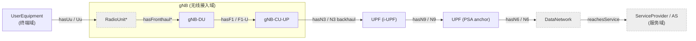
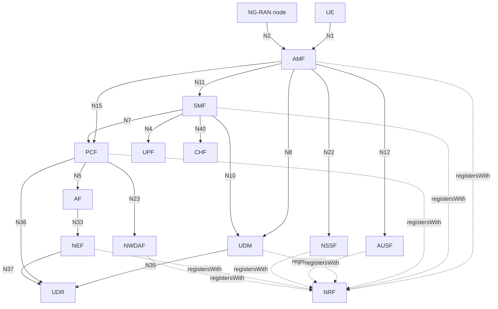
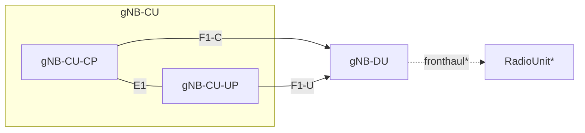

# 3GPP 5G SA — Quality-Degradation-Propagation Ontology

A 3GPP-grounded ontology for **end-to-end quality-degradation propagation** in
mobile networks. This first release delivers the **foundation**: a TBox/Schema of
the **5G Standalone network-element connection topology** — from terminal, through
the radio air interface, transport network, and core network, to the service
provider — plus the **mounting points** for the KPI / QoE layer to come.

> Scope decisions for this release:
> **Generation** = 5G SA (NG-RAN + 5GC) · **Format** = OWL 2 Turtle ·
> **Standards** = key Rel-19 specs downloaded + indexed · **Coverage** = full
> topology TBox + KPI/QoE placeholder scaffold.

---

## 1. Layout

```
3GPP_Ontology/
├── README.md                         ← this file
├── ontology/
│   ├── 3gpp-5gs-topology.ttl         ← CORE TBox: network entities, reference
│   │                                    points, links, domains, e2e path
│   └── 3gpp-pm-qoe-scaffold.ttl      ← KPI/QoE mount-point layer (imports core)
├── specs/
│   ├── INDEX.md                      ← provenance: spec no / version / clauses
│   ├── raw/*.zip                     ← original 3GPP specs (Rel-19) + fetch.sh/log
│   └── txt/*.txt                     ← text-extracted specs (for search/citation)
└── docs/
    └── modeling-notes.md            ← design rationale, competency questions, SPARQL
```

## 2. The two ontology modules

| Module | IRI | Contents |
|--------|-----|----------|
| Topology (core) | `http://3gpp-ontology.org/ns/5gs#` (prefix `fgs:`) | 56 classes, 40 object properties. Network entities, reference points, reified links, network domains, data-path direction, end-to-end service path. |
| PM/QoE scaffold | `http://3gpp-ontology.org/ns/pm#` (prefix `pm:`) | KPI/QoS/QoE category classes + bridge properties + degradation-propagation seed. `owl:imports` the core. |

> ⚠️ The base IRIs are working placeholders — rename to your own domain before publishing.

## 3. Topology at a glance

### 3.1 End-to-end user-plane (data) path — the spine of propagation


`*` RadioUnit and Fronthaul are deployment extensions, **not** 3GPP-normative.

### 3.2 Control plane (5GC service-based architecture, key reference points)



### 3.3 gNB functional split (TS 38.401)



## 4. Design highlights (how it serves propagation)

- **Reference points are first-class** (`fgs:ReferencePoint` individuals: N1…N40, Uu,
  F1, E1, Xn, NG, SBIs) — each citable to its spec clause.
- **Connectivity in two complementary forms:**
  - *Shortcut object properties* (`fgs:hasN2`, `fgs:hasN3`, `fgs:hasF1`, …), each a
    sub-property of the symmetric `fgs:connectedTo`, with `rdfs:domain`/`rdfs:range`
    encoding the **standard 5G SA topology** (e.g. `hasN3`: `NgRanNode → UPF`).
  - *Reified `fgs:Link`* (two `fgs:linkEndpoint`s + `fgs:realizesReferencePoint`) so a
    connection can **carry KPIs and degradation events** — what a fault model needs.
- **Direction for propagation:** `fgs:downstreamOf` / `fgs:upstreamOf` (transitive)
  order entities along the UE→AS data path.
- **Domain segmentation:** every entity maps to a `fgs:NetworkDomain`
  (Terminal / RadioAccess / Transport / Core / Service) for cross-segment analysis.
- **KPI/QoE bridge (scaffold):** `pm:hasPerformanceIndicator` mounts counters/KPIs/QoE
  onto any `fgs:Measurable` (entity *or* link); `pm:impactsQoE` links network-side
  indicators to user-side experience — the seam where network faults become felt QoE.

## 5. Using it

- **Protégé:** open `ontology/3gpp-5gs-topology.ttl` (then load the scaffold; its
  `owl:imports` resolves the core if both are in the same folder / catalog).
- **Validation done:** both files parse cleanly with rdflib (1064 triples merged);
  all `rdfs:domain`/`rdfs:range` targets are declared classes (0 dangling).
- **Recommended follow-up:** run a DL reasoner (HermiT/Pellet) once a JRE is
  installed — the local `/usr/bin/java` here is a stub with no runtime.

## 6. Roadmap

1. **(this release)** Topology TBox + KPI/QoE scaffold. ✅
2. Populate the indicator catalogue from TS 28.552/28.554 into `pm:` (concrete KPIs,
   counters, their `pm:aggregatesFrom` / `pm:measuredOn` bindings).
3. Formalize propagation rules (SWRL/SHACL) over `fgs:downstreamOf` + `pm:propagatesTo`.
4. Add an ABox: a sample deployment instance + a worked degradation-propagation case.
5. Optional: extend to NSA/4G (EN-DC, E-UTRAN, EPC) per the broader scope options.

See `docs/modeling-notes.md` for rationale, competency questions and example SPARQL.
Spec provenance is in `specs/INDEX.md`.
