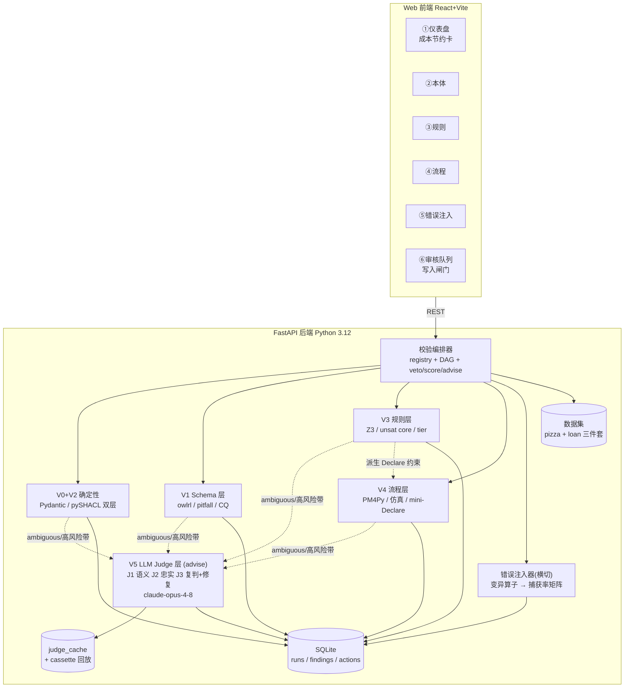

# 本体校验参考 Demo · 历史设计基线（v2.1）

> 日期：2026-06-11（v2；v1 同日早些时候）
> 状态：已实施并于 2026-07-13 迁移到 Ontology 仓库；本文仅保留为参考 Demo 的设计与决策记录。
> 它不是当前目标系统设计；新基线见 [`./system-design/`](./system-design/) 和其中的
> `ontology-validator-registry.json`。本文的 V0–V6 是历史实现编号，不应继续扩展为目标分类法。
> 上游输入：
> - KnowledgeExtraction 仓库的 `research/knowledge_extraction_survey/notes/knowledge-validation-tech-plan.md`（下称 **TP**）及全部 D_/E_ 系列调研笔记
> - 项目根目录 `截屏2026-06-11 09.40.39.png`（网页版 Claude 产出的系统级概念架构图，下称 **概念图**）
>
> v2 相对 v1 的变更（响应用户审阅意见）：
> 1. 恢复并强化 **validator registry + 依赖 DAG**，引入 veto / score / advise 三级权限语义；
> 2. 引入 **LLM-as-judge 层**（3 个 judge + 修复建议起草，默认 `claude-opus-4-8`），废除 v1 的「零 LLM」约束；judge 权限为 advise（不可否决），核心展示目标 = **可量化的人工成本节约**；
> 3. 架构图分为 **L0 概念架构**（概念图的 V0–V6 分层）与 **L1 实现架构** 两层，并给出概念层 ↔ TP 模块 ↔ demo 实现的三方映射表；demo 统一采用概念层 V0–V6 命名；
> 4. 新增 3 个「仅 LLM 能抓」的预埋缺陷（语义合理性 ×1、抽取忠实性 ×2），捕获率矩阵新增 LLM judge 列；
> 5. 修复建议进 demo（起草 + 人工 accept/dismiss），「一键应用修复 → 重跑校验 → 有界重试」的完整闭环列为演进项。

---

## 1. 背景与裁剪原则

### 1.1 上游材料的取舍

TP 是为 PersonalLibrary（个人文献库，另一项目）写的交付稿，其中混入了大量 PL 专属内容。本 demo 的取舍如下：

**保留（通用策略，demo 核心）**：

| TP 来源 | 策略 | demo 用法 |
|---|---|---|
| §2.1.1 | **validator registry + 依赖 DAG + blocking/advisory 门禁** | 校验编排器主骨架，扩展为三级权限（§2.4） |
| §2.1.4 | `validation_runs` 三表存储 schema | SQLite 同构落地 |
| §2.3.2/§2.11.4 | judge 双路取证、结论必须挂证据指针、多维结构化评估、abstain | LLM judge 层的 SOP（§4.5） |
| §2.5 | SHACL 双层门禁（最低入库 shape blocking + 可信层 shape advisory）、pySHACL `inference` 显式指定 | 实例层校验主引擎 |
| §2.6 | reasoner 一致性 + pitfall 检查 | owlrl 物化 + 自写检查器 |
| §2.7 | CQ 回归（SPARQL 资产 + 三种期望模式 + 失败三分类） | Schema 层功能性闸门；失败分类由 judge 提议、人工确认 |
| §2.8 | `pm4py.analysis.check_soundness()`（新 API，旧 woflan 已弃用） | 流程层形式化校验 |
| §2.9.1 | play-out 合成 trace + 规则×流程交叉验证环 | 仿真校验（无真实日志场景的唯一通路） |
| §2.9.4 | 活动覆盖率 / gateway 分支覆盖率 | 仿真充分性度量 |
| §2.9.5 | 错误注入 + 「错误类型 × 校验层」捕获率矩阵 | 横切基础设施（"validator 的 validator"） |
| §2.12 | violation 附带候选修复、一键处理、`review_actions.repair_id` 留痕 | judge 起草修复建议 + 审核队列采纳 |
| §2.0 P3 | **LLM 生成 artifact、辅助裁判，确定性引擎终审**——demo 中 LLM judge 权限为 advise，死锁/可满足性/约束违反的最终判定仍来自确定性引擎 | 权限分级的设计依据 |
| §2.0 P4 | violation 是负证据不是删除指令；blocking 失败进 quarantine 不丢弃 | 写入闸门语义 |

**剥离（PL 专属或 demo 过重，标注为演进方向）**：

- V2 证据校验的 NLI 本地模型路线（DeBERTa-v3）——demo 用 LLM judge 的忠实性校验（J2）承担同类职责，本地 NLI 留作演进；
- V3 实体归一（splink）、V10 完整校准体系（conformal/ECE，需 gold set 积累期）——demo 用简化版 judge 置信度代替；
- Crossref/OpenAlex 书目核验、Zotero/Docling 集成、trust 状态机与 PL 代码的衔接——全部不进 demo；
- ProMoAI/POWL、Prosimos、Declare4Py、sheXer——首版不引入（依赖重或许可证问题），见 §10 演进路径。

### 1.2 Demo 的四条设计原则

1. **权限分级的混合裁判**：确定性引擎（pySHACL / owlrl / Z3 / PM4Py）持有 veto/score 权限做形式判定；LLM judge 持有 advise 权限做语义判定与复判，**不可否决、不可删数据**；人工在写入闸门终审；
2. **blocking / advisory 两态门禁**：结构校验 + 最低 shape 为 veto（失败进 quarantine），其余全部 advisory（违例 = 负证据 + 进审核队列，不删数据）；
3. **每条 finding 可解释、可定位**：SHACL 给 focusNode/path/constraint，Z3 给具体反例 model 或 unsat core，仿真给违例 trace，judge 给带证据引用的 rationale——不输出裸布尔；
4. **校验器自身可证伪**：错误注入实验室产出捕获率矩阵（含 LLM judge 列），回答"这套管线对已知错误能抓住几成、各层互补性如何"。

---

## 2. 总体架构

### 2.1 L0 概念架构（系统级蓝图，源自概念图）

复刻项目根目录概念图的分层（原图：`截屏2026-06-11 09.40.39.png`），demo 与未来完整系统共用这张蓝图：

```text
┌──────────────────────┐          ┌──────────────────────────┐
│  人工建模 / 存量数据   │          │     LLM 自动构建产物       │
└──────────┬───────────┘          └────────────┬─────────────┘
           │                                   ▼
           │                      ┌──────────────────────────┐  修复反馈
           │                      │ V5 生成-验证-修复闭环      │◀────────┐
           │                      │   结构校验 · 有界重试      │         │
           │                      └────────────┬─────────────┘         │
           ▼                                   ▼                       │
┌──────────────────────────────────────────────────────────────┐      │
│                        校验流水线                              │      │
│  ┌──────────────────────────────────────────────────────────┐ │      │
│  │           V0 语法与结构校验 · fail-fast                    │ │      │
│  └──────────────────────────────────────────────────────────┘ │      │
│  ┌────────────┐ ┌────────────┐ ┌────────────┐ ┌────────────┐  │      │
│  │ V1 Schema 层│ │ V2 实例层   │ │ V3 规则层   │ │ V4 流程层   │  │──────┘
│  │ 推理+CQ测试 │ │ SHACL 双轨  │ │ 异常检测·分层│ │ 健全性·Saga │  │
│  └────────────┘ └────────────┘ └────────────┘ └────────────┘  │
└──────────────────────────────┬───────────────────────────────┘
                               ▼
┌──────────────────────────────────────────────────────────────┐
│            V6 写入闸门（Action Gate）                          │
│            目标校验 · 审批审计 · 暂存合并                       │
└──────────────┬───────────────────────────┬───────────────────┘
               ▼                           ▼
┌──────────────────────────┐   ┌──────────────────────────┐
│  可信本体 / 知识图谱       │   │   标准化流程 DAG           │
│  统一语义层 · 黄金记录     │   │   供推理/执行模块消费       │
└──────────────────────────┘   └──────────────────────────┘
```

### 2.1.1 L0 概念架构 v2.1（评审改进版，已采纳）

对概念图的评审发现：静态分层正确（fail-fast 前置、四层并列、写入闸门收口、双产物输出保持不变），但**反馈回路与横切关注点不可见**——"系统如何随时间变好"没有画出来。v2.1 增补五处（`+` 标出）：

```text
人工建模/存量数据      LLM 自动构建产物 ◀──修复反馈── V5a 生成-修复闭环
        │                    │
        ▼                    ▼
┌─────────────────────────────────────────────┐    ┌────────────────────┐
│ V0 语法与结构校验 · fail-fast                 │    │ + V5b LLM 辅助裁决  │
│ V1 Schema │ V2 实例 │ V3 规则 ◀+─▶ V4 流程    │◀──▶│   judge 复判/修复   │
│            ▲        └─ + 交叉验证环 ─┘        │    │   起草/violation    │
└────────────│────────────────────────────────┘    │   可读化 (advise)   │
┌────────────│────────────────────────────▲───┐    └────────────────────┘
│ + 横切底座：错误注入·捕获率矩阵 ┊ 校准·风险路由·成本分级 │
└────────────│────────────────────────────│───┘
             ▼                            │
   V6 写入闸门（+ 版本 diff·增量重验）       │
             │                            │
             ├─── + 裁决回流（gold set / 校准集 / 路由权重）
             ▼
   可信本体/KG · 流程 DAG
             │
             └─── + 数据侧 shape 挖掘 · 双源对账 ──▶ 回 V2 实例层
```

| # | 增补 | 依据 | demo v2 覆盖 |
|---|---|---|---|
| ① | **人工裁决回流线**：V6 的 approve/reject/edit 回流为 gold set、校准集、风险路由权重——人工劳动复利化 | TP P7 / §2.12 回流三路 | 部分（`review_actions` 表留痕；三路回流为演进） |
| ② | **可信层反哺线**：黄金记录 → 数据侧 shape 挖掘 → 与 schema 声明 shape 对账，校验标准随数据演化 | TP §2.5.2 双源对账 | 演进（sheXer） |
| ③ | **V3↔V4 交叉验证线**：规则派生约束 × 流程仿真 trace，抓"单看都对、合起来矛盾" | TP §2.9.1 | **完整**（mini-Declare 交叉环） |
| ④ | **V5 拆分两角色**：V5a 入口生成-修复闭环（原位保留）+ V5b 贯穿式 LLM 辅助裁决服务（advise 权限） | demo v2 §4.5 的实践反推 | V5b 完整；V5a 有界重试为演进 |
| ⑤ | **横切底座**：(a) 错误注入·捕获率矩阵（校验器的校验，可证伪性）；(b) 校准·风险路由·成本分级（分数融合与管线深度决策） | TP §2.9.5 / V10 | (a) 完整；(b) 简化（judge 路由 + 固定 τ） |
| 次 | 「暂存合并」补**版本 diff·增量重验**语义（diff → CQ 回归 → shape 重生成 → 受影响对象重验） | TP §2.6 | 演进 |

### 2.2 概念层 ↔ TP 模块 ↔ Demo 实现：三方映射表

demo 统一采用概念层 V0–V6 命名（TP 的 V1–V11 编号仅作出处引用，避免两套编号混淆）：

| 概念层（L0） | TP 模块 | Demo 实现（L1 引擎 / 页面） | 权限 | demo 覆盖度 |
|---|---|---|---|---|
| V0 语法与结构校验 fail-fast | TP-V1 结构校验 | Pydantic IR 校验 + evidence 字段非空检查 | **veto** | 完整 |
| V1 Schema 层（推理 + CQ 测试） | TP-V5 本体逻辑 + TP-V6 CQ 回归 | owlrl 物化 + 一致性扫描、pitfall 扫描（SPARQL 档案）、CQ 回归（三种期望模式 + 失败三分类） | score | 完整（HermiT/ROBOT 演进） |
| V2 实例层（SHACL 双轨） | TP-V4 形状/约束校验 | pySHACL 双层：minimal shapes（veto）+ trusted shapes（score）；inference 显式指定 | **veto** + score | 完整（双源 shape 挖掘演进） |
| V3 规则层（异常检测 · 分层） | TP-V9 规则形式化 | Z3 五类缺陷检测 + unsat core + tier 分级语义（hard 报错 / heuristic 竞争建议） | score | 完整（defeasible/ASP 演进） |
| V4 流程层（健全性 · Saga） | TP-V7 流程形式化 + TP-V8 仿真 | IR→Petri（PM4Py）+ check_soundness + play-out 覆盖率 + 数据感知仿真 + mini-Declare 交叉验证环 | score | 健全性+仿真完整；**Saga 补偿模式不进 demo**（演进） |
| V5 LLM 闭环（生成-验证-修复） | TP-V2 证据校验（judge 形态）+ TP §2.11.4 judge SOP + TP §2.12 修复建议 | **J1 语义合理性 / J2 抽取忠实性 / J3 finding 复判 + 修复起草**（§4.5）；demo 含「judge + 修复建议」，**有界重试闭环为演进项** | **advise** | 部分（闭环演进） |
| V6 写入闸门（Action Gate） | TP-V11 HITL + quarantine 语义 + TP §2.1.3 | 审核队列页：聚合审、judge 徽章、修复建议 accept/dismiss、quarantine 列表、可信图谱导出 | 人工终审 | 简化版（trust 两维状态机演进） |
| —（概念图未画，TP 横切） | TP §2.9.5 错误注入 | 错误注入实验室：变异算子 → 全管线重跑 → 捕获率矩阵（含 LLM judge 列） | — | 完整 |

### 2.3 L1 实现架构（demo web app）

```text
┌────────────────────────────────── Web 前端（React + Vite + antd）──────────────────────────────────┐
│                                                                                                    │
│ ①总览仪表盘        ②本体校验        ③规则校验      ④流程校验        ⑤错误注入实验室   ⑥审核队列      │
│  门禁状态卡         Cytoscape 图谱   规则表+tier    bpmn-js 流程图    变异算子选择      (V6 写入闸门)  │
│  人工成本节约卡      SHACL 报告双层   缺陷+具体反例  soundness 诊断    捕获率矩阵热力图   judge 徽章     │
│  judge 调用统计     推理/pitfall     unsat core    仿真trace+覆盖率  (含 LLM judge 列) 修复建议卡     │
│  运行历史           CQ 回归(三分类)   竞争建议分区   交叉验证违例                        quarantine    │
└───────────────────────────────────────┬────────────────────────────────────────────────────────────┘
                                        │ REST（JSON / BPMN XML / 图数据）
┌───────────────────────────────────────┴────────────────────────────────────────────────────────────┐
│                            FastAPI 后端（Python 3.12，uv 管理独立 venv）                              │
│                                                                                                    │
│  ┌──────────────────────────────────────────────────────────────────────────────────────────────┐  │
│  │        校验编排器：validator registry + 依赖 DAG + 三级权限（veto / score / advise）            │  │
│  │        拓扑序调度 · veto 失败短路该对象 → quarantine · judge 节点依赖确定性层输出               │  │
│  └───┬──────────────┬──────────────┬──────────────┬───────────────────┬─────────────────────────┘  │
│  ┌───┴─────────┐ ┌──┴──────────┐ ┌─┴───────────┐ ┌┴────────────────┐ ┌┴─────────────────────────┐  │
│  │ V0+V2 确定性 │ │ V1 Schema 层 │ │ V3 规则层    │ │ V4 流程层        │ │ V5 LLM Judge 层           │  │
│  │ Pydantic IR  │ │ owlrl 推理   │ │ Z3 五类缺陷  │ │ IR→Petri(PM4Py) │ │ J1 语义合理性             │  │
│  │ pySHACL 双层 │ │ pitfall 扫描 │ │ unsat core   │ │ check_soundness │ │ J2 抽取忠实性             │  │
│  │ minimal=veto │ │ CQ 回归      │ │ tier 分级    │ │ play-out 覆盖率  │ │ J3 复判+修复起草          │  │
│  │ trusted=score│ │ (score)     │ │ (score)     │ │ 数据感知仿真器    │ │ (advise，不可否决)        │  │
│  └─────────────┘ └─────────────┘ └─────────────┘ │ mini-Declare 环  │ │ anthropic SDK            │  │
│                                                  │ (score)         │ │ claude-opus-4-8(可切换)   │  │
│        错误注入器（横切）：变异算子库 → 注入 → 全管线重跑 → 捕获率矩阵    └──────────┬───────────────┘  │
│  ┌──────────────────────┐  ┌────────────────────────────┐  ┌─────────────────────┴─────────────┐  │
│  │ SQLite               │  │ 数据集仓库（文件系统）        │  │ judge_cache（input-hash 缓存）     │  │
│  │ validation_runs      │  │ pizza.owl（公开本体）        │  │ 兼作 cassette：无 ANTHROPIC_API_  │  │
│  │ findings（+judge 列） │  │ loan/ 贷款审批场景三件套      │  │ KEY 时回放录制响应，demo 全程可跑  │  │
│  │ review_actions       │  │ （含语义/忠实性预埋缺陷）      │  └───────────────────────────────────┘  │
│  └──────────────────────┘  └────────────────────────────┘                                          │
└────────────────────────────────────────────────────────────────────────────────────────────────────┘

交叉验证环（V3×V4，TP §2.9.1）：
  规则 IR ──派生──▶ mini-Declare 约束 ──检查──▶ 仿真 trace ◀──生成── 流程 IR
判定与复判分工（V5 advise 语义）：
  确定性 findings ──ambiguous/高风险带──▶ LLM judge 复判 ──▶ 调置信度/优先级 + 修复建议 ──▶ 审核队列（人工终审）
```

Mermaid 版（便于嵌入其他文档）：



### 2.4 校验编排器：registry + DAG + 三级权限

每个校验器注册元数据（TP §2.1.1 的 demo 落地形态）：

```json
{
  "validator_id": "instance.shacl_trusted",
  "layer": "V2",
  "engine": "pyshacl",
  "cost_class": "L1",
  "authority": "score",
  "depends_on": ["structure.pydantic", "instance.shacl_minimal"],
  "applicable_types": ["instance_graph"]
}
```

**三级权限语义**（用户反馈的核心设计点——不同校验器持有不同权限）：

| authority | 语义 | 持有者 | 失败/输出走向 |
|---|---|---|---|
| `veto` | 直接否决：失败即短路该对象后续校验，对象进 quarantine（可见、可审、可恢复，不丢弃） | 仅确定性引擎：V0 结构校验、V2 minimal shapes | quarantine 列表（页面⑥） |
| `score` | 写 finding 作负证据：violation 带 severity/locus/诊断进 findings，不删数据 | 确定性 advisory 引擎：V2 trusted shapes、V1 推理/pitfall/CQ、V3 Z3、V4 soundness/仿真/交叉环 | 审核队列（页面⑥） |
| `advise` | 辅助裁决：调整 finding 置信度与队列优先级、起草修复建议、产出新的语义类 finding；**不可否决、不可删数据、不可自动应用修复** | LLM judge 全部（J1/J2/J3） | 叠加在 findings 上（judge_verdict 等列） |

执行语义：
- **DAG 调度**：按 `depends_on` 拓扑序执行；同层无依赖的校验器并行；
- **短路规则**：veto 失败 → 该对象剩余校验器全部 skip（记 `validation_runs.verdict='skip'`），对象进 quarantine；
- **judge 路由**：J3 只接「ambiguous/高风险带」——severity=warning 的 finding、heuristic 竞争对、CQ 失败、数值/枚举类 violation（这些最可能是误报或可一键修复）；severity=violation 的确定性结论（如 SMT 冲突、死锁）**不送 judge 复判**（确定性引擎在形式问题上是终审，TP P3）；J1/J2 是独立 finding 生产者，对全量对象运行（受缓存与预算约束）；
- **幂等缓存**：每次执行以 `hash(对象内容 + validator_id + 配置)` 查 `validation_runs`/`judge_cache`，命中即跳过——这也是 demo「重复运行不重复扣 API 费」的机制。

---

## 3. 数据集方案

### 3.1 公开本体：Pizza Ontology（本体校验的通用性展示）

- 来源：`https://protege.stanford.edu/ontologies/pizza/pizza.owl`（Stanford/Manchester 教学经典，~100 类，含 disjointness、存在限制，体量适中；仓库内缓存副本）；
- 用途：演示 demo 对任意公开 OWL 本体的开箱能力——pitfall 扫描、owlrl 物化 + 一致性检查（内置一个注错实例：同时 typed 为互斥类系）、手写 3–5 条 SHACL shape、2–3 条 CQ、**J1 语义合理性扫描**（对公开本体的类名-公理一致性抽查，展示 judge 对陌生本体的开箱能力）；
- 备选公开本体（实施时任选其一追加，不阻塞）：W3C ORG 组织本体、FOAF、LUBM 大学本体。

### 3.2 业务串联场景：贷款审批（demo 主线，本体+规则+流程一体）

选贷款审批的理由：它是 DMN/BPMN 教学的公共经典场景（规则素材可参照 DMN 规范与 Camunda 公开示例改写），且天然同时具备「本体实例 + 决策规则 + 审批流程」三类 artifact，能演示**跨 artifact 交叉验证**与**确定性×LLM 互补**——单独校验任何一类、单用任何一种裁判都给不出这些信号。

#### a) 本体 + 实例（`ontology.ttl` + `instances.ttl`，约 8 类 / 15 属性 / 30 个申请实例）

类：`Applicant / LoanApplication / RiskAssessment / Document / Employee / Organization`（Applicant 与 Organization 声明 disjoint）。
属性：`hasApplicant(domain:Application, range:Applicant) / age / monthlyIncome / loanAmount / creditScore / riskLevel{LOW,MEDIUM,HIGH} / hasDocument / assessedBy / birthDate(functional)` 等。

预埋实例/本体缺陷（→ 期望捕获层与权限路径）：

| # | 缺陷 | 期望捕获层 | 权限路径 |
|---|---|---|---|
| O1 | 申请缺 `hasApplicant`（必填缺失） | V2 minimal shape `sh:minCount` | **veto → quarantine** |
| O2 | `monthlyIncome="八千"`（datatype 错误） | V2 trusted shape `sh:datatype` | score → 队列 |
| O3 | `riskLevel="EXTREME"`（枚举越界） | V2 trusted shape `sh:in` | score → 队列（J3 复判：疑似 HIGH 笔误 + 修复建议） |
| O4 | `age=-5`、`loanAmount=0`（范围违例） | V2 trusted shape `sh:minInclusive` | score → 队列 |
| O5 | `hasApplicant` 指向一个 `LoanApplication`（range 违例） | V2 trusted shape `sh:class` | score → 队列 |
| O6 | 某实体同时 typed `Applicant` 与 `Organization`（disjoint 违例） | V1 owlrl 推理一致性 | score → 队列 |
| O7 | 两个 `birthDate`（functional 违例） | V2 trusted shape `sh:maxCount` | score → 队列 |
| O8 | schema 级：无 label 的类、无 domain 的属性、subclass 环 | V1 pitfall 扫描 | score（info 级） |
| **O9** | **`TemporaryEmployee rdfs:subClassOf Document`（逻辑自洽、语义荒谬——人是文档的子类）** | **V5 J1 语义合理性 judge（确定性层全部 miss）** | **advise → 高优先入队** |

SHACL 资产双层组织（TP §2.5.1）：`shapes/minimal.ttl`（veto：三元组完整性 + 必填 + 类型可解析）与 `shapes/trusted.ttl`（score：datatype/枚举/范围/class/cardinality）。pySHACL 调用显式 `inference="rdfs"`（TP 警告：默认 `none` 会静默放行依赖推理的验证）。

#### b) 规则 IR（`rules.json`，约 13 条，沿用 TP §2.2 的 IR schema）

```json
{
  "rule_id": "R2",
  "guard": {"expr": "monthly_income >= 5000 && loan_amount <= 100000"},
  "conclusion": {"action": "approve", "polarity": "require"},
  "tier": "hard",
  "scope": {"domain": "loan"},
  "evidence": [{"quote": "月收入5000以上且金额10万内可直批", "source": "信贷手册§3.2"}]
}
```

预埋规则缺陷（→ Z3 五类缺陷对照表 TP §2.10.2 + judge 忠实性）：

| # | 规则内容（示意） | 缺陷类型 | 检测方式 | 输出物 |
|---|---|---|---|---|
| R1 | `age < 18 → reject` (hard) | — 正常 | — | — |
| R2 | `income≥5000 ∧ amount≤10万 → approve` (hard) | 与 R4 冲突 | Z3 `SAT(g2 ∧ g4 ∧ incompatible)` | 具体反例：income=6000, credit=550 时既 approve 又 reject |
| R4 | `credit_score < 600 → reject` (hard) | 同上 | 同上 | 同上 |
| R5 | `age < 18 ∧ age > 65 → …` | dead rule | Z3 `UNSAT(g5 ∧ domain)` | 永不触发 |
| R6 | `age < 16 → reject` | 被 R1 subsume | Z3 `UNSAT(g6 ∧ ¬g1)` 且结论一致 | 被吞规则对 |
| R7… | 全集 | coverage gap | Z3 `SAT(domain ∧ ¬(g1∨…∨gn))` | 未覆盖输入的具体样例（如 income<5000 ∧ amount∈(10万,50万]） |
| R8/R9 | `建议线上面签` vs `建议线下面签`（guard 重叠） | heuristic 竞争 | 同 conflict query + tier 语义 | **不报错**，登记为"竞争建议"（TP §2.10.3） |
| R10 | `amount > 50万 → manual_review` (hard) | — 正常，供交叉验证用 | — | — |
| **R11** | **guard 写 `monthly_income >= 5000`，但 evidence 引文为「月收入五万以上方可直批」（数量级抽错）** | **抽取忠实性缺陷** | **V5 J2 忠实性 judge（Z3 全部 miss——规则集逻辑完全自洽）** | judge rationale 引用 evidence 原文 + 修复建议（50000） |

guard 语言：受限表达式（变量为 int/real/enum/bool，运算符 `&& || ! < <= > >= == !=`），自写 ~100 行解析器编译到 Z3 的 QF_LRA/LIA + enum sort（不走完整 FOL，TP 纠错点）。domain constraints：`age∈[0,120], income≥0, amount>0, credit∈[300,850]`。

#### c) 流程 IR（`process.json`，1 个正常 + 3 个缺陷变体）

正常版：`提交申请 → 完整性检查 → 风险评估 → [XOR: amount>50万?] → 是→人工复核→审批决定；否→自动审批 → 通知`。

| 变体 | 预埋缺陷 | 期望捕获层 |
|---|---|---|
| P-deadlock | XOR-split 配 AND-join（经典 unsound 结构） | V4 `check_soundness()` 诊断（score） |
| P-dead-branch | 一个 gateway 分支指向孤立活动后无出口 | V4 play-out 活动覆盖率 < 100%（score） |
| P-rule-violation | gateway 条件被改为 `amount > 80万` 才走人工复核 | **V3×V4 交叉验证环**：R10 派生约束 "amount>50万 ⇒ ManualReview ∈ trace"，数据感知仿真 trace 违例（score） |
| **P-edge-unfaithful** | **边 `完整性检查 → 风险评估` 的 evidence 引文写「先评估风险、通过后再查材料完整性」（IR 顺序与原文相反）** | **V5 J2 忠实性 judge（soundness/仿真全部 miss——流程结构完全健全）** | advise → 高优先入队 |

流程 IR schema：`{steps[], edges[{from,to,condition?,evidence[]}], gateways[{id,type:XOR|AND,branches}]}`，每个 step/edge 带 `evidence` 字段（V0 结构检查强制非空，TP §2.8.2 的最低保留；evidence 引文即 J2 的比对输入）。

#### d) CQ 资产（`cqs.json`，6–8 条，TP §2.7 格式）

例：「所有 HIGH 风险申请是否都有 RiskAssessment 记录？」（SPARQL + `expected.mode: non_empty/exact_set/contains`）。预埋 1 条因数据缺口失败、1 条因本体缺口失败。失败三分类（本体回退 / CQ 过时 / 数据缺口）由 **J3 提议分类 + 人工确认**——这正是「LLM 辅助裁决降低人工成本」的典型样例：分类是判断题而非计算题，确定性引擎只能报"失败"。

---

## 4. 校验引擎设计

### 4.1 V0 + V2：结构与实例层（确定性，veto + score）

| 检查 | 实现 | authority |
|---|---|---|
| IR 结构校验（四类 artifact 的 Pydantic schema + evidence 非空） | Pydantic v2 | **veto** |
| 最低入库 shape | pySHACL(`shapes/minimal.ttl`, inference="rdfs") | **veto**；focusNode 进 quarantine |
| 可信层 shape | pySHACL(`shapes/trusted.ttl`) | score；focusNode/path/constraint/severity/message |

### 4.2 V1：Schema 层（确定性，score）

| 检查 | 实现 |
|---|---|
| 推理一致性 | owlrl OWL-RL 物化 → 扫描 disjoint 命中、`owl:Nothing` 成员、domain/range 类型冲突 |
| pitfall 扫描 | 自写 SPARQL 档案（缺 label/comment、属性缺 domain/range、subclass 环、孤立类、命名不一致）——OOPS! 清单的本地可跑子集 |
| CQ 回归 | rdflib SPARQL 执行 + 三种期望模式比对；失败送 J3 提议三分类 |

注：HermiT/ELK（JVM）不进 demo；owlrl 一致性检测的具体机制（异常 vs 推出矛盾三元组）在 D1 实施时先做 30 分钟技术验证，备选方案为物化后自写矛盾扫描器。

### 4.3 V3：规则层（确定性，score）

- guard 解析器 → Z3 表达式；结论不相容矩阵显式声明（approve⊥reject、approve⊥manual_review 可共存等）；
- 五类缺陷按 TP §2.10.2 对照表实现：conflict / subsumption / gap / dead rule / overlap（unsafe 需前置条件建模，列为 stretch）；
- **tier 语义**：hard×hard 冲突 → severity=violation；heuristic 参与 → 降级为"竞争建议"（info），不报错——防误报海量的关键设计；
- 诊断：conflict 给 Z3 model 具体反例；不一致规则集给 unsat core 定位最小冲突子集。

### 4.4 V4：流程层（确定性，score）

- IR → PM4Py PetriNet 对象（自写转换器 ~150 行）+ 结构检查（纯函数）；
- `pm4py.analysis.check_soundness()` → (bool, diagnostics)，死锁 marking 展示；
- **play-out 仿真**：basic + extensive 变体，每流程 ≥200 条 trace → 活动覆盖率、gateway 分支覆盖率、variant 数（TP §2.9.4 阈值：活动 100%、分支 ≥95%）；
- **数据感知仿真器**（自写 ~200 行）：随机申请数据 → 按 gateway 条件 token game → 带 case 属性的 trace；
- **mini-Declare 检查器**（自写，4 模板：`existence / absence / response(A,B) / conditional-occurrence(cond ⇒ activity)`）：从规则 IR 自动派生约束，跑在数据感知 trace 上；违例 trace + 违反约束 + 来源规则三方联动展示。Declare4Py 不引入，模板语义对齐其定义以便后续替换。

### 4.5 V5：LLM Judge 层（advise，demo 新增核心）

**三个 judge**（anthropic Python SDK，`client.messages.parse()` + Pydantic 结构化输出）：

| judge | 职责 | 输入 | 触发范围 |
|---|---|---|---|
| **J1 语义合理性** | 类/属性/关系的「名称-公理-实例」语义一致性：类名与外延不符（O9）、subclass 误代 part-of、关系方向语义反了但逻辑自洽 | 本体摘要（类层级+标签+公理）+ 待判类/关系 | 全量类与关系（批量、缓存） |
| **J2 抽取忠实性** | 形式化产物 vs evidence 原文：规则 guard/conclusion 与引文一致性（R11）、流程边/gateway 条件与引文顺序一致性（P-edge-unfaithful） | 单条规则 IR 或流程边 + 其 `evidence[].quote` | 全量带 evidence 的 IR 元素 |
| **J3 finding 复判 + 修复起草** | 对 advisory finding 输出复判与修复建议；CQ 失败三分类提议 | finding（含 locus/诊断）+ 相关上下文片段 | 仅 ambiguous/高风险带（§2.4 路由） |

**统一输出 schema**（Pydantic，多维拆分——TP §2.11.4 多维结构化评估降偏 31.5% 的思想）：

```python
class JudgeVerdict(BaseModel):
    verdict: Literal["confirm", "likely_false_positive", "uncertain"]   # J3；J1/J2 为 issue_found/no_issue/uncertain
    dimensions: dict[str, bool]      # 按维度拆分的判定（如 J2：数值一致/方向一致/条件一致）
    confidence: float                # 0-1
    rationale: str                   # 必须引用证据（evidence 引文 / 本体公理 / finding 诊断），无引用降级 uncertain
    repair_suggestion: str | None    # 候选修复（文本或目标值），仅起草不应用
```

**SOP 约束**（TP §2.11.4 的 demo 可行子集）：
- 每个 verdict 必须带证据引用，模型未引用则程序侧降级 `uncertain`；允许 abstain（`uncertain` 即弃权 → 维持人工审核）；
- judge 结论**只能**：调 finding 置信度/队列优先级、附加 rationale 与修复建议、产出新的 advise 级 finding——不可改写或删除确定性 finding，不可触碰数据；
- 模型默认 **`claude-opus-4-8`**（demo 单次全量运行约几十次调用，质量优先），`GET/PUT /api/judge/config` 可切换 `claude-sonnet-4-6` / `claude-haiku-4-5`；
- demo 局限如实标注：judge 与抽取器异族约束（TP §2.11.4 第 1 条）在 demo 不适用（无抽取 LLM）；position-swap 双评适用于 pairwise 场景，demo 的单对象判定用多维拆分代偿。

**调用后端双适配**（`JudgeBackend` 接口，配置切换，cassette 缓存层在接口之上、两后端共享）：

| 后端 | 实现 | 认证/成本 | 结构化输出 | 适用 |
|---|---|---|---|---|
| `CliBackend`（**demo 默认**） | `claude -p --output-format json --model …`（或 claude-agent-sdk），`--max-turns 1` + 禁用工具锁住单轮纯文本判定 | Claude Code 订阅 OAuth，**无需 API key、无单独账单** | 提示词要求严格 JSON → Pydantic 校验 → 失败带错误反馈重试 1 次 | 本机 demo |
| `ApiBackend` | anthropic SDK `messages.parse()` + Pydantic | `ANTHROPIC_API_KEY`，按 token 计费 | 原生 schema 强制；系统提示词置稳定前缀利用 prompt caching | 服务化/批量/CI |

后端选择顺序：配置显式指定 > 有 API key 用 ApiBackend > 本机有 claude CLI 登录态用 CliBackend > 都没有 → cassette 回放模式。CLI 确切 flag（系统提示注入/工具禁用）在 D5 实施时以 `claude --help` 为准。

**成本与可运行性**：
- **input-hash 缓存**：`judge_cache(input_hash, judge_id, model, response_json, created_at)`，重复运行零 API 费；
- **cassette 回放模式**：开发期录制的 judge 响应随仓库分发（即 judge_cache 的种子数据）；运行时无 `ANTHROPIC_API_KEY` → 自动进入回放模式，**demo 全流程无 key 可跑**；有 key 时缓存未命中才真实调用；
- 仪表盘展示 judge 调用统计：调用次数 / token 用量 / 缓存命中率 / 估算费用。

**人工成本节约指标**（用户反馈的核心展示目标）：
- J3 复判后：`confirm ∧ confidence ≥ τ` 的 finding 标记"judge 已确认"（默认 τ=0.85，配置项），在队列中折叠为低交互项；`likely_false_positive` 降权折叠；`uncertain` 维持原优先级；
- 仪表盘成本卡：**「需人工逐条审核的 finding：judge 前 N 条 → judge 后 M 条（降低 X%）」**；
- 重要语义：折叠 ≠ 自动通过——所有 finding 仍在队列可见、人工一键展开复核，写入闸门的终审权始终在人（advise 权限的边界）。

### 4.6 错误注入器（横切，捕获率矩阵）

变异算子库（每类 2–4 个，TP §2.9.5 表的子集 + LLM 互补算子）：

| 对象 | 算子 | 期望捕获层 |
|---|---|---|
| 实例数据 | 删必填字段 / 枚举越界 / 数值边界±异常 / 类型替换 | V2 SHACL 双层 |
| 本体 | 删 disjointness / 交换 domain-range / 注入 subclass 环 / **挂错父类（语义型）** | V1 推理/pitfall / V2 / **V5 J1** |
| 规则 | 翻转比较算子 / 翻转极性 / 边界±1 / **guard 数值改到与 evidence 不符（忠实性型）** | V3 SMT / 交叉环 / **V5 J2** |
| 流程 | 交换步骤 / 翻转 gateway 条件 / 删 edge / XOR↔AND / **edge 顺序与 evidence 反转（忠实性型）** | V4 soundness/仿真 / 交叉环 / **V5 J2** |

执行：选择算子 → 对干净数据集生成变异体 → 全管线重跑（含 judge 层，走缓存/cassette）→ 输出「变异算子 × 校验层」捕获矩阵热力图 + 每层捕获率。矩阵设计上呈现三类格局：
1. 确定性层 catch、judge 无需参与（形式缺陷）；
2. **确定性层全 miss、仅 LLM judge 列 catch**（语义/忠实性缺陷 O9、R11、P-edge——互补性可视化）；
3. **全层 miss**（"删 disjointness"预期漏报，故意保留）——演示矩阵作为"可证伪质量证书"如何暴露管线盲区（TP P6）。

---

## 5. Web 前端设计

技术：React 18 + Vite + TypeScript + antd；可视化：Cytoscape.js（本体图谱）、bpmn-js（流程图，后端 PM4Py `convert_to_bpmn` + `write_bpmn` 产出 XML）、ECharts（捕获率热力图/覆盖率）。

| 页面 | 内容 |
|---|---|
| ① 总览仪表盘 | 数据集选择（loan / pizza）、一键全管线运行、门禁状态卡（veto 通过率 / advisory finding 数 / quarantine 数）、**人工成本节约卡（judge 前 N → 后 M，降低 X%）**、**judge 调用统计（次数/token/缓存命中/估算费用）**、运行历史 |
| ② 本体校验 | 左：Cytoscape 类层级+实例图（违例节点红色高亮，J1 语义缺陷紫色高亮，点击联动）；右：SHACL 报告（双层分组）、推理/pitfall 发现、**J1 findings（带 rationale）**、CQ 回归结果（J3 提议分类着色 + 人工确认按钮） |
| ③ 规则校验 | 规则表（tier 徽章）、缺陷列表（冲突对展开具体反例、dead/subsumed/gap 诊断）、heuristic 竞争建议独立分区、**J2 忠实性 findings（guard vs evidence 引文对照展示）** |
| ④ 流程校验 | bpmn-js 流程图（死锁/不可达高亮）、soundness 诊断、仿真面板（trace 样本 + 覆盖率进度条）、交叉验证违例（trace ↔ 约束 ↔ 来源规则三方联动）、**J2 边忠实性 findings（IR 顺序 vs evidence 引文对照）** |
| ⑤ 错误注入实验室 | 算子多选 → 运行 → 捕获率矩阵热力图（**含 LLM judge 列**，三类格局着色）、每层捕获率、变异体 diff 查看 |
| ⑥ 审核队列（V6 写入闸门） | findings 按 finding_type 聚合（"一个 shape 问题 + N 个实例"打包审）、**judge 徽章（confirm/疑似误报/uncertain）+ rationale 展开 + 按 verdict 重排序与折叠**、**修复建议卡（accept/dismiss，记入 review_actions）**、quarantine 对象列表（可恢复）、可信图谱导出（通过闸门的对象 → trusted.ttl 下载） |

---

## 6. API 设计（FastAPI）

```text
GET  /api/datasets                          # 可用数据集列表
POST /api/runs?dataset=loan                 # 触发全管线（含 judge 层）→ run_id
GET  /api/runs/{run_id}                     # 运行状态 + 汇总指标（含成本节约指标）
GET  /api/runs/{run_id}/findings?type=…     # finding 列表（含 judge 列，分页/过滤/排序）
GET  /api/ontology/{ds}/graph               # Cytoscape 节点/边 JSON（含违例与 J1 标记）
GET  /api/ontology/{ds}/cq-results
GET  /api/rules/{ds}                        # 规则表 + 缺陷 + J2 findings
GET  /api/process/{ds}/{variant}/bpmn.xml   # bpmn-js 渲染用
GET  /api/process/{ds}/{variant}/simulation # trace 样本 + 覆盖率 + 交叉验证违例
POST /api/judge/run?run_id=…                # 对一次 run 的 findings/对象批量复判（独立触发，便于演示前后对比）
GET  /api/judge/config                      # 当前模型/阈值/模式(live|cassette)
PUT  /api/judge/config                      # 切换模型/阈值
GET  /api/judge/stats?run_id=…              # 调用数/token/缓存命中/估算费用
POST /api/mutations/run                     # {operators:[…]} → 捕获率矩阵
POST /api/findings/{id}/action              # accept | dismiss | accept_repair
GET  /api/export/{ds}/trusted.ttl           # 通过写入闸门的可信图谱导出
```

---

## 7. 存储 schema（SQLite）

```sql
validation_runs(id, run_id, dataset, validator_id, authority,   -- veto | score | advise
                verdict,                                         -- pass | fail | ambiguous | skip
                started_at, duration_ms)

findings(id, run_id, validator_id, severity,        -- violation | warning | info
         object_type, object_id,                     -- ontology|instance|rule|process|cq
         finding_type, message, locus_json,          -- focusNode/规则对/trace 等定位
         evidence_json, status,                      -- open | accepted | dismissed
         judge_verdict,                              -- confirm | likely_false_positive | uncertain | NULL(未复判)
         judge_confidence, judge_rationale,
         repair_json)                                -- LLM 起草的候选修复

judge_cache(input_hash PRIMARY KEY, judge_id, model,
            response_json, tokens_in, tokens_out, created_at)   -- 兼作 cassette 种子

review_actions(id, finding_id, action,               -- accept | dismiss | accept_repair
               note, created_at)
```

---

## 8. 技术栈与依赖

| 层 | 选型 | 版本基线 | 备注 |
|---|---|---|---|
| Python | 3.12（uv 项目环境） | — | `pyproject.toml` 固定 `>=3.12,<3.13`，由 uv 创建和锁定环境 |
| Web | fastapi + uvicorn | 最新 | |
| RDF/SHACL | rdflib 7.x + pyshacl 0.31.x + owlrl | A2 笔记已验证组合 | `inference` 显式指定 |
| SMT | z3-solver | 最新 | QF_LRA/LIA + enum sort |
| 流程 | pm4py 2.7.x | `check_soundness()` 新 API | 旧 `soundness_woflan()` 已弃用，禁用 |
| **LLM** | **双后端**：Claude Code CLI（`claude -p`，demo 默认）/ anthropic Python SDK | 最新 | 默认模型 `claude-opus-4-8`，可切换 sonnet-4-6 / haiku-4-5；CLI 走订阅认证零额外成本，API 后端 $5/$25 每百万 token；两者皆无 → cassette 回放（见 §4.5 后端表） |
| 前端 | React 18 + Vite + cytoscape + echarts | — | Ontology 根级 pnpm workspace |
| 存储 | SQLite（stdlib sqlite3 或 SQLModel） | — | 零部署 |

目录结构：

```text
apps/ontology-validation/
├── backend/
│   ├── app/main.py                # FastAPI 入口
│   ├── app/orchestrator.py        # registry + DAG + 三级权限调度
│   ├── app/validators/            # structural.py / instance.py / schema_layer.py /
│   │                              # rules.py / process.py / mutation.py
│   ├── app/judges/                # base.py(SOP/降级/缓存) / backends.py(CLI|API 双适配) /
│   │                              # j1_semantic.py / j2_faithfulness.py / j3_review.py / cassette.py
│   ├── app/engines/               # guard_parser.py / petri_builder.py / simulator.py / declare.py
│   └── app/store.py
├── src/                           # Vite/React 前端
├── fixtures/
│   ├── loan/   (ontology.ttl, instances.ttl, shapes/, rules.json, process*.json, cqs.json)
│   └── pizza/  (pizza.owl, shapes.ttl, cqs.json, seeded_inconsistency.ttl)
├── cassettes/                     # judge 响应录制（judge_cache 种子，随仓库分发）
└── README.md
```

---

## 9. 实施里程碑与验收（D1–D6）

| 阶段 | 内容 | 验收标准 |
|---|---|---|
| D1 骨架+数据 | uv venv、FastAPI/Vite 脚手架、SQLite 四表、**registry+DAG+三级权限编排器**、loan 三件套与 pizza 数据制作（含全部预埋缺陷 O1–O9 / R1–R11 / 4 流程变体）、owlrl 一致性机制技术验证 | 数据集可加载；预埋缺陷清单文档化（§3.2 各表即 gold）；veto 短路语义可单测 |
| D2 本体引擎 | V2 SHACL 双层 + V1 owlrl/pitfall/CQ + 页面② | O1 进 quarantine（veto）；O2–O8 按预期层捕获（score）；CQ 失败可见 |
| D3 规则引擎 | V3 guard 解析器 + Z3 五类缺陷 + tier 语义 + 页面③ | R2×R4 冲突给出具体反例；R5/R6/gap 检出；R8×R9 显示为竞争建议而非冲突 |
| D4 流程引擎 | V4 Petri 转换 + soundness + play-out + 数据感知仿真 + mini-Declare + 页面④ | P-deadlock 被 soundness 抓；P-dead-branch 覆盖率暴露；P-rule-violation 被交叉环抓且三方联动展示 |
| **D5 LLM Judge 层** | J1/J2/J3 + SOP（多维输出/证据引用降级/abstain）+ judge_cache/cassette + 路由（ambiguous 带）+ 成本节约卡 + 队列 judge 徽章/修复建议卡 + 页面①⑥改造 | **O9 被 J1 检出且 V1/V2 全 miss；R11 被 J2 检出且 V3 全 miss；P-edge-unfaithful 被 J2 检出且 V4 全 miss**；O3 经 J3 给出 HIGH 修复建议；CQ 失败获得 J3 三分类提议；**无 ANTHROPIC_API_KEY 时 cassette 模式全流程可跑**；成本卡显示 N→M 降幅 |
| D6 注入+收尾 | 错误注入器（含语义/忠实性算子）+ 捕获率矩阵（LLM 列）+ 可信图谱导出 + README + demo 剧本 | 矩阵呈现三类格局（确定性 catch / 仅 LLM catch / 全层 miss 盲区）；全流程 demo 剧本一键走通 |

预埋缺陷清单（§3 各表）同时就是 demo 的验收 gold set——每个缺陷必须被预期的层捕获，预期漏报必须真的漏报。

---

## 10. 风险与演进路径

**风险**：

1. owlrl 一致性检测机制需 D1 验证（备选：物化后自写矛盾扫描）；
2. pm4py 在 py3.12 的 `check_soundness` 行为以 D1 冒烟为准（备选：自写基于可达图的死锁检测，demo 规模下可行）；
3. bpmn-js 渲染 pm4py 生成的 BPMN XML 兼容性（备选：Graphviz 渲染 Petri net SVG）；
4. **judge 判定的非确定性**：同输入多次调用结论可能漂移——demo 用缓存固定首次结论（兼顾费用与可复现）；真实系统需 TP §2.11 的校准与一致性审计；
5. **J1 误报风险**：语义合理性判定主观性强——J1 findings 一律 info/warning 级、必须人工确认才计入指标，不参与任何自动动作；
6. pizza.owl 需联网下载一次（仓库内缓存副本）。

**demo → 完整系统演进路径**（与 TP 路线图对齐，验收后按需启动）：

| demo 组件 | 演进方向（TP 出处） |
|---|---|
| 手写 SHACL | Astrea/SCOOP schema 侧生成 + sheXer 数据侧挖掘 + 双源对账（§2.5.2） |
| mini-Declare | Declare4Py 2.0 + NL2LTL 文本入口（§2.8.5） |
| 自写数据感知仿真 | Prosimos 平凡参数协议 / CPN-Py（§2.9.2） |
| judge + 修复建议 | **完整 V5 闭环：一键应用修复 → 沙箱重跑校验 → 有界重试（≤2 轮）→ 收敛展示**（概念图 V5 + TP §2.12）；LLM 生成 artifact（规则 IR/流程 IR/SHACL）接入后形成「生成→校验→修复」全闭环 |
| judge 单模型 | PoLL 评审团（3 异族小模型多数票）、judge≠抽取器异族约束、位置交换双评、ECE/TH-Score 季度校准审计（§2.11.4） |
| 固定 τ 阈值 | precision-targeted 工作点 + conformal 门控（需 gold set 积累，§2.11.2） |
| 简化审核队列 | trust 两维状态机 + 回流三路（裁决→gold set/校准集/采样权重，§2.1.3/§2.12） |
| 一次性捕获矩阵 | 季度化 mutation testing 基础设施（§2.9.5） |
| V4 流程层 | Saga 补偿模式（概念图 V4 注记）、SpiffWorkflow 执行级 smoke test（§2.8.4） |
