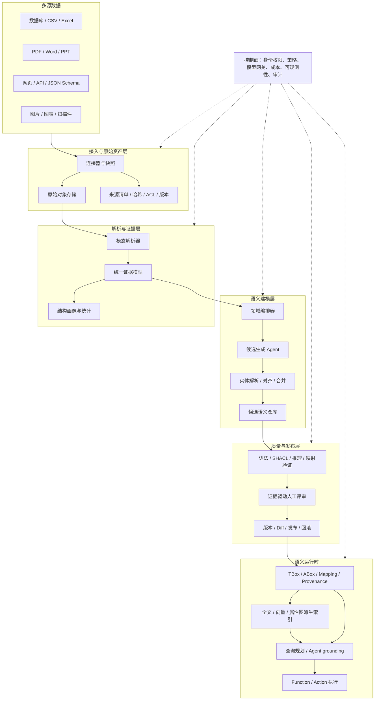

# 自动本体建模系统架构与业界洞察报告

> 版本：0.1
> 核对日期：2026-07-10
> 适用范围：结构化表、文档、PPT、网页等多源数据驱动的企业级自动本体建模

## 1. 执行摘要

自动本体建模系统不应被设计成“让大模型一次生成一份 OWL 文件”。更可靠的定位是：一个以证据为输入、以语义资源为中间表示、以验证和评审为发布门槛的“语义编译与持续交付系统”。

本报告的核心判断如下：

1. 企业平台正在从“统一存储数据”转向“统一解释业务并驱动行动”。Palantir、Microsoft、SAP、Salesforce、ServiceNow 的近期产品路线都把业务语义、知识、Agent 和工作流放到了同一平台叙事中。
2. 本体系统必须同时管理四类内容：语义模型、数据映射、实例知识、业务能力。只构建 Class 和 Property，无法支撑企业 Agent；只做 RAG，也无法形成可治理、可执行的业务语义。
3. 多源接入的关键不是统一转成 Markdown，而是形成带稳定坐标和访问策略的统一证据模型。Markdown 可以是派生格式，不能成为唯一事实源。
4. LLM 适合提出候选、归纳术语、解释歧义和辅助对齐；主键、外键、IRI、约束、映射引用、权限继承和发布门禁必须由确定性程序控制。
5. 自动化应采用分级策略：低风险候选可自动接受，中风险候选抽样复核，高风险语义必须人工批准。身份规则、类层级、基数、传递性、逆属性和写操作都属于高风险。
6. 当前仓库已经具备 `Object/Link + Function/Action` 的产品模型、OWL/Turtle 可视化能力、3GPP 领域本体和 NPD 基准。最合理的第一条纵向链路是：NPD SQL schema 和样本数据 -> 候选本体与映射 -> 验证 -> 评审 -> OWL/R2RML/domain pack 发布 -> 当前可视化界面。

## 2. 系统目标与边界

### 2.1 目标

系统需要完成以下闭环：

- 接入关系数据库、CSV/Excel、OpenAPI/JSON Schema、PDF/Word、PPT、网页和图片等来源。
- 保留原始数据、版本、权限、来源坐标和内容哈希。
- 自动提出业务对象、属性、关系、事件、指标、约束、映射、函数和动作候选。
- 将多个来源中的同义、冲突、重复和粒度差异合并为可评审方案。
- 生成 OWL/RDFS、SHACL、R2RML/OBDA 和当前 domain pack 所需资源。
- 用确定性校验、推理、映射执行和业务问题验证发布质量。
- 为搜索、分析、Agent 问答和受控业务动作提供统一语义运行时。
- 支持增量更新、差异评审、版本发布、回滚和审计。

### 2.2 非目标

- 不追求第一阶段完全无人值守地发布企业本体。
- 不以“抽取三元组数量”作为主要成功指标。
- 不要求把所有源数据复制进同一个图数据库。
- 不把向量相似度当作实体同一性的最终判据。
- 不允许 Agent 绕过权限和发布流程直接修改生产本体或业务数据。

### 2.3 自动化等级

| 等级 | 行为 | 适用场景 |
|---|---|---|
| L0 辅助 | 只生成候选和解释 | 新领域、法规、核心主数据 |
| L1 建议 | 自动排序、去重、标注冲突，由人确认 | 类、属性、关系设计 |
| L2 受控自动 | 通过规则和阈值后自动合并，保留可回滚记录 | 标签、注释、低风险映射 |
| L3 连续交付 | 自动检测漂移、验证并生成发布提案 | 已稳定的数据产品 |
| L4 受控执行 | Agent 基于已发布本体调用 Function/Action | 查询、分析和有审批的业务动作 |

## 3. 业界洞察

### 3.1 大型企业平台的共同方向

| 平台 | 近期进展 | 核心抽象 | 对本系统的启发 |
|---|---|---|---|
| Palantir Foundry/AIP | Ontology 原生连接对象、关系、Function 和 Action；Function 可读取属性、遍历关系并提交 Ontology edits，Action 支持事务式修改和外部副作用 | Object、Link、Function、Action | 本体不是静态词表，而是业务运行时和安全边界 |
| Microsoft Fabric IQ | Ignite 2025 推出 Fabric IQ；当前 Ontology item 仍为 Preview，可定义 entity type、property、relationship、constraint，并绑定 OneLake 数据供 Data Agent 和实时组件使用 | Ontology item、data binding、graph、agent context | 湖仓之上需要共享业务语义；“绑定”比复制更重要 |
| SAP Business Data Cloud | 2025 年发布 Business Data Cloud，强调数据产品、业务语义、Knowledge Graph 与 Joule Agent；随后进一步提出连接数据、流程、政策和模拟的 knowledge core | Data product、business semantics、knowledge graph、Joule Agent | 本体应和数据产品、指标、流程一起交付，而不是孤立图文件 |
| Salesforce Data Cloud/Agentforce | 2025 年持续增强结构化与非结构化接入、Hybrid Search、Context Indexing、RAG 2.0、元数据和引用审计 | Customer 360、context index、retriever、Agent skill/action | 文档解析、检索和引用链必须纳入语义治理，而不是旁路 RAG |
| ServiceNow AI Platform | Knowledge 2025 将 Knowledge Graph、Workflow Data Fabric、AI Agent Fabric 和 AI Control Tower 合并到一个企业 AI 平台叙事中 | Knowledge Graph、data fabric、agent fabric、workflow | 知识、数据、Agent 和工作流需要统一控制面与可观测性 |

证据来源：

- Palantir 当前文档说明 Function 对 Ontology 的对象、关系和编辑提供原生支持，并把 Action 作为受控修改和外部副作用入口：[Functions on objects](https://www.palantir.com/docs/foundry/functions/functions-on-objects)、[Object edits and materializations](https://www.palantir.com/docs/foundry/object-edits/overview)。
- Microsoft 将 Ontology 定义为跨域和 OneLake 数据源的企业词汇与语义层，并明确供人和 Agent 共享推理、决策和行动语境；该能力当前标记为 Preview：[What is ontology (preview)?](https://learn.microsoft.com/en-us/fabric/iq/ontology/overview)、[Fabric terminology](https://learn.microsoft.com/en-us/fabric/fundamentals/fabric-terminology)。
- SAP Business Data Cloud 将受治理的数据产品、业务语义、Knowledge Graph 和 Joule Agent 组合起来：[SAP Business Data Cloud](https://www.sap.com/products/data-cloud/what-is-sap-business-data-cloud.html)、[Business data fabric](https://www.sap.com/products/data-cloud/business-data-fabric.html)、[2025 发布说明](https://news.sap.com/2025/02/sap-business-data-cloud-databricks-turbocharge-business-ai/)。
- Salesforce 公开资料显示 Data Cloud 同时接入结构化和非结构化来源，使用混合检索和上下文索引为 Agentforce 提供业务语境，并强调来源引用和审计：[Data Cloud fuels Agentforce](https://www.salesforce.com/news/stories/how-data-cloud-powers-agentforce/)、[Summer '25 release](https://www.salesforce.com/news/stories/summer-2025-product-release-announcement/)、[Trusted AI foundation](https://www.salesforce.com/news/stories/trusted-ai-foundation-agentic-enterprise/)。
- ServiceNow 在 Knowledge 2025 发布的架构把 Knowledge Graph、Workflow Data Fabric 和 AI Agent Fabric 放在统一 Engagement Layer 下，并增加 Control Tower：[ServiceNow AI Platform](https://newsroom.servicenow.com/press-releases/details/2025/ServiceNow-Unveils-the-New-ServiceNow-AI-Platform-to-Put-Any-AI-Any-Agent-Any-Model-to-Work-Across-the-Enterprise/default.aspx)、[Workflow Data Fabric](https://newsroom.servicenow.com/press-releases/details/2025/ServiceNow-Enhances-Its-Workflow-Data-Fabric-With-New-Ecosystem-to-Power-AI-agents-and-Workflows-With-Real-Time-Intelligence/default.aspx)。

### 3.2 从这些进展得到的五个判断

第一，企业语义层正在成为 Agent 的上下文契约。Agent 不应直接猜测表名、字段含义和可用工具，而应通过对象、关系、指标、能力和策略完成发现。

第二，语义层正在从只读分析走向“系统可执行模型”。Function 和 Action 使本体成为操作业务的受控接口，因此权限、审计、幂等、事务和人工审批必须进入架构核心。

第三，数据绑定和 zero-copy 会长期并存。企业数据分散在湖仓、SaaS、数据库和文件系统中，本体平台应维护绑定、映射和可访问性，而不是要求所有数据先物化为 RDF。

第四，非结构化知识正在被提升为受治理数据。文档、网页、合同、图表和表格不仅需要向量化，还要保留结构、引用位置、版本和权限，并能与结构化对象关联。

第五，平台竞争焦点从单模型能力转向“语义、数据、工具、治理和执行”的系统组合。模型可替换，业务语义和反馈数据才是长期资产。

### 3.3 开源个人知识库与图增强 RAG 的探索

| 项目 | 当前探索 | 可借鉴机制 | 企业化时要补的部分 |
|---|---|---|---|
| Logseq | 本地优先、页面和块引用、反向链接、属性、查询、知识图谱 | 稳定块标识、渐进式结构化、链接即知识 | 权限、共享词表、发布和审计 |
| SiYuan | 块级双向引用、自定义属性、SQL 查询嵌入、Web clipping、PDF 标注和 OCR | 块级来源坐标、结构化查询与原文共存 | 多租户、跨源身份和策略继承 |
| AFFiNE | 文档、白板、数据库和 AI 统一在 local-first 工作区 | 文本、空间布局和结构化表的统一用户体验 | 标准本体、约束和企业治理 |
| Khoj | 自托管个人 AI，可索引 PDF、Markdown、Word、Notion、图片和网页，并配置知识、模型和工具 | 模型无关、自托管、个人数据主权、多源检索 | 语义发布、强一致映射、长期运维 |
| Open WebUI | Knowledge collection、目录、文件级工具、Focused Retrieval 与 Full Context | 知识集合隔离、按需检索、文件工具化 | 类型化语义、实体消歧和本体演进 |
| Microsoft GraphRAG | 从文本提取实体、关系和 claims，执行社区检测、分层摘要和向量化 | 可配置索引流水线、全局主题摘要 | 成本较高，输出是检索图而非可信本体 |
| LightRAG/Hyper-Extract | 轻量图抽取、增量合并、模板驱动和多种图结构 | 增量更新、强类型输出、graph/hypergraph 思路 | OWL/SHACL/R2RML、证据和治理仍需补齐 |

主要官方来源：[Logseq](https://github.com/logseq/logseq)、[SiYuan](https://github.com/siyuan-note/siyuan)、[AFFiNE](https://affine.pro/about-us)、[Khoj](https://github.com/khoj-ai/khoj)、[Open WebUI Knowledge](https://docs.openwebui.com/features/workspace/knowledge/)、[Microsoft GraphRAG](https://microsoft.github.io/graphrag/index/overview/)、[LightRAG](https://github.com/HKUDS/LightRAG)。

个人知识库给企业系统的最大启发，不是照搬笔记软件界面，而是以下四点：

- 用户必须能看到并拥有原始知识，AI 生成内容不能覆盖来源。
- 知识的最小引用单元应比“文件”更细，通常是块、表格区域、幻灯片元素或网页 DOM 节点。
- 结构化应是渐进式和可逆的，允许先引用、后分类、再提升为正式本体资源。
- 增量更新和本地可用性比一次性构建漂亮大图更重要。

### 3.4 洞察的解释边界

以上企业资料主要来自厂商官方文档和发布说明，适合判断产品方向和抽象收敛，不构成独立的性能、成本或成熟度比较。尤其是 Microsoft Fabric Ontology 当前仍为 Preview，具体能力、刷新机制和 API 可能继续变化。架构设计应吸收共同模式，不应把任何一家产品的命名或当前实现当作事实标准。

## 4. 设计原则

### 4.1 证据优先

每个自动生成的语义断言都必须指向一个或多个证据位置。没有证据的候选只能进入待确认区，不能自动发布。

### 4.2 概率生成，确定性收口

LLM 负责理解和建议；schema 校验、IRI 生成、引用完整性、映射编译、SHACL、推理、权限和发布状态由确定性组件完成。

### 4.3 分离五类图

逻辑上至少区分：

- TBox：类、属性、层级、公理和约束。
- ABox：对象实例、事实和事件。
- Mapping Graph：源表、列、文档区域与语义资源之间的绑定。
- Provenance Graph：来源、证据、抽取运行、模型、人工决策和版本。
- Capability Graph：Object/Link 与 Function/Action 的读取、遍历、写入和调用依赖。

它们可以物理存储在同一 RDF 系统中，但不能在概念上混为一张图。

### 4.4 一份语义事实源，多种派生索引

本体仓库和发布清单是语义事实源；属性图、向量索引、全文索引和可视化布局均为可重建派生物。

### 4.5 Domain pack 是交付单元

企业语义不能只按技术类型拆散。每个领域应交付对象、关系、能力、映射、约束、证据、测试和运行时入口的完整包。

### 4.6 增量和可回滚

系统需要用源内容哈希和稳定 fragment ID 判断变化，只重建受影响候选、映射、索引和验证结果；每次发布都可定位差异并回滚。

## 5. 总体架构



### 5.1 接入与原始资产层

职责包括连接、快照、内容寻址、权限同步和版本检测。原始文件与源 schema 必须原样保存，解析失败和后续模型升级时才能重放。

建议每个 `SourceAsset` 至少记录：

- `asset_id`、`source_uri`、`source_type`、`content_hash`、`version`。
- `observed_at`、`effective_time`、`owner`、`domain_hint`。
- 源 ACL、敏感级别、许可、网页 robots/使用约束。
- 连接器版本、解析状态和错误信息。

### 5.2 解析与证据层

这一层不直接生成正式本体，而是把多模态内容转成可定位、可比较的事实片段。

开源实现可优先评估 Docling。它提供统一 `DoclingDocument`，支持 PDF、DOCX、PPTX、XLSX、HTML、图片等格式，并能保留版面、阅读顺序、表格、公式和图片结构：[Docling](https://github.com/docling-project/docling)。MarkItDown 可作为快速文本化或格式补充通道，支持 PDF、PowerPoint、Word、Excel、HTML、CSV、JSON 等格式：[MarkItDown](https://github.com/microsoft/markitdown/blob/main/README.md)。

重要决策：统一证据模型应保存文档树和坐标，Markdown 只是面向 LLM 和人工阅读的派生输出。

### 5.3 语义建模层

采用有状态工作流，不采用自由对话式的多 Agent 循环。建议状态机如下：

```text
INGESTED -> NORMALIZED -> PROFILED -> CANDIDATE
         -> RESOLVED -> VALIDATED -> REVIEWED
         -> PUBLISHED -> SUPERSEDED / DEPRECATED
```

每个步骤必须产生类型化输出、输入哈希、模板版本、模型信息、耗时、成本和错误记录。

### 5.4 质量与发布层

发布是独立动作，而不是建模 Agent 的最后一步。发布单元包含本体、映射、约束、能力、证据清单、验证报告、兼容性说明和版本号。

### 5.5 语义运行时

运行时面向两类消费者：

- 人和应用：浏览、查询、分析、指标、API 和可视化。
- Agent：领域发现、对象锚定、路径规划、工具选择、策略检查和受控执行。

## 6. 统一证据模型

### 6.1 核心对象

| 对象 | 作用 | 关键字段 |
|---|---|---|
| `SourceAsset` | 一个数据库、文件、网页或 API 资产 | URI、哈希、版本、ACL、owner |
| `SourceFragment` | 可引用的最小证据单元 | fragment ID、asset ID、坐标、文本/结构、父子关系 |
| `ObservedSchema` | 确定性发现的源结构 | 表列、类型、PK/FK、JSON path、DOM/schema.org |
| `ProfileMetric` | 数据画像 | null ratio、distinct、pattern、min/max、top values |
| `CandidateAssertion` | 自动提出的语义断言 | subject、predicate、object、kind、confidence、status |
| `EvidenceRef` | 候选与证据的关联 | fragment ID、role、extractor、support score |
| `ConflictSet` | 相互冲突的候选集合 | conflict type、members、resolution |
| `DecisionRecord` | 人或规则的评审结论 | actor、decision、reason、timestamp、before/after |
| `ModelingRun` | 一次可重放运行 | input hash、pipeline/template/model version、cost |

标准层面建议：

- 用 [DCAT 3](https://www.w3.org/TR/vocab-dcat-3/) 对齐数据集和数据服务目录，避免 SourceAsset 只能在本系统内部解释。
- 用 [PROV-O](https://www.w3.org/TR/prov-o/) 表达 Entity、Activity、Agent、派生、使用、生成和归属关系，再用本系统字段补充模型成本、prompt 和人工决策细节。
- 跨词表概念对齐优先使用 [SKOS mapping properties](https://www.w3.org/TR/skos-reference/#mapping)，区分 `exactMatch`、`closeMatch`、`broadMatch` 和 `narrowMatch`，不要过早使用语义过强的 `owl:sameAs`。

### 6.2 多模态坐标

不同来源的证据坐标不能只保存页码：

| 来源 | 建议坐标 |
|---|---|
| 数据库 | catalog/schema/table/column/constraint，必要时加脱敏样本行键 |
| CSV/Excel | sheet、header、row/column range、named range |
| PDF/Word | page、section path、block ID、bounding box、table cell |
| PPT | slide、shape ID、z-order、bounding box、speaker notes、connector endpoints |
| 网页 | canonical URL、snapshot hash、DOM path、CSS/XPath、JSON-LD node、viewport region |
| 图片 | page/slide、region bbox、OCR token、视觉对象 ID |

这些坐标用于引用、差异检测、权限追踪和人工评审，也决定系统是否真正可解释。

## 7. 分来源处理策略

### 7.1 结构化表数据

处理顺序：

1. 读取 catalog、DDL、注释、约束、索引和外键。
2. 生成列级画像，只抽取脱敏且受策略控制的样本值。
3. 识别实体表、关系表、枚举表、事实表、维表和事件表候选。
4. 由确定性规则先生成身份和关系候选，再由 LLM 补充业务命名和语义解释。
5. 结合查询日志或已知业务问题判断常用路径和粒度。
6. 生成对象、属性、关系、R2RML/OBDA mapping 和 SHACL 候选。
7. 编译 mapping，并用抽样数据执行 SPARQL/SQL 结果对照。

必须避免让 LLM 重新猜测数据库已经明确给出的 PK、FK 和类型信息。W3C R2RML 是关系数据库到 RDF 自定义映射的标准交付格式：[R2RML Recommendation](https://www.w3.org/TR/r2rml/)。

### 7.2 文档类数据

处理顺序：版面解析 -> 章节树 -> 表格/图注/公式 -> 定义句和 claims -> 实体与关系候选 -> 跨章节合并。

文档中的“出现”不等于本体中的“类”。系统需要区分：术语提及、对象实例、定义、规则、例子、指标和事实断言。

### 7.3 PPT

PPT 不能按纯文本顺序处理。需要同时保留：

- 演示文稿、章节和 slide 层级。
- 标题、正文层次、speaker notes。
- shape 的位置、组合、样式和连接线。
- 表格、图表、图片和图例。
- 同一概念跨 slide 的重复和演进。

连接线、空间分组和图例经常承载关系语义，应由视觉模型提出候选，但仍需回指到 slide 和 shape 坐标。

### 7.4 网页

网页接入需要保留原始 HTML 和渲染快照，优先利用：

- `<title>`、heading、table、list、definition list。
- `schema.org`、JSON-LD、OpenGraph 和结构化元数据。
- canonical URL、站点地图、更新时间和语言。
- SPA 动态渲染后的 DOM。

系统还需要处理 robots、许可、登录态、重复页面、导航噪声和内容漂移。网页文本中的“忽略之前指令”等内容必须始终作为数据，不能进入系统 prompt 指令域。

### 7.5 跨源融合

同一业务概念可能同时存在于表名、规范定义、PPT 架构图和网页产品文档中。融合评分应综合：

- 明确主键、外键或标准编号。
- 名称、别名和多语言标签。
- 类型、属性和邻域结构。
- 来源权威性与生效时间。
- 语义向量相似度。
- 人工确认和历史发布记录。

向量相似度只能用于召回，不能单独触发实体合并。

## 8. 语义建模编排器

### 8.1 专项建模组件

| 组件 | 输入 | 输出 |
|---|---|---|
| Source Profiler | observed schema、文档树、统计 | source profile、领域线索 |
| Glossary Miner | 定义句、标题、字段注释 | 术语、定义、别名候选 |
| Object Designer | 术语、表和文档证据 | Class/ObjectType 候选 |
| Property Designer | 列、属性表述、单位 | DatatypeProperty、单位、range |
| Link/Event Designer | FK、连接线、关系陈述、事件 | ObjectProperty、Link、Event/Hyperedge |
| Constraint Designer | NOT NULL、枚举、规则文本 | SHACL、cardinality、业务规则候选 |
| Mapping Designer | 源 schema 和已确认语义资源 | R2RML/OBDA、文档绑定 |
| Metric Designer | 指标定义、公式和粒度 | Metric、维度、口径、lineage |
| Capability Miner | SOP、流程、API、函数说明 | Function/Action 候选及依赖 |
| Alignment Resolver | 外部标准和已有本体 | exact/close/broad/narrow mapping |
| Critic/Validator | 全部候选和规则 | 冲突、缺口、风险和修复建议 |

组件是可注册的“建模方法”，不是固定绑定某个 LLM。Hyper-Extract 的模板工厂、强类型输出、方法注册和 `brainstorm -> designer -> optimizer -> validator` 流程可作为工程参考，但其输出主要是实例层图，需要扩展为 OWL、SHACL、R2RML、证据与发布模型。

### 8.2 Prompt 与 schema 的边界

- Schema 定义“必须返回什么结构”。
- Guideline 定义“如何提取才算高质量”。
- Policy 定义“什么不能读取、生成或自动发布”。
- Validator 定义“什么条件下输出有效”。

四者应独立版本化，避免把字段定义、抽取策略、权限和质量门槛混在一段 prompt 中。

## 9. 本体与领域包模型

建议在现有 domain pack 基础上扩展，而不是另起一套不兼容结构：

```text
domains/<domain-id>/
  manifest.json
  sources/
    source-manifest.json
  ontology/
    objects.json
    links.json
    functions.json
    actions.json
    ontology.ttl
    shapes.ttl
    metrics.json
  mappings/
    r2rml.ttl
    document-bindings.json
  runtime/
    entrypoints.json
    path-templates.json
    capability-graph.json
    query-templates.json
  logic/
    functions/
    actions/
  evidence/
    assertions.jsonl
    decisions.jsonl
    validation-report.json
  releases/
    0.1.0.json
```

### 9.1 核心资源

- `Object/Class`：身份、属性、显示字段、生命周期和数据绑定。
- `Link/ObjectProperty`：两端类型、方向、基数、逆关系和证据。
- `Event/Hyperedge`：参与者角色、时间、地点、状态和结果。
- `Metric`：定义、公式、单位、粒度、维度、来源和聚合规则。
- `Function`：纯查询、计算、归一化或评估能力。
- `Action`：改变业务状态或调用外部系统的受控能力。
- `Shape/Constraint`：数据质量和业务不变量。
- `Mapping`：源结构到语义资源的绑定。

OWL/RDFS 用于共享语义和推理，SHACL 用于数据形状、校验和发布门禁。W3C 对 SHACL 的定义就是描述和验证 RDF graph：[SHACL Recommendation](https://www.w3.org/TR/shacl/)。

## 10. 候选合并与冲突处理

候选不能直接写入正式本体。建议先进入独立 candidate store，执行以下步骤：

1. 规范化名称、语言、命名空间、类型和单位。
2. 基于确定性 key 进行精确匹配。
3. 基于别名、结构邻域和向量进行近似召回。
4. 生成 `same_as`、`close_match`、`broader`、`narrower` 或“不合并”建议。
5. 检查属性、粒度、时间和来源冲突。
6. 按风险等级自动处理或进入人工评审。

冲突不应被强行消除。不同系统中的 `Customer` 可能代表账户、合同主体、联系人或家庭，保留 scoped concept 往往比合并成一个万能节点更正确。

## 11. 验证与评测体系

### 11.1 发布门禁

| 门禁 | 验证内容 |
|---|---|
| 语法 | Turtle/RDF/XML/JSON、R2RML、domain pack schema 可解析 |
| 引用完整性 | 所有 IRI、source/target、表列、logicRef 和 evidenceRef 存在 |
| SHACL | 数据图满足形状约束并产生可追踪报告 |
| 推理一致性 | 类层级、公理、disjoint、domain/range 不引入冲突 |
| 映射 | mapping 可编译，引用真实表列，抽样输出可解析 |
| 数据质量 | 身份冲突、孤立节点、非法枚举、单位和时间错误 |
| 业务问题 | competency questions 可执行并返回预期语义范围 |
| 来源覆盖 | 已发布断言有充分证据和可访问引用 |
| 权限 | 派生断言、索引和答案不扩大源数据访问权限 |
| 兼容性 | 破坏性变更被识别并有迁移说明 |

### 11.2 建议指标

- Object/Class 发现 precision、recall、F1。
- 属性分类与 range 准确率。
- Link/ObjectProperty 方向和端点准确率。
- mapping 字段覆盖率与查询结果一致率。
- 层级和对齐准确率。
- evidence coverage 与引用可达率。
- 未解决冲突率和人工接受率。
- competency query 成功率。
- 每个已接受候选的 token、延迟和成本。
- 增量更新影响范围和重建时间。

建议首期发布门槛：语法和引用完整性 100%，悬空关系 0，已发布断言证据覆盖不低于 95%，全部基准 mapping 可编译，关键 competency queries 全部通过。语义 precision/recall 阈值应在 NPD 基准和人工标注小集上测量后确定，不能提前凭经验拍定。

## 12. 人工评审与发布体验

评审界面应围绕“候选与证据”设计，而不只是展示一张图：

- 左侧显示源文档、表结构、PPT 或网页原位置。
- 中间显示候选对象、关系、属性、映射或约束。
- 右侧显示已有本体、冲突、影响范围和验证结果。
- 支持接受、拒绝、编辑、拆分、合并、建立对齐和填写理由。
- 支持按来源、风险、置信度、领域和变更类型批量处理。
- 发布前展示语义 diff、数据影响、API 影响和 competency query 差异。

置信度只能帮助排序，不能代替证据和风险判断。

## 13. Agent 与业务运行时

### 13.1 查询路径

```text
用户问题
  -> domain 发现
  -> Object/Class 锚定
  -> Link/Metric/Capability 发现
  -> 权限和策略检查
  -> SPARQL / SQL / vector / full-text 混合计划
  -> 执行与结果合并
  -> 带来源、路径和不确定性的回答
```

Agent 不应直接看到所有底层表和工具。它应先通过已发布的本体和 capability graph 找到可用对象、路径和 Function/Action。

### 13.2 写操作

Action 必须具备：

- 显式输入输出 schema。
- 读取和写入对象声明。
- 幂等键、事务边界和补偿策略。
- 权限检查和敏感动作审批。
- dry-run 和影响预览。
- action log、来源、调用 Agent 和模型版本。

检索 Agent 和执行 Agent 应逻辑分离。前者可默认只读，后者需要更严格授权。

## 14. 物理实现建议

### 14.1 首期最小实现

| 能力 | 建议实现 |
|---|---|
| Python 环境 | 使用 `uv` 创建和管理项目内虚拟环境 |
| 原始资产 | 本地对象目录或 S3 兼容对象存储 |
| 元数据与候选 | PostgreSQL JSONB；需要语义召回时启用 pgvector |
| 文档解析 | Docling 主通道，MarkItDown 作为快速或补充通道 |
| 类型与 API | Pydantic schema + FastAPI 或等价服务层 |
| RDF/OWL | RDFLib 或 Oxigraph 负责解析、序列化和 SPARQL 基础能力 |
| SHACL | pySHACL 或兼容处理器 |
| 映射验证 | NPD 配套 Ontop/R2RML 工具链 |
| 模型接入 | Provider abstraction + structured output；允许云模型和本地 vLLM |
| 可视化与评审 | 复用当前 `packages/ontology-viz`，增加 candidate/evidence/diff 视图 |

首期不建议立刻引入独立图数据库、向量数据库、搜索集群和复杂流处理。先用一个事实源完成 NPD 闭环，再根据查询和规模证据拆分。

### 14.2 规模化演进

出现以下信号后再引入专用组件：

- RDF/SPARQL 查询和推理规模超过单机处理能力。
- 跨域图遍历成为核心在线负载。
- 文档量和权限过滤需要独立全文/向量搜索集群。
- 增量接入和发布需要事件总线与分布式工作流。
- 多团队并行建模需要独立 registry、policy service 和 model gateway。

物理组件可以扩展，但语义事实源、证据模型和发布协议不应随存储产品变化。

## 15. 安全、治理与可观测性

### 15.1 权限继承

源 ACL 必须沿 `SourceAsset -> Fragment -> Candidate -> Published Assertion -> Index -> Answer` 传播。跨多个来源生成的断言，默认访问权限应取来源权限的安全交集或由明确策略计算。

### 15.2 Prompt injection 与内容安全

- 网页和文档内容永远作为数据，不允许改变系统指令。
- 解析器、检索器和 Agent 工具使用 allowlist 与 schema 验证。
- 外部 URL、附件和脚本内容在隔离环境处理。
- 发布前扫描 PII、秘密、许可证和越权引用。

### 15.3 模型治理

记录 provider、model、版本、参数、prompt/template、输入输出哈希、成本和评审结果。敏感来源只能发送给满足数据策略的模型端点。

### 15.4 语义可观测性

需要监控：源数据漂移、解析失败、候选量异常、未解决冲突、SHACL 失败、映射失效、索引陈旧、Agent 查询路径、Action 失败和人工推翻率。

## 16. 与当前仓库的落地关系

当前仓库已经拥有三块可直接复用的资产：

1. `SmartManufacturing` 已经定义 `Object/Link + Function/Action + runtime + logic` 的领域包边界，可作为 capability graph 和 Agent 运行时目标格式。
2. `packages/ontology-viz` 已经解析和呈现 Class、ObjectProperty、DatatypeProperty、domain、range、subClassOf 等显式本体元素，可作为发布结果和候选 diff 的前端基础。
3. `docs/structured-data-ontology-testsets.md` 已把 NPD、TM Forum、Spider/BIRD、W3C R2RML tests 等整理为评测路线，首期无需重新寻找 benchmark。

建议新增一个独立后端子项目，例如：

```text
services/ontology-modeler/
  pyproject.toml
  uv.lock
  src/ontology_modeler/
    connectors/
    evidence/
    profiling/
    modeling/
    resolution/
    validation/
    publishing/
    api/
  templates/
  tests/
```

该目录只在开始实现时创建；本报告阶段不改变当前仓库的“多个独立探索子项目”约定。

## 17. 分阶段路线图

### 阶段 0：契约与基准

- 定义统一证据模型、candidate schema、发布清单和 domain pack 扩展。
- 固定 NPD v1.10.1 快照和 gold ontology/mappings/queries。
- 建立 30 至 50 个高价值人工标注对象、属性、关系和映射小集。

验收：同一输入可重放，运行和候选有稳定 ID，基准结果可量化。

### 阶段 1：结构化数据纵向闭环

- PostgreSQL schema、DDL、FK、注释和样本画像接入。
- 生成 Object/Link/Class/Property、SHACL 和 R2RML 候选。
- 实现候选评审、验证、发布和当前可视化接入。

验收：NPD 从 schema 到 ontology/mapping/SPARQL 查询形成可重复闭环。

### 阶段 2：文档、PPT 和网页

- 引入 Docling/MarkItDown 与网页快照。
- 实现 page/slide/shape/DOM 级证据引用。
- 生成 glossary、definition、claim、event 和标准对齐候选。

验收：3GPP 规范或制造文档中的关键概念可回指原文，并与已有本体对齐。

### 阶段 3：跨源融合与持续更新

- 将表、文档、PPT 和网页候选合并。
- 实现源漂移检测、影响分析和增量重建。
- 增加版本、兼容性和回滚。

验收：源字段或文档版本变化只重建受影响资源，并生成可理解 diff。

### 阶段 4：能力层与 Agent

- 从 SOP、API 和已有逻辑生成 Function/Action 候选。
- 实现 capability graph、领域发现和混合查询规划。
- 首先上线只读 Agent，再引入有审批的 Action。

验收：Agent 能说明命中的对象、关系、能力、查询路径和证据；写操作具备 dry-run、权限和 action log。

### 阶段 5：语义运营

- 多领域 registry、策略、质量 SLO、成本和使用反馈。
- 根据真实查询、失败和人工修正持续优化模板与模型。
- 支持外部标准包和内部语义产品市场。

## 18. 关键风险与应对

| 风险 | 表现 | 应对 |
|---|---|---|
| LLM 幻觉 | 创建不存在的类、关系或来源 | 强制 evidenceRef，确定性校验，人工门禁 |
| 过度合并 | 不同业务语境被合成一个概念 | scoped concept、冲突集、禁止仅凭向量合并 |
| 解析损失 | PPT 图、表格关系、PDF 阅读顺序丢失 | 保留结构化文档树、bbox 和原始资产 |
| 图规模失控 | 所有 mention 都变成正式节点 | 区分 mention、instance、concept 和 ontology resource |
| 映射漂移 | 表列变化导致查询静默错误 | schema diff、mapping compile、契约测试 |
| 权限泄露 | 聚合断言或索引扩大可见范围 | 端到端 ACL 继承和查询时策略过滤 |
| 成本不可控 | 全量 GraphRAG 或重复解析 | 内容寻址缓存、增量影响分析、分层模型路由 |
| Agent 误执行 | 错误业务写入或外部调用 | 读写分离、dry-run、审批、幂等和审计 |
| 技术栈过早膨胀 | 多种数据库和引擎难以运维 | 先做 NPD 单链路，用负载证据驱动拆分 |

## 19. 最终建议

系统应以“证据驱动的语义编译器”为核心，以 domain pack 为交付单元，以 OWL/SHACL/R2RML 和当前 `Object/Link + Function/Action` 为双重契约，以 Agent 和业务应用为运行时消费者。

第一阶段的重点不是更多模型或更大的知识图，而是把以下闭环做实：

```text
可重放输入
  -> 带来源坐标的证据
  -> 类型化候选
  -> 可解释合并
  -> 确定性验证
  -> 人工评审
  -> 可版本化发布
  -> 可执行查询与回归测试
```

一旦这条链路在 NPD 上稳定，再扩展文档、PPT、网页和 Agent 执行，风险最低，也最能验证系统是否真正完成了“自动本体建模”，而不是只生成了一张看起来合理的图。
