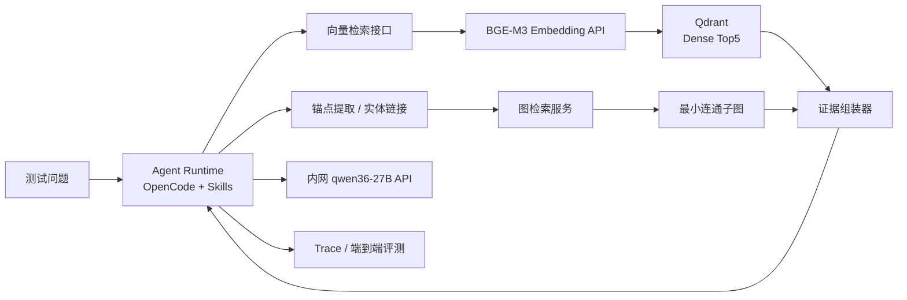

# 基于本体的 RAG 智能体测试环境部署方案

> 文档版本：1.0
> 更新日期：2026-07-24
> 适用目标：复刻真实业务本体智能体的关键链路，验证“问题到答案”的端到端结果。
> 默认技术路线：内网 Qwen API + OpenCode/Agent + BGE-M3 + Qdrant Top5 + 最小连通子图。

## 1. 目标与范围

本环境重点验证本体信息能否提升 RAG 的最终回答质量，而不是验证某个单独模型或数据库的极限性能。

需要复刻的主链路：

1. 用户提出问题。
2. Agent 调用 BGE-M3 生成查询向量。
3. Qdrant 返回向量相似度 Top5。
4. Agent 或锚点服务从问题中提取本体锚点节点。
5. 图检索服务计算连接锚点的最小连通子图。
6. 证据组装器合并向量证据和图证据。
7. 内网 `qwen36-27B` 根据证据生成答案。
8. 评测器保存最终答案、检索结果、子图、耗时及质量指标。

当前已有：

- 内网 Qwen API。
- OpenCode/Agent。
- mock 数据。
- ontology 检索、子图召回、图查询等 skill 包。

当前主要新增：

- BGE-M3 embedding 服务。
- Qdrant 向量库。
- 可重复执行的索引构建任务。
- 统一的检索接口、评测记录和迁移机制。

第一版不建议引入：

- Kubernetes。
- BGE-M3 sparse/ColBERT 混合检索。
- reranker。
- 向量量化。
- 多节点 Qdrant。
- 为了测试而在本地部署 Qwen 大模型。

这些能力会引入额外变量，应该在 dense Top5 基线跑通后通过独立实验开启。

## 2. 推荐架构



### 2.1 服务职责

| 服务 | 默认端口 | 职责 | 是否常驻 |
|---|---:|---|---|
| `rag-api` | 8000 | 对外统一入口、双路召回、证据组装、运行记录 | 是 |
| `embedding-api` | 8001 | 加载 BGE-M3，提供 OpenAI-compatible `/v1/embeddings` | 是 |
| `graph-retriever` | 8002 | 实体链接、锚点解析、最小连通子图 | 是 |
| `qdrant` | 6333/6334 | 保存 1024 维 dense 向量和 payload | 是 |
| `agent-runtime` | 4096，可选 | OpenCode 和已有 skill 的运行环境 | 视现有部署而定 |
| `indexer` | 无 | 数据规范化、切片、向量化、upsert | 一次性任务 |
| `evaluator` | 无 | 批量运行问题集，生成对比报告 | 一次性任务 |
| `neo4j` | 7474/7687，可选 | 当 skill 强依赖 Cypher 或需高保真图数据库时使用 | 可选 |

安全边界建议：

- 测试机对外只开放 `rag-api`。
- `embedding-api`、Qdrant、图服务和 Neo4j 默认只在 Compose 内部网络通信。
- 本地调试端口绑定到 `127.0.0.1`，不要直接绑定到所有网卡。
- Qwen API Key、Qdrant API Key 等凭据只放在未提交的 `runtime.env` 或密钥系统中。

## 3. 关键技术决策

### 3.1 Embedding

第一版仅使用 BGE-M3 的 dense 向量：

```yaml
model: BAAI/bge-m3
dimension: 1024
max_supported_length: 8192
recommended_chunk_length: 512-1024
normalize_embeddings: true
query_instruction: none
```

BGE-M3 官方模型卡说明其 dense 向量为 1024 维、最大序列长度为 8192，并且查询不需要添加额外 instruction：

- 模型和说明：<https://huggingface.co/BAAI/bge-m3>
- 官方代码库：<https://github.com/FlagOpen/FlagEmbedding>

虽然模型支持 8192 token，第一版切片不建议直接使用 8192。较短的 512～1024 token 切片通常更适合知识检索，也能降低索引时间和在线延迟。

### 3.2 向量库

推荐 Qdrant，原因是：

- 单节点容器即可满足测试环境。
- REST/gRPC 接口简单。
- 支持 payload 过滤。
- 支持 collection alias。
- 支持 collection snapshot，方便迁移。
- 后续可以平滑切换到集群部署。

默认集合：

```yaml
collection: ontology_chunks_v1
alias: ontology_current
vector_size: 1024
distance: Cosine
top_k: 5
score_threshold: null
quantization: disabled
```

第一版不设置 score threshold，确保按需求返回 Top5，同时记录每条命中的 score。

Qdrant 使用 Cosine 时会在上传时归一化向量，但 embedding 服务仍建议显式归一化，以保证切换向量库或调试离线相似度时结果一致。

官方资料：

- Qdrant 安装：<https://qdrant.tech/documentation/installation/>
- Collection：<https://qdrant.tech/documentation/manage-data/collections/>
- Points：<https://qdrant.tech/documentation/concepts/points/>
- 查询：<https://qdrant.tech/documentation/search/>
- Snapshot：<https://qdrant.tech/documentation/snapshots/>
- 安全配置：<https://qdrant.tech/documentation/security/>
- 官方镜像：<https://hub.docker.com/r/qdrant/qdrant>

### 3.3 图检索

默认推荐：

- mock 图规模较小时，`graph-retriever` 内部使用 NetworkX。
- 图数据从版本化的 `nodes.jsonl` 和 `edges.jsonl` 加载。
- 在无向加权投影上使用 Steiner Tree 近似算法。
- 输出时恢复原始关系方向、类型、属性和来源。

NetworkX 官方的 `steiner_tree` 返回最小 Steiner Tree 的近似结果，并支持 Mehlhorn 和 Kou 算法：

- <https://networkx.org/documentation/stable/reference/algorithms/generated/networkx.algorithms.approximation.steinertree.steiner_tree.html>

需要更接近真实业务图数据库时，启用 Neo4j profile：

- Neo4j Docker：<https://neo4j.com/docs/operations-manual/current/docker/introduction/>
- Neo4j Compose：<https://neo4j.com/docs/operations-manual/current/docker/docker-compose-standalone/>
- Directed Steiner Tree：<https://neo4j.com/docs/graph-data-science/current/algorithms/directed-steiner-tree/>
- 官方镜像：<https://hub.docker.com/_/neo4j>

图算法边界规则：

| 锚点情况 | 处理方式 |
|---|---|
| 0 个锚点 | 返回空图，继续使用向量 Top5 |
| 1 个锚点 | 返回锚点属性和受限的一跳邻域 |
| 2 个及以上锚点 | 计算近似 Steiner Tree |
| 锚点分属不连通分量 | 返回多个子图并标记 `disconnected=true` |
| 锚点过多 | 根据链接置信度截断，并记录被截断锚点 |
| 算法超时 | 返回已确认的局部证据和明确的 timeout 状态 |

建议初始保护参数：

```yaml
graph:
  max_anchors: 8
  max_hops: 4
  max_nodes: 80
  max_edges: 120
  timeout_ms: 800
  steiner_method: mehlhorn
  default_edge_cost: 1.0
```

这些值不是质量标准，应通过真实问题集调整。

### 3.4 Agent 与内网模型

OpenCode 支持接入 OpenAI-compatible 自定义 provider：

- Provider 文档：<https://opencode.ai/docs/providers>
- 配置文档：<https://opencode.ai/docs/config/>
- 源码和发布：<https://github.com/anomalyco/opencode>

项目级 `opencode.json` 示例：

```json
{
  "$schema": "https://opencode.ai/config.json",
  "provider": {
    "qwen-intranet": {
      "npm": "@ai-sdk/openai-compatible",
      "name": "Qwen Intranet",
      "options": {
        "baseURL": "{env:QWEN_BASE_URL}",
        "apiKey": "{env:QWEN_API_KEY}",
        "timeout": 600000
      },
      "models": {
        "qwen36-27B": {
          "name": "qwen36-27B"
        }
      }
    }
  },
  "model": "qwen-intranet/qwen36-27B",
  "instructions": [
    "agents/system.md",
    "agents/retrieval-policy.md"
  ]
}
```

不要把真实 API Key 写入 `opencode.json`。

## 4. 推荐项目结构

建议在仓库中新增独立应用目录：

```text
apps/ontology-rag-test/
├── README.md
├── opencode.json
├── Makefile                         # Linux/macOS 可选统一入口
├── Taskfile.yml                     # Windows/Linux 可选统一入口
├── deploy/
│   ├── compose.yaml                 # CPU/通用基础编排
│   ├── compose.gpu.yaml             # NVIDIA GPU 覆盖配置
│   ├── compose.neo4j.yaml           # 可选高保真图数据库
│   └── qdrant/
│       └── production.yaml
├── config/
│   ├── runtime.env.example
│   ├── runtime.env                  # 不提交
│   ├── retrieval.yaml
│   └── logging.yaml
├── agents/
│   ├── system.md
│   └── retrieval-policy.md
├── services/
│   ├── rag-api/
│   │   ├── pyproject.toml
│   │   ├── uv.lock
│   │   ├── Dockerfile
│   │   ├── src/ontology_rag_api/
│   │   └── tests/
│   ├── embedding-api/
│   │   ├── pyproject.toml
│   │   ├── uv.lock
│   │   ├── Dockerfile
│   │   ├── src/ontology_embedding_api/
│   │   └── tests/
│   └── graph-retriever/
│       ├── pyproject.toml
│       ├── uv.lock
│       ├── Dockerfile
│       ├── src/ontology_graph_retriever/
│       └── tests/
├── jobs/
│   ├── indexer/
│   │   ├── pyproject.toml
│   │   ├── uv.lock
│   │   ├── Dockerfile
│   │   └── src/ontology_indexer/
│   └── evaluator/
│       ├── pyproject.toml
│       ├── uv.lock
│       ├── Dockerfile
│       └── src/ontology_evaluator/
├── skills/
│   ├── ontology-search/
│   ├── subgraph-retrieval/
│   └── graph-query/
├── data/
│   ├── raw/                         # 原始 mock 数据，只读
│   ├── normalized/                  # 规范化后的索引输入
│   ├── graph/
│   │   ├── nodes.jsonl
│   │   └── edges.jsonl
│   └── eval/
│       └── eval_cases.jsonl
├── models/
│   └── bge-m3/                      # 模型文件，不提交 Git
├── manifests/
│   ├── parity-manifest.yaml         # 与真实环境的一致性清单
│   ├── data-manifest.yaml
│   ├── model-manifest.yaml
│   └── image-manifest.yaml
├── state/
│   ├── qdrant/                      # 本地持久化目录，不提交
│   └── neo4j/                       # 可选，不提交
├── snapshots/
│   ├── qdrant/
│   └── neo4j/
├── artifacts/
│   ├── runs/
│   ├── reports/
│   └── logs/
└── scripts/
    ├── bootstrap.ps1
    ├── bootstrap.sh
    ├── smoke-test.ps1
    ├── smoke-test.sh
    ├── backup.ps1
    └── restore.ps1
```

`.gitignore` 至少排除：

```gitignore
apps/ontology-rag-test/config/runtime.env
apps/ontology-rag-test/models/
apps/ontology-rag-test/state/
apps/ontology-rag-test/snapshots/
apps/ontology-rag-test/artifacts/
apps/ontology-rag-test/**/.venv/
apps/ontology-rag-test/**/__pycache__/
```

## 5. 数据契约

### 5.1 向量记录

实体、关系和原始文档需要使用同一套稳定 ID。建议向量记录包括三类：

1. `entity`：实体名称、类型、别名、描述、关键属性。
2. `relation`：主体、谓词、客体和业务语义。
3. `document`：与本体实体关联的原始业务文本切片。

Qdrant point payload：

```json
{
  "id": "UUIDv5",
  "vector": [0.0],
  "payload": {
    "text": "用于 embedding 和回答引用的文本",
    "record_type": "entity",
    "entity_ids": ["entity:123"],
    "source_id": "mock-source:456",
    "source_version": "2026-07-24",
    "ontology_version": "ontology-v1",
    "chunk_index": 0,
    "content_hash": "sha256:...",
    "title": "实体或文档标题"
  }
}
```

建议 point ID 使用 UUIDv5，由以下字段生成：

```text
source_id + record_type + chunk_index + content_hash
```

这能够保证同一批数据重复建库时 upsert 幂等。

### 5.2 图记录

节点：

```json
{
  "id": "entity:123",
  "type": "Equipment",
  "name": "设备A",
  "aliases": ["A设备"],
  "properties": {},
  "source_id": "mock-source:456"
}
```

边：

```json
{
  "id": "relation:789",
  "source": "entity:123",
  "target": "entity:456",
  "type": "DEPENDS_ON",
  "weight": 1.0,
  "properties": {},
  "source_id": "mock-source:456"
}
```

图节点 ID 必须与向量 payload 中的 `entity_ids` 完全一致。

### 5.3 评测记录

```json
{
  "case_id": "case-001",
  "question": "问题文本",
  "reference_answer": "参考答案",
  "required_facts": ["必须覆盖的事实1", "必须覆盖的事实2"],
  "expected_entities": ["entity:123"],
  "expected_relations": ["relation:789"],
  "expected_sources": ["mock-source:456"],
  "tags": ["multi-hop", "ontology"]
}
```

## 6. 配置文件

`config/runtime.env.example` 建议包含：

```dotenv
# 内网 Qwen
QWEN_BASE_URL=http://qwen-intranet.example.local/v1
QWEN_API_KEY=replace-me
QWEN_MODEL=qwen36-27B

# Embedding
EMBEDDING_MODEL=BAAI/bge-m3
EMBEDDING_MODEL_PATH=/models/bge-m3
EMBEDDING_MODEL_REVISION=replace-with-huggingface-commit-sha
EMBEDDING_DIMENSION=1024
EMBEDDING_MAX_LENGTH=1024
EMBEDDING_BATCH_SIZE=8
EMBEDDING_NORMALIZE=true
EMBEDDING_DEVICE=cpu
EMBEDDING_DTYPE=float32

# Qdrant
QDRANT_URL=http://qdrant:6333
QDRANT_API_KEY=replace-me
QDRANT_COLLECTION=ontology_chunks_v1
QDRANT_ALIAS=ontology_current
VECTOR_TOP_K=5
VECTOR_SCORE_THRESHOLD=
VECTOR_EXACT_SEARCH=true

# 图检索
GRAPH_MAX_ANCHORS=8
GRAPH_MAX_HOPS=4
GRAPH_MAX_NODES=80
GRAPH_MAX_EDGES=120
GRAPH_TIMEOUT_MS=800
GRAPH_STEINER_METHOD=mehlhorn

# 运行
LOG_LEVEL=INFO
ANSWER_TEMPERATURE=0
EVIDENCE_MAX_TOKENS=6000

# 镜像必须在验证后替换为明确 tag 或 digest
QDRANT_IMAGE=qdrant/qdrant@sha256:replace-with-verified-digest
NEO4J_IMAGE=neo4j@sha256:replace-with-verified-digest
```

`manifests/parity-manifest.yaml`：

```yaml
environment_name: ontology-rag-test
baseline_date: 2026-07-24

llm:
  model: qwen36-27B
  base_url: redacted
  temperature: 0
  prompt_hash: replace-me

skills:
  ontology_search_hash: replace-me
  subgraph_retrieval_hash: replace-me
  graph_query_hash: replace-me

embedding:
  model: BAAI/bge-m3
  revision: replace-with-commit-sha
  dimension: 1024
  normalize: true
  max_length: 1024
  dtype: float32

vector_search:
  collection: ontology_chunks_v1
  distance: Cosine
  top_k: 5
  exact: true
  score_threshold: null

graph_search:
  algorithm: approximate-steiner-tree
  implementation: networkx
  method: mehlhorn
  directed_projection: undirected
  timeout_ms: 800

data:
  ontology_version: ontology-v1
  source_manifest_hash: replace-me
```

## 7. Docker Compose 参考

以下是 `deploy/compose.yaml` 的建议骨架。实际镜像构建前需要实现相应服务目录。

```yaml
name: ontology-rag-test

services:
  qdrant:
    image: ${QDRANT_IMAGE}
    restart: unless-stopped
    ports:
      - "127.0.0.1:6333:6333"
      - "127.0.0.1:6334:6334"
    volumes:
      - ../state/qdrant:/qdrant/storage
      - ../snapshots/qdrant:/qdrant/snapshots
      - ./qdrant/production.yaml:/qdrant/config/production.yaml:ro
    networks:
      - rag-internal

  embedding-api:
    build:
      context: ../services/embedding-api
    restart: unless-stopped
    env_file:
      - ../config/runtime.env
    ports:
      - "127.0.0.1:8001:8001"
    volumes:
      - ../models/bge-m3:/models/bge-m3:ro
    networks:
      - rag-internal

  graph-retriever:
    build:
      context: ../services/graph-retriever
    restart: unless-stopped
    env_file:
      - ../config/runtime.env
    ports:
      - "127.0.0.1:8002:8002"
    volumes:
      - ../data/graph:/data/graph:ro
    networks:
      - rag-internal

  rag-api:
    build:
      context: ../services/rag-api
    restart: unless-stopped
    env_file:
      - ../config/runtime.env
    ports:
      - "8000:8000"
    depends_on:
      - qdrant
      - embedding-api
      - graph-retriever
    volumes:
      - ../skills:/app/skills:ro
      - ../artifacts:/artifacts
    networks:
      - rag-internal

  indexer:
    build:
      context: ../jobs/indexer
    profiles: ["jobs"]
    env_file:
      - ../config/runtime.env
    depends_on:
      - qdrant
      - embedding-api
    volumes:
      - ../data:/data
      - ../artifacts:/artifacts
    networks:
      - rag-internal

  evaluator:
    build:
      context: ../jobs/evaluator
    profiles: ["jobs"]
    env_file:
      - ../config/runtime.env
    depends_on:
      - rag-api
    volumes:
      - ../data/eval:/data/eval:ro
      - ../artifacts:/artifacts
    networks:
      - rag-internal

networks:
  rag-internal:
    driver: bridge
```

GPU 覆盖文件 `deploy/compose.gpu.yaml`：

```yaml
services:
  embedding-api:
    environment:
      EMBEDDING_DEVICE: cuda
      EMBEDDING_DTYPE: float16
    deploy:
      resources:
        reservations:
          devices:
            - driver: nvidia
              count: 1
              capabilities: [gpu]
```

可选 Neo4j 覆盖文件 `deploy/compose.neo4j.yaml`：

```yaml
services:
  neo4j:
    image: ${NEO4J_IMAGE}
    restart: unless-stopped
    environment:
      NEO4J_AUTH: ${NEO4J_AUTH}
    ports:
      - "127.0.0.1:7474:7474"
      - "127.0.0.1:7687:7687"
    volumes:
      - ../state/neo4j:/data
      - ../data/graph:/import:ro
      - ../snapshots/neo4j:/backups
    networks:
      - rag-internal

  graph-retriever:
    environment:
      GRAPH_BACKEND: neo4j
      NEO4J_URI: bolt://neo4j:7687
      NEO4J_AUTH: ${NEO4J_AUTH}
    depends_on:
      - neo4j
```

## 8. Python 与 uv 约定

所有 Python 服务必须使用项目内虚拟环境和 `uv.lock`。

官方资料：

- uv 安装：<https://docs.astral.sh/uv/getting-started/installation/>
- uv 项目同步：<https://docs.astral.sh/uv/concepts/projects/sync/>
- uv Docker：<https://docs.astral.sh/uv/guides/integration/docker/>

### 8.1 Windows 安装 uv

PowerShell：

```powershell
winget install --id=astral-sh.uv -e
uv --version
```

或使用官方安装脚本：

```powershell
powershell -ExecutionPolicy ByPass -c "irm https://astral.sh/uv/install.ps1 | iex"
uv --version
```

### 8.2 Linux/macOS 安装 uv

```bash
curl -LsSf https://astral.sh/uv/install.sh | sh
uv --version
```

### 8.3 初始化服务

以下命令在 `apps/ontology-rag-test/` 下执行：

```powershell
uv init --package --python 3.12 services/embedding-api
Set-Location services/embedding-api
uv add fastapi "uvicorn[standard]" FlagEmbedding torch pydantic-settings
uv lock
Set-Location ../..

uv init --package --python 3.12 services/graph-retriever
Set-Location services/graph-retriever
uv add fastapi "uvicorn[standard]" networkx pydantic-settings
uv lock
Set-Location ../..

uv init --package --python 3.12 services/rag-api
Set-Location services/rag-api
uv add fastapi "uvicorn[standard]" httpx pydantic-settings qdrant-client
uv lock
Set-Location ../..
```

开发机同步依赖：

```powershell
Set-Location services/embedding-api
uv sync --locked
uv run pytest
```

容器构建必须使用锁文件，不允许启动时自动升级依赖。Dockerfile 示例：

```dockerfile
FROM python:3.12-slim

COPY --from=ghcr.io/astral-sh/uv:0.11.31 /uv /uvx /bin/

WORKDIR /app
COPY pyproject.toml uv.lock ./
RUN uv sync --locked --no-dev --no-install-project

COPY src ./src
RUN uv sync --locked --no-dev

ENV PATH="/app/.venv/bin:$PATH"
CMD ["uv", "run", "uvicorn", "ontology_embedding_api.app:app", "--host", "0.0.0.0", "--port", "8001"]
```

正式封版时还应把 uv 镜像 tag 替换为 SHA256 digest。

## 9. 下载源与准备命令

### 9.1 Docker Desktop / Docker Compose

Windows 推荐安装 Docker Desktop，并启用 WSL2 后端：

- Windows 安装说明：<https://docs.docker.com/desktop/setup/install/windows-install/>
- Docker Compose 安装说明：<https://docs.docker.com/compose/install/>

必要时先安装 WSL：

```powershell
wsl --install
wsl --update
```

安装 Docker Desktop 后检查：

```powershell
docker version
docker compose version
```

### 9.2 下载并固定 BGE-M3

Hugging Face CLI 文档：

- <https://huggingface.co/docs/huggingface_hub/en/guides/cli>

先查询 main 分支当前 commit：

```powershell
git ls-remote https://huggingface.co/BAAI/bge-m3 refs/heads/main
```

把输出的 commit SHA 写入 `EMBEDDING_MODEL_REVISION`，然后下载固定版本：

```powershell
Set-Location apps/ontology-rag-test
uvx hf download BAAI/bge-m3 `
  --revision <替换为上一步的commit-sha> `
  --local-dir models/bge-m3
```

Bash：

```bash
cd apps/ontology-rag-test
uvx hf download BAAI/bge-m3 \
  --revision <替换为上一步的commit-sha> \
  --local-dir models/bge-m3
```

如果访问 Hugging Face 需要认证：

```powershell
uvx hf auth login
uvx hf auth whoami
```

生成模型文件校验清单：

```powershell
Get-ChildItem models\bge-m3 -Recurse -File |
  Get-FileHash -Algorithm SHA256 |
  Export-Csv manifests\bge-m3-sha256.csv -NoTypeInformation
```

不要只保存 Hugging Face 缓存路径；迁移包应该包含明确的 `models/bge-m3/` 目录、commit SHA 和校验值。

### 9.3 下载并固定 Qdrant 镜像

```powershell
docker pull qdrant/qdrant:latest
docker image inspect qdrant/qdrant:latest --format "{{index .RepoDigests 0}}"
```

将输出的 `qdrant/qdrant@sha256:...` 写入 `runtime.env` 的 `QDRANT_IMAGE`。部署时使用 digest，而不是继续使用 `latest`。

如果启用 Neo4j：

```powershell
docker pull neo4j:latest
docker image inspect neo4j:latest --format "{{index .RepoDigests 0}}"
```

## 10. 部署流程和显式命令

以下命令假设当前目录为仓库根目录。

### 10.1 准备运行配置

PowerShell：

```powershell
Set-Location apps/ontology-rag-test
Copy-Item config/runtime.env.example config/runtime.env
notepad config/runtime.env
```

Bash：

```bash
cd apps/ontology-rag-test
cp config/runtime.env.example config/runtime.env
```

必须修改：

- `QWEN_BASE_URL`
- `QWEN_API_KEY`
- `EMBEDDING_MODEL_REVISION`
- `QDRANT_IMAGE`
- GPU 环境下的 `EMBEDDING_DEVICE` 和 `EMBEDDING_DTYPE`

### 10.2 构建镜像

CPU：

```powershell
docker compose `
  --env-file config/runtime.env `
  -f deploy/compose.yaml `
  build
```

GPU：

```powershell
docker compose `
  --env-file config/runtime.env `
  -f deploy/compose.yaml `
  -f deploy/compose.gpu.yaml `
  build
```

### 10.3 启动基础服务

CPU：

```powershell
docker compose `
  --env-file config/runtime.env `
  -f deploy/compose.yaml `
  up -d qdrant embedding-api graph-retriever
```

GPU：

```powershell
docker compose `
  --env-file config/runtime.env `
  -f deploy/compose.yaml `
  -f deploy/compose.gpu.yaml `
  up -d qdrant embedding-api graph-retriever
```

检查状态：

```powershell
docker compose `
  --env-file config/runtime.env `
  -f deploy/compose.yaml `
  ps

Invoke-RestMethod http://localhost:6333/readyz
Invoke-RestMethod http://localhost:8001/health
Invoke-RestMethod http://localhost:8002/health
```

检查日志：

```powershell
docker compose `
  --env-file config/runtime.env `
  -f deploy/compose.yaml `
  logs --tail 200 qdrant embedding-api graph-retriever
```

### 10.4 验证 embedding 接口

约定 embedding 服务兼容 `/v1/embeddings`：

```powershell
$embeddingRequest = @{
  model = "BAAI/bge-m3"
  input = @("测试环境如何验证本体检索能力？")
} | ConvertTo-Json -Depth 5

$embeddingResponse = Invoke-RestMethod `
  -Method Post `
  -Uri "http://localhost:8001/v1/embeddings" `
  -ContentType "application/json" `
  -Body $embeddingRequest

$embeddingResponse.data[0].embedding.Count
```

期望输出：

```text
1024
```

### 10.5 创建 Qdrant 集合

PowerShell：

```powershell
$collectionBody = @{
  vectors = @{
    size = 1024
    distance = "Cosine"
  }
} | ConvertTo-Json -Depth 5

Invoke-RestMethod `
  -Method Put `
  -Uri "http://localhost:6333/collections/ontology_chunks_v1" `
  -ContentType "application/json" `
  -Body $collectionBody
```

Git Bash/Linux：

```bash
curl -fsS -X PUT \
  "http://localhost:6333/collections/ontology_chunks_v1" \
  -H "Content-Type: application/json" \
  --data-raw '{
    "vectors": {
      "size": 1024,
      "distance": "Cosine"
    }
  }'
```

检查集合：

```powershell
Invoke-RestMethod `
  -Method Get `
  -Uri "http://localhost:6333/collections/ontology_chunks_v1"
```

### 10.6 构建向量索引

索引任务需要依次执行：

```text
读取 raw 数据
→ 规范化实体和关系 ID
→ 生成 entity/relation/document 记录
→ 切片
→ 调用 embedding-api
→ 校验向量维度为 1024
→ 批量 upsert Qdrant
→ 生成 data-manifest
```

运行：

```powershell
docker compose `
  --env-file config/runtime.env `
  -f deploy/compose.yaml `
  --profile jobs `
  run --rm indexer `
  uv run python -m ontology_indexer build `
  --source /data/raw `
  --normalized /data/normalized `
  --collection ontology_chunks_v1 `
  --batch-size 32 `
  --recreate
```

`--recreate` 只允许用于明确的测试集合。若集合中有不可重建数据，不得使用该参数。

检查精确点数：

```powershell
$countBody = @{
  exact = $true
} | ConvertTo-Json

Invoke-RestMethod `
  -Method Post `
  -Uri "http://localhost:6333/collections/ontology_chunks_v1/points/count" `
  -ContentType "application/json" `
  -Body $countBody
```

### 10.7 建立 collection alias

```powershell
$aliasBody = @{
  actions = @(
    @{
      create_alias = @{
        collection_name = "ontology_chunks_v1"
        alias_name = "ontology_current"
      }
    }
  )
} | ConvertTo-Json -Depth 6

Invoke-RestMethod `
  -Method Post `
  -Uri "http://localhost:6333/collections/aliases" `
  -ContentType "application/json" `
  -Body $aliasBody
```

后续重建 `ontology_chunks_v2` 时，先完成全部验证，再用一次 alias 更新切换，避免直接覆盖当前基线。

### 10.8 启动完整 RAG

CPU：

```powershell
docker compose `
  --env-file config/runtime.env `
  -f deploy/compose.yaml `
  up -d rag-api
```

GPU：

```powershell
docker compose `
  --env-file config/runtime.env `
  -f deploy/compose.yaml `
  -f deploy/compose.gpu.yaml `
  up -d rag-api
```

检查：

```powershell
Invoke-RestMethod http://localhost:8000/health
```

### 10.9 启动 OpenCode

在项目根目录运行：

```powershell
Set-Location apps/ontology-rag-test
$env:QWEN_BASE_URL = "http://qwen-intranet.example.local/v1"
$env:QWEN_API_KEY = "replace-me"
opencode
```

在 OpenCode 中检查模型：

```text
/models
```

选择：

```text
qwen-intranet/qwen36-27B
```

生产式运行不要把真实 Key 写入 PowerShell 历史，优先使用组织现有的凭据注入机制。

### 10.10 运行单题端到端测试

约定 `rag-api` 提供 `/v1/answer`：

```powershell
$answerBody = @{
  question = "替换为真实测试问题"
  retrieval = @{
    vector_top_k = 5
    graph_enabled = $true
  }
  trace = $true
} | ConvertTo-Json -Depth 8

Invoke-RestMethod `
  -Method Post `
  -Uri "http://localhost:8000/v1/answer" `
  -ContentType "application/json" `
  -Body $answerBody
```

返回体至少应包含：

```json
{
  "answer": "...",
  "citations": [],
  "vector_hits": [],
  "anchors": [],
  "subgraph": {
    "nodes": [],
    "edges": [],
    "disconnected": false
  },
  "timings_ms": {},
  "trace_id": "..."
}
```

### 10.11 批量评测

至少执行四种对照：

| variant | 能力 |
|---|---|
| `llm` | 仅 Qwen |
| `vector` | Qwen + 向量 Top5 |
| `graph` | Qwen + 图检索 |
| `hybrid` | Qwen + 向量 Top5 + 图检索 |

命令：

```powershell
docker compose `
  --env-file config/runtime.env `
  -f deploy/compose.yaml `
  --profile jobs `
  run --rm evaluator `
  uv run python -m ontology_evaluator run `
  --dataset /data/eval/eval_cases.jsonl `
  --variants llm,vector,graph,hybrid `
  --run-id baseline-001 `
  --output /artifacts/runs/baseline-001
```

## 11. 评测指标

### 11.1 最终答案

- 关键事实覆盖率。
- 最终答案正确率。
- 无证据断言率。
- 引用正确率。
- 本体概念和关系使用准确率。

### 11.2 检索诊断

- Vector Recall@5。
- 锚点识别准确率。
- 锚点消歧准确率。
- 子图终端节点覆盖率。
- 子图关系真实性。
- 不连通情况识别率。
- 证据去重率。

### 11.3 系统指标

- embedding 延迟。
- 向量检索延迟。
- 图检索延迟。
- Qwen 首 token 和总耗时。
- 端到端 P50/P95。
- 超时率和失败率。
- 每题 evidence token 数。

LLM Judge 只能作为补充。`required_facts`、实体 ID、关系 ID 和来源引用应优先使用规则校验，再抽样人工复核。

## 12. 正确性与性能双配置

为了减少环境差异，建议同时保留两个 profile。

### 12.1 Correctness profile

```yaml
temperature: 0
vector_exact_search: true
embedding_dtype: float32
quantization: disabled
fixed_prompt: true
fixed_data_version: true
```

用途：

- 回归测试。
- 对比检索策略。
- 定位环境差异。

### 12.2 Performance profile

```yaml
temperature: 0
vector_exact_search: false
embedding_dtype: float16
hnsw: enabled
batching: enabled
```

用途：

- 测量吞吐量。
- 测量 P95。
- 评估 GPU 和批处理参数。

性能 profile 的结果不能直接替换 correctness 基线。

## 13. 备份、恢复和迁移

### 13.1 创建 Qdrant snapshot

PowerShell：

```powershell
$snapshotResponse = Invoke-RestMethod `
  -Method Post `
  -Uri "http://localhost:6333/collections/ontology_chunks_v1/snapshots"

$snapshotName = $snapshotResponse.result.name
$snapshotName
```

下载 snapshot：

```powershell
New-Item -ItemType Directory -Force snapshots\qdrant | Out-Null

Invoke-WebRequest `
  -Uri "http://localhost:6333/collections/ontology_chunks_v1/snapshots/$snapshotName" `
  -OutFile "snapshots\qdrant\$snapshotName"
```

注意事项：

- Qdrant collection snapshot 不包含 collection alias。
- 恢复后必须重新创建 `ontology_current`。
- Qdrant 官方要求 snapshot 恢复目标使用相同 minor version。
- 迁移机恢复期间需要为 snapshot 文件和恢复后集合预留额外磁盘空间。

### 13.2 恢复 snapshot

PowerShell 调用 `curl.exe` 上传：

```powershell
curl.exe -X POST `
  "http://localhost:6333/collections/ontology_chunks_v1/snapshots/upload?priority=snapshot" `
  -H "Content-Type: multipart/form-data" `
  -F "snapshot=@snapshots/qdrant/<snapshot-file-name>"
```

恢复完成后重新创建 alias，命令见“10.7 建立 collection alias”。

### 13.3 数据重建

Snapshot 是快速迁移路径，版本化原始数据重建是最终兜底路径。

重建命令：

```powershell
docker compose `
  --env-file config/runtime.env `
  -f deploy/compose.yaml `
  --profile jobs `
  run --rm indexer `
  uv run python -m ontology_indexer build `
  --source /data/raw `
  --normalized /data/normalized `
  --collection ontology_chunks_restore_test `
  --batch-size 32
```

恢复演练必须在另一套集合或另一台测试机执行，不能只验证 snapshot 文件“存在”。

### 13.4 导出容器镜像

先查看部署所用镜像：

```powershell
docker compose `
  --env-file config/runtime.env `
  -f deploy/compose.yaml `
  images
```

导出：

```powershell
New-Item -ItemType Directory -Force artifacts\images | Out-Null

docker save `
  -o artifacts\images\qdrant.tar `
  qdrant/qdrant@sha256:<替换为实际digest>

docker save `
  -o artifacts\images\ontology-embedding-api.tar `
  ontology-rag-test-embedding-api:<替换为实际tag>

docker save `
  -o artifacts\images\ontology-graph-retriever.tar `
  ontology-rag-test-graph-retriever:<替换为实际tag>

docker save `
  -o artifacts\images\ontology-rag-api.tar `
  ontology-rag-test-rag-api:<替换为实际tag>
```

迁移机导入：

```powershell
docker load -i artifacts\images\qdrant.tar
docker load -i artifacts\images\ontology-embedding-api.tar
docker load -i artifacts\images\ontology-graph-retriever.tar
docker load -i artifacts\images\ontology-rag-api.tar
```

### 13.5 迁移包内容

迁移包至少包含：

```text
deploy/
config/runtime.env.example
services/ 和 jobs/ 的源码
所有 pyproject.toml 和 uv.lock
skills/
data/raw/
data/graph/
data/eval/
models/bge-m3/
manifests/
snapshots/qdrant/
artifacts/images/
README.md
```

不要打包：

- 真实 API Key。
- 无法说明来源的临时数据。
- 未记录版本的 `latest` 镜像。
- 本机 `.venv`。
- Python/Hugging Face 缓存目录。

## 14. 硬件参考

由于 Qwen 使用内网 API，本机资源主要用于 BGE-M3、Qdrant 和图检索。

| 场景 | CPU | 内存 | GPU | 磁盘 |
|---|---:|---:|---:|---:|
| 功能验证 | 8 核 | 32GB | 无，可 CPU 推理 | 100GB NVMe |
| 推荐测试 | 8～16 核 | 32～64GB | NVIDIA 12～16GB | 200GB NVMe |
| 百万级向量 | 16 核以上 | 64GB 起 | NVIDIA 16GB 起 | 按数据量评估 |

1024 维 float32 向量的原始大小约为：

```text
1024 × 4 bytes = 4096 bytes/向量
```

100 万条向量仅原始 vector 就约 4GB，实际还要考虑：

- HNSW 索引。
- payload。
- WAL。
- snapshot。
- 恢复时的临时空间。

第一版不要以原始向量大小直接估算生产磁盘。

## 15. 验收清单

### 15.1 环境

- [ ] Docker 和 Compose 版本已记录。
- [ ] 所有镜像均使用明确 tag 或 digest。
- [ ] 所有 Python 服务包含 `uv.lock`。
- [ ] BGE-M3 revision 和文件校验值已记录。
- [ ] mock 数据和 skill 包包含版本或哈希。
- [ ] API Key 未进入 Git。

### 15.2 Embedding 和向量库

- [ ] 同一文本重复 embedding 结果一致。
- [ ] embedding 维度为 1024。
- [ ] Qdrant 使用 Cosine。
- [ ] 查询固定返回 Top5，数据不足时除外。
- [ ] 每个命中包含 score、text、entity ID 和 source ID。
- [ ] 重复执行 indexer 不产生重复 point。

### 15.3 图检索

- [ ] 锚点候选、最终 ID 和置信度可追溯。
- [ ] 多锚点子图包含所有可连接锚点。
- [ ] 返回边都能在源图中验证。
- [ ] 不连通时明确标记，不生成虚假关系。
- [ ] 节点、边和超时限制有效。

### 15.4 Agent 和答案

- [ ] Agent 能分别调用向量和图工具。
- [ ] 向量证据和图证据具有稳定引用编号。
- [ ] 最终答案能够回溯到证据。
- [ ] 完整 trace 包含 prompt、tool input/output、模型参数和耗时。
- [ ] 同一 correctness 配置可重复运行。

### 15.5 迁移

- [ ] Qdrant snapshot 已在另一实例成功恢复。
- [ ] alias 已重新创建。
- [ ] 能够仅使用 raw 数据和 manifest 重建向量库。
- [ ] 离线镜像能够 `docker load`。
- [ ] 迁移后固定问题集结果与原环境完成差异对比。

## 16. 推荐实施顺序

按单人实施、mock 数据和 skill 接口清晰估算，第一版约需 5～7 个工作日。

1. 固化 parity manifest 和数据 ID。
2. 实现并验证 BGE-M3 `/v1/embeddings`。
3. 启动 Qdrant，建立 1024/Cosine 集合。
4. 完成 indexer，固定 Top5 基线。
5. 接入 NetworkX 图检索和边界处理。
6. 接入 OpenCode、skills 和内网 Qwen。
7. 保存完整端到端 trace。
8. 执行 `llm/vector/graph/hybrid` 四组评测。
9. 创建 snapshot，并在另一实例完成恢复演练。
10. 封存镜像、模型、锁文件、数据 manifest 和评测报告。

## 17. 官方来源汇总

| 类别 | 链接 |
|---|---|
| BGE-M3 模型 | <https://huggingface.co/BAAI/bge-m3> |
| FlagEmbedding | <https://github.com/FlagOpen/FlagEmbedding> |
| Hugging Face CLI | <https://huggingface.co/docs/huggingface_hub/en/guides/cli> |
| Qdrant 安装 | <https://qdrant.tech/documentation/installation/> |
| Qdrant Collection | <https://qdrant.tech/documentation/manage-data/collections/> |
| Qdrant Points | <https://qdrant.tech/documentation/concepts/points/> |
| Qdrant Search | <https://qdrant.tech/documentation/search/> |
| Qdrant Snapshot | <https://qdrant.tech/documentation/snapshots/> |
| Qdrant Docker 镜像 | <https://hub.docker.com/r/qdrant/qdrant> |
| NetworkX Steiner Tree | <https://networkx.org/documentation/stable/reference/algorithms/generated/networkx.algorithms.approximation.steinertree.steiner_tree.html> |
| Neo4j Docker | <https://neo4j.com/docs/operations-manual/current/docker/introduction/> |
| Neo4j Directed Steiner Tree | <https://neo4j.com/docs/graph-data-science/current/algorithms/directed-steiner-tree/> |
| OpenCode Provider | <https://opencode.ai/docs/providers> |
| OpenCode Config | <https://opencode.ai/docs/config/> |
| OpenCode 源码 | <https://github.com/anomalyco/opencode> |
| Docker Desktop Windows | <https://docs.docker.com/desktop/setup/install/windows-install/> |
| Docker Compose | <https://docs.docker.com/compose/install/> |
| uv 安装 | <https://docs.astral.sh/uv/getting-started/installation/> |
| uv Docker | <https://docs.astral.sh/uv/guides/integration/docker/> |
