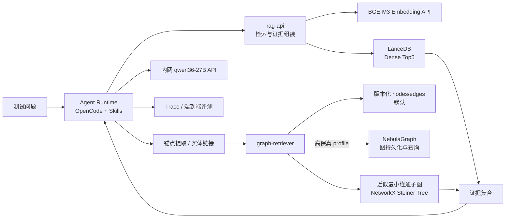

# 基于本体的 RAG 智能体测试环境部署方案

> 文档版本：1.1
>
> 更新日期：2026-07-24
>
> 适用目标：复刻真实业务本体智能体的关键链路，验证“问题到答案”的端到端结果。
>
> 默认技术路线：内网 Qwen API + OpenCode/Agent + BGE-M3 + LanceDB Dense Top5 + NetworkX/NebulaGraph 图检索。

## 1. 目标与范围

本环境重点验证本体信息能否提升 RAG 的最终回答质量，而不是验证单个模型或数据库的极限性能。

需要复刻的主链路：

1. 用户提出问题。
2. Agent 调用 BGE-M3 生成查询向量。
3. `rag-api` 从 LanceDB 取回余弦距离最小的 Top5。
4. Agent 或锚点服务从问题中提取本体锚点节点。
5. 图检索服务从版本化图文件或 NebulaGraph 取出候选邻域。
6. 图检索服务计算连接锚点的近似最小连通子图。
7. 证据组装器合并向量证据和图证据。
8. 内网 `qwen36-27B` 根据证据生成答案。
9. 评测器保存最终答案、检索结果、子图、耗时及质量指标。

当前已有：

- 内网 Qwen API。
- OpenCode/Agent。
- mock 数据。
- ontology 检索、子图召回、图查询等 skill 包。

当前主要新增：

- BGE-M3 embedding 服务。
- LanceDB 本地向量库。
- 可重复执行的索引构建任务。
- 统一的检索接口、评测记录和迁移机制。
- 需要复刻真实图数据库行为时使用的 NebulaGraph profile。

第一版暂不引入：

- Kubernetes。
- BGE-M3 sparse/ColBERT 混合检索。
- reranker。
- 向量量化。
- 多节点向量服务。
- 为了测试而在本地部署 Qwen 大模型。

这些能力会引入额外变量，应在 dense Top5 基线跑通后通过独立实验开启。

## 2. 推荐架构



### 2.1 服务职责

| 服务或组件 | 默认端口 | 职责 | 是否常驻 |
|---|---:|---|---|
| `rag-api` | 8000 | 对外统一入口、LanceDB 查询、双路召回、证据组装、运行记录 | 是 |
| `embedding-api` | 8001 | 加载 BGE-M3，提供 OpenAI-compatible `/v1/embeddings` | 是 |
| `graph-retriever` | 8002 | 实体链接、锚点解析、候选图读取、最小连通子图计算 | 是 |
| LanceDB | 无 | 以内嵌库方式保存 1024 维 dense 向量和元数据 | 随 `rag-api`/`indexer` 进程使用 |
| `agent-runtime` | 4096，可选 | OpenCode 和已有 skill 的运行环境 | 视现有部署而定 |
| `indexer` | 无 | 数据规范化、切片、向量化、写入 LanceDB 和图数据 | 一次性任务 |
| `evaluator` | 无 | 批量运行问题集，生成对比报告 | 一次性任务 |
| NebulaGraph Graph Service | 9669，可选 | 保存图数据，执行路径、邻域和子图查询 | 可选 |

安全边界：

- 测试机对外只开放 `rag-api`。
- `embedding-api`、图服务和 NebulaGraph 默认只允许本机或容器内部访问。
- 本地调试端口绑定到 `127.0.0.1`，不要直接绑定到所有网卡。
- LanceDB 数据目录仅授予应用账号读写权限。
- Qwen 和 NebulaGraph 凭据只放在未提交的 `runtime.env` 或组织密钥系统中。

## 3. 关键技术决策

### 3.1 Embedding

第一版仅使用 BGE-M3 的 dense 向量：

```yaml
model: BAAI/bge-m3
dimension: 1024
max_supported_length: 8192
recommended_chunk_length: 512-1024
normalize_embeddings: true
query_instruction: none
```

BGE-M3 官方模型卡说明其 dense 向量为 1024 维、最大序列长度为 8192，并且查询不需要添加额外 instruction：

- 模型和说明：<https://huggingface.co/BAAI/bge-m3>
- 官方代码库：<https://github.com/FlagOpen/FlagEmbedding>

虽然模型支持 8192 token，第一版切片不建议直接使用 8192。较短的 512～1024 token 切片通常更适合知识检索，也能降低索引时间和在线延迟。

### 3.2 LanceDB 向量库

推荐使用 LanceDB OSS 的本地嵌入式模式：

```yaml
uri: /data/lancedb
table: ontology_chunks_v1
vector_column: vector
vector_size: 1024
distance: cosine
top_k: 5
exact_search: true
score_threshold: null
```

选择原因：

- 不需要额外启动向量数据库容器，适合单机测试和离线迁移。
- 数据库目录可以与源码、模型、manifest 一起打包。
- Python API 与 `uv` 管理的服务直接集成。
- 支持 metadata filter、精确扫描和 ANN 索引。
- 第一版数据量不大时可以不建 ANN 索引，减少一个影响召回结果的变量。

需要明确的运行边界：

- LanceDB 是应用内嵌库，不存在独立健康检查端口。
- `rag-api` 和 `indexer` 共享同一个数据库目录。
- 只允许 `indexer` 写入，在线 `rag-api` 按只读方式使用。
- 避免同时启动多个 indexer；重建时优先写入新表，再切换表名配置。
- 本地目录模式适合单机测试。若以后跨主机并发访问，应重新评估 LanceDB Cloud、对象存储和一致性策略。

Top5 查询必须显式指定余弦距离：

```python
hits = (
    table.search(query_vector)
    .distance_type("cosine")
    .bypass_vector_index()
    .limit(5)
    .to_list()
)
```

LanceDB 返回字段 `_distance`，数值越小越相似。对余弦距离可额外输出：

```text
similarity = 1 - _distance
```

但 trace 中必须保留原始 `_distance`，不要把距离和相似度都命名为 `score`。

两种运行配置：

| profile | LanceDB 查询方式 | 用途 |
|---|---|---|
| `correctness` | 不建索引，或使用 `bypass_vector_index()` | 回归与环境一致性验证 |
| `performance` | 创建 cosine 向量索引并使用 ANN | 延迟与吞吐测试 |

官方资料：

- 快速开始与本地连接：<https://docs.lancedb.com/quickstart>
- 向量查询与精确扫描：<https://docs.lancedb.com/search/vector-search>
- 向量索引：<https://docs.lancedb.com/indexing/vector-index>
- Metadata filtering：<https://docs.lancedb.com/search/filtering>
- 存储：<https://docs.lancedb.com/storage>
- OSS 并发与容量说明：<https://docs.lancedb.com/faq/faq-oss>
- Python API：<https://lancedb.github.io/lancedb/python/python/>

### 3.3 图检索与 NebulaGraph

默认 profile：

- `graph-retriever` 从版本化的 `nodes.jsonl` 和 `edges.jsonl` 加载 mock 图。
- 在无向加权投影上使用 NetworkX `steiner_tree` 计算近似最小连通子图。
- 输出时恢复原始关系方向、类型、属性和来源。

高保真 profile：

- NebulaGraph 负责图数据持久化、邻域查询和路径查询。
- `graph-retriever` 使用 nGQL `GET SUBGRAPH`、`FIND PATH` 等能力获取受限候选图。
- `graph-retriever` 再把候选图转换为 NetworkX 图并运行相同的 Steiner Tree 近似算法。

NebulaGraph 不应被描述为直接提供与 NetworkX 相同的 Steiner Tree API。将算法保留在 `graph-retriever` 中，可以让文件后端和数据库后端共享一致的算法与验收标准。

官方资料：

- NebulaGraph 3.8 文档：<https://docs.nebula-graph.io/3.8.0/>
- nGQL 查询速查：<https://docs.nebula-graph.io/3.8.0/2.quick-start/6.cheatsheet-for-ngql/>
- 通用查询语句：<https://docs.nebula-graph.io/3.8.0/3.ngql-guide/7.general-query-statements/1.general-query-statements-overview/>
- Python client：<https://docs.nebula-graph.io/3.8.0/14.client/5.nebula-python-client/>
- Console：<https://docs.nebula-graph.io/3.8.0/nebula-console/>
- 身份认证：<https://docs.nebula-graph.io/3.8.0/7.data-security/1.authentication/1.authentication/>
- 官方 Docker Compose 仓库：<https://github.com/vesoft-inc/nebula-docker-compose>
- Docker Compose 部署说明：<https://docs.nebula-graph.io/3.8.0/4.deployment-and-installation/2.compile-and-install-nebula-graph/3.deploy-nebula-graph-with-docker-compose/>
- NetworkX Steiner Tree：<https://networkx.org/documentation/stable/reference/algorithms/generated/networkx.algorithms.approximation.steinertree.steiner_tree.html>

图算法边界规则：

| 锚点情况 | 处理方式 |
|---|---|
| 0 个锚点 | 返回空图，继续使用向量 Top5 |
| 1 个锚点 | 返回锚点属性和受限的一跳邻域 |
| 2 个及以上锚点 | 在候选图上计算近似 Steiner Tree |
| 锚点分属不连通分量 | 返回多个子图并标记 `disconnected=true` |
| 锚点过多 | 根据链接置信度截断，并记录被截断锚点 |
| 查询或算法超时 | 返回已确认的局部证据和明确的 timeout 状态 |

建议初始保护参数：

```yaml
graph:
  backend: files
  max_anchors: 8
  max_hops: 4
  max_nodes: 80
  max_edges: 120
  timeout_ms: 800
  steiner_method: mehlhorn
  default_edge_cost: 1.0
```

这些值不是质量标准，应通过真实问题集调整。

### 3.4 Agent 与内网模型

OpenCode 支持接入 OpenAI-compatible 自定义 provider：

- Provider 文档：<https://opencode.ai/docs/providers>
- 配置文档：<https://opencode.ai/docs/config/>
- 源码和发布：<https://github.com/anomalyco/opencode>

项目级 `opencode.json` 示例：

```json
{
  "$schema": "https://opencode.ai/config.json",
  "provider": {
    "qwen-intranet": {
      "npm": "@ai-sdk/openai-compatible",
      "name": "Qwen Intranet",
      "options": {
        "baseURL": "{env:QWEN_BASE_URL}",
        "apiKey": "{env:QWEN_API_KEY}",
        "timeout": 600000
      },
      "models": {
        "qwen36-27B": {
          "name": "qwen36-27B"
        }
      }
    }
  },
  "model": "qwen-intranet/qwen36-27B",
  "instructions": [
    "agents/system.md",
    "agents/retrieval-policy.md"
  ]
}
```

不要把真实 API Key 写入 `opencode.json`。

## 4. 推荐项目结构

```text
apps/ontology-rag-test/
├── README.md
├── opencode.json
├── Makefile
├── Taskfile.yml
├── deploy/
│   ├── compose.yaml                 # CPU/通用基础编排
│   ├── compose.gpu.yaml             # NVIDIA GPU 覆盖配置
│   └── nebula/                      # 固定 commit 的官方 Compose 栈
├── config/
│   ├── runtime.env.example
│   ├── runtime.env                  # 不提交
│   ├── retrieval.yaml
│   └── logging.yaml
├── agents/
│   ├── system.md
│   └── retrieval-policy.md
├── services/
│   ├── rag-api/
│   │   ├── pyproject.toml
│   │   ├── uv.lock
│   │   ├── Dockerfile
│   │   ├── src/ontology_rag_api/
│   │   └── tests/
│   ├── embedding-api/
│   │   ├── pyproject.toml
│   │   ├── uv.lock
│   │   ├── Dockerfile
│   │   ├── src/ontology_embedding_api/
│   │   └── tests/
│   └── graph-retriever/
│       ├── pyproject.toml
│       ├── uv.lock
│       ├── Dockerfile
│       ├── src/ontology_graph_retriever/
│       └── tests/
├── jobs/
│   ├── indexer/
│   │   ├── pyproject.toml
│   │   ├── uv.lock
│   │   ├── Dockerfile
│   │   └── src/ontology_indexer/
│   └── evaluator/
│       ├── pyproject.toml
│       ├── uv.lock
│       ├── Dockerfile
│       └── src/ontology_evaluator/
├── skills/
│   ├── ontology-search/
│   ├── subgraph-retrieval/
│   └── graph-query/
├── data/
│   ├── raw/                         # 原始 mock 数据，只读
│   ├── normalized/                  # 规范化后的索引输入
│   ├── graph/
│   │   ├── schema.ngql
│   │   ├── nodes.jsonl
│   │   └── edges.jsonl
│   └── eval/
│       └── eval_cases.jsonl
├── models/
│   └── bge-m3/                      # 模型文件，不提交 Git
├── manifests/
│   ├── parity-manifest.yaml
│   ├── data-manifest.yaml
│   ├── model-manifest.yaml
│   └── image-manifest.yaml
├── state/
│   ├── lancedb/                     # 本地数据库，不提交
│   └── nebulagraph/                 # 可选冷备目录，不提交
├── backups/
│   ├── lancedb/
│   └── nebulagraph/
├── artifacts/
│   ├── runs/
│   ├── reports/
│   ├── images/
│   └── logs/
└── scripts/
    ├── bootstrap.ps1
    ├── bootstrap.sh
    ├── smoke-test.ps1
    ├── smoke-test.sh
    ├── backup.ps1
    └── restore.ps1
```

`.gitignore` 至少排除：

```gitignore
apps/ontology-rag-test/config/runtime.env
apps/ontology-rag-test/models/
apps/ontology-rag-test/state/
apps/ontology-rag-test/backups/
apps/ontology-rag-test/artifacts/
apps/ontology-rag-test/deploy/nebula/data/
apps/ontology-rag-test/deploy/nebula/logs/
apps/ontology-rag-test/**/.venv/
apps/ontology-rag-test/**/__pycache__/
```

`deploy/nebula/` 有两种管理方式：

1. 作为 Git submodule 固定到经过验证的 commit。
2. 将官方 Compose 必要文件复制进项目，并在 `image-manifest.yaml` 记录上游仓库和 commit。

不要只记录分支名或 `latest`。

## 5. 数据契约

### 5.1 LanceDB 表记录

实体、关系和原始文档需要使用同一套稳定 ID。建议包含三类记录：

1. `entity`：实体名称、类型、别名、描述、关键属性。
2. `relation`：主体、谓词、客体和业务语义。
3. `document`：与本体实体关联的原始业务文本切片。

LanceDB 表建议使用扁平字段，避免把所有可过滤字段塞进不透明 JSON：

```json
{
  "id": "UUIDv5",
  "vector": [0.0],
  "text": "用于 embedding 和回答引用的文本",
  "record_type": "entity",
  "entity_ids_json": "[\"entity:123\"]",
  "source_id": "mock-source:456",
  "source_version": "2026-07-24",
  "ontology_version": "ontology-v1",
  "chunk_index": 0,
  "content_hash": "sha256:...",
  "title": "实体或文档标题"
}
```

建议使用显式 Arrow schema，并把向量长度固定为 1024：

```python
import pyarrow as pa

schema = pa.schema(
    [
        pa.field("id", pa.string(), nullable=False),
        pa.field("vector", pa.list_(pa.float32(), 1024), nullable=False),
        pa.field("text", pa.string(), nullable=False),
        pa.field("record_type", pa.string(), nullable=False),
        pa.field("entity_ids_json", pa.string(), nullable=False),
        pa.field("source_id", pa.string(), nullable=False),
        pa.field("source_version", pa.string(), nullable=False),
        pa.field("ontology_version", pa.string(), nullable=False),
        pa.field("chunk_index", pa.int32(), nullable=False),
        pa.field("content_hash", pa.string(), nullable=False),
        pa.field("title", pa.string(), nullable=True),
    ]
)
```

`id` 使用 UUIDv5，由以下字段生成：

```text
source_id + record_type + chunk_index + content_hash
```

同一批数据重复建库时，indexer 必须按 `id` 幂等覆盖或先构建新表，不能无条件追加重复记录。

### 5.2 图记录

节点：

```json
{
  "id": "entity:123",
  "type": "Equipment",
  "name": "设备A",
  "aliases": ["A设备"],
  "properties": {},
  "source_id": "mock-source:456"
}
```

边：

```json
{
  "id": "relation:789",
  "source": "entity:123",
  "target": "entity:456",
  "type": "DEPENDS_ON",
  "weight": 1.0,
  "properties": {},
  "source_id": "mock-source:456"
}
```

图节点 VID 必须与 LanceDB 字段 `entity_ids_json` 中的实体 ID 完全一致。NebulaGraph 的 `FIXED_STRING` VID 长度应覆盖最长业务 ID。

### 5.3 评测记录

```json
{
  "case_id": "case-001",
  "question": "问题文本",
  "reference_answer": "参考答案",
  "required_facts": ["必须覆盖的事实1", "必须覆盖的事实2"],
  "expected_entities": ["entity:123"],
  "expected_relations": ["relation:789"],
  "expected_sources": ["mock-source:456"],
  "tags": ["multi-hop", "ontology"]
}
```

## 6. 配置文件

`config/runtime.env.example`：

```dotenv
# 内网 Qwen
QWEN_BASE_URL=http://qwen-intranet.example.local/v1
QWEN_API_KEY=replace-me
QWEN_MODEL=qwen36-27B

# Embedding
EMBEDDING_URL=http://embedding-api:8001/v1
EMBEDDING_MODEL=BAAI/bge-m3
EMBEDDING_MODEL_PATH=/models/bge-m3
EMBEDDING_MODEL_REVISION=replace-with-huggingface-commit-sha
EMBEDDING_DIMENSION=1024
EMBEDDING_MAX_LENGTH=1024
EMBEDDING_BATCH_SIZE=8
EMBEDDING_NORMALIZE=true
EMBEDDING_DEVICE=cpu
EMBEDDING_DTYPE=float32

# LanceDB
LANCEDB_URI=/data/lancedb
LANCEDB_TABLE=ontology_chunks_v1
LANCEDB_VECTOR_COLUMN=vector
VECTOR_DISTANCE=cosine
VECTOR_TOP_K=5
VECTOR_SCORE_THRESHOLD=
VECTOR_EXACT_SEARCH=true

# 图检索
GRAPH_BACKEND=files
GRAPH_DATA_DIR=/data/graph
GRAPH_MAX_ANCHORS=8
GRAPH_MAX_HOPS=4
GRAPH_MAX_NODES=80
GRAPH_MAX_EDGES=120
GRAPH_TIMEOUT_MS=800
GRAPH_STEINER_METHOD=mehlhorn

# NebulaGraph 可选 profile
NEBULA_ADDRESS=host.docker.internal:9669
NEBULA_USER=root
NEBULA_PASSWORD=replace-me
NEBULA_SPACE=ontology_test

# 运行
LOG_LEVEL=INFO
ANSWER_TEMPERATURE=0
EVIDENCE_MAX_TOKENS=6000
```

`manifests/parity-manifest.yaml`：

```yaml
environment_name: ontology-rag-test
baseline_date: 2026-07-24

llm:
  model: qwen36-27B
  base_url: redacted
  temperature: 0
  prompt_hash: replace-me

skills:
  ontology_search_hash: replace-me
  subgraph_retrieval_hash: replace-me
  graph_query_hash: replace-me

embedding:
  model: BAAI/bge-m3
  revision: replace-with-commit-sha
  dimension: 1024
  normalize: true
  max_length: 1024
  dtype: float32

vector_search:
  engine: lancedb
  table: ontology_chunks_v1
  distance: cosine
  top_k: 5
  exact: true
  score_threshold: null

graph_search:
  storage_backend: files
  algorithm: approximate-steiner-tree
  implementation: networkx
  method: mehlhorn
  directed_projection: undirected
  timeout_ms: 800

data:
  ontology_version: ontology-v1
  source_manifest_hash: replace-me
```

切换到 NebulaGraph profile 时只修改：

```yaml
graph_search:
  storage_backend: nebulagraph
  algorithm: approximate-steiner-tree
  implementation: networkx
  candidate_graph_query: ngql
```

算法实现仍保持 NetworkX，便于比较两个存储后端的结果。

## 7. Docker Compose 参考

LanceDB 没有独立 service。`rag-api` 和 `indexer` 挂载相同的 `/data/lancedb`。

`deploy/compose.yaml`：

```yaml
name: ontology-rag-test

services:
  embedding-api:
    build:
      context: ../services/embedding-api
    restart: unless-stopped
    env_file:
      - ../config/runtime.env
    ports:
      - "127.0.0.1:8001:8001"
    volumes:
      - ../models/bge-m3:/models/bge-m3:ro
    networks:
      - rag-internal

  graph-retriever:
    build:
      context: ../services/graph-retriever
    restart: unless-stopped
    env_file:
      - ../config/runtime.env
    ports:
      - "127.0.0.1:8002:8002"
    volumes:
      - ../data/graph:/data/graph:ro
    extra_hosts:
      - "host.docker.internal:host-gateway"
    networks:
      - rag-internal

  rag-api:
    build:
      context: ../services/rag-api
    restart: unless-stopped
    env_file:
      - ../config/runtime.env
    ports:
      - "127.0.0.1:8000:8000"
    depends_on:
      - embedding-api
      - graph-retriever
    volumes:
      - ../state/lancedb:/data/lancedb:ro
      - ../skills:/app/skills:ro
      - ../artifacts:/artifacts
    networks:
      - rag-internal

  indexer:
    build:
      context: ../jobs/indexer
    profiles: ["jobs"]
    env_file:
      - ../config/runtime.env
    depends_on:
      - embedding-api
    volumes:
      - ../data:/data
      - ../state/lancedb:/data/lancedb
      - ../artifacts:/artifacts
    networks:
      - rag-internal

  evaluator:
    build:
      context: ../jobs/evaluator
    profiles: ["jobs"]
    env_file:
      - ../config/runtime.env
    depends_on:
      - rag-api
    volumes:
      - ../data/eval:/data/eval:ro
      - ../artifacts:/artifacts
    networks:
      - rag-internal

networks:
  rag-internal:
    driver: bridge
```

Linux 中 `host.docker.internal` 依赖 `extra_hosts` 的 `host-gateway` 映射；Docker Desktop 通常内置该名称。若安全策略不允许容器访问宿主机，应把两个 Compose 栈加入显式创建的共享 Docker network。

GPU 覆盖文件 `deploy/compose.gpu.yaml`：

```yaml
services:
  embedding-api:
    environment:
      EMBEDDING_DEVICE: cuda
      EMBEDDING_DTYPE: float16
    deploy:
      resources:
        reservations:
          devices:
            - driver: nvidia
              count: 1
              capabilities: [gpu]
```

NebulaGraph 使用官方 Compose 仓库，不要伪装成单容器服务。官方栈包含 graphd、metad、storaged 等组件。测试环境通过宿主机 `127.0.0.1:9669` 暴露 Graph Service，再由 `graph-retriever` 使用 `host.docker.internal:9669` 访问。

## 8. Python 与 uv 约定

所有 Python 服务必须使用项目内虚拟环境和 `uv.lock`。

官方资料：

- uv 安装：<https://docs.astral.sh/uv/getting-started/installation/>
- uv 项目同步：<https://docs.astral.sh/uv/concepts/projects/sync/>
- uv Docker：<https://docs.astral.sh/uv/guides/integration/docker/>

### 8.1 Windows 安装 uv

PowerShell：

```powershell
winget install --id=astral-sh.uv -e
uv --version
```

或使用官方安装脚本：

```powershell
powershell -ExecutionPolicy ByPass -c "irm https://astral.sh/uv/install.ps1 | iex"
uv --version
```

### 8.2 Linux/macOS 安装 uv

```bash
curl -LsSf https://astral.sh/uv/install.sh | sh
uv --version
```

### 8.3 初始化服务

以下命令在 `apps/ontology-rag-test/` 下执行：

```powershell
uv init --package --python 3.12 services/embedding-api
Set-Location services/embedding-api
uv add fastapi "uvicorn[standard]" FlagEmbedding torch pydantic-settings
uv lock
Set-Location ../..

uv init --package --python 3.12 services/graph-retriever
Set-Location services/graph-retriever
uv add fastapi "uvicorn[standard]" networkx pydantic-settings nebula3-python
uv lock
Set-Location ../..

uv init --package --python 3.12 services/rag-api
Set-Location services/rag-api
uv add fastapi "uvicorn[standard]" httpx pydantic-settings lancedb pyarrow
uv lock
Set-Location ../..

uv init --package --python 3.12 jobs/indexer
Set-Location jobs/indexer
uv add httpx pydantic-settings lancedb pyarrow nebula3-python
uv lock
Set-Location ../..
```

提交前应把 `nebula3-python` 固定到与服务端兼容并经过测试的版本，由 `uv.lock` 锁定完整依赖树。

开发机同步依赖：

```powershell
Set-Location services/rag-api
uv sync --locked
uv run pytest
```

容器构建必须使用锁文件，不允许启动时自动升级依赖。Dockerfile 示例：

```dockerfile
FROM python:3.12-slim

COPY --from=ghcr.io/astral-sh/uv:0.11.31 /uv /uvx /bin/

WORKDIR /app
COPY pyproject.toml uv.lock ./
RUN uv sync --locked --no-dev --no-install-project

COPY src ./src
RUN uv sync --locked --no-dev

ENV PATH="/app/.venv/bin:$PATH"
CMD ["uv", "run", "uvicorn", "ontology_rag_api.app:app", "--host", "0.0.0.0", "--port", "8000"]
```

正式封版时还应把 uv 镜像 tag 替换为 SHA256 digest。

## 9. 下载源与准备命令

### 9.1 Docker Desktop / Docker Compose

Windows 推荐安装 Docker Desktop，并启用 WSL2 后端：

- Windows 安装说明：<https://docs.docker.com/desktop/setup/install/windows-install/>
- Docker Compose 安装说明：<https://docs.docker.com/compose/install/>

必要时先安装 WSL：

```powershell
wsl --install
wsl --update
```

检查：

```powershell
docker version
docker compose version
```

### 9.2 下载并固定 BGE-M3

Hugging Face CLI 文档：

- <https://huggingface.co/docs/huggingface_hub/en/guides/cli>

查询当前 commit：

```powershell
git ls-remote https://huggingface.co/BAAI/bge-m3 refs/heads/main
```

把输出 SHA 写入 `EMBEDDING_MODEL_REVISION`，然后下载固定版本：

```powershell
Set-Location apps/ontology-rag-test
uvx hf download BAAI/bge-m3 `
  --revision <替换为上一步的commit-sha> `
  --local-dir models/bge-m3
```

Bash：

```bash
cd apps/ontology-rag-test
uvx hf download BAAI/bge-m3 \
  --revision <替换为上一步的commit-sha> \
  --local-dir models/bge-m3
```

生成模型文件校验清单：

```powershell
Get-ChildItem models\bge-m3 -Recurse -File |
  Get-FileHash -Algorithm SHA256 |
  Export-Csv manifests\bge-m3-sha256.csv -NoTypeInformation
```

迁移包应包含明确的 `models/bge-m3/` 目录、commit SHA 和校验值，而不是仅保存 Hugging Face 缓存路径。

### 9.3 固定 LanceDB 版本

LanceDB 作为 Python 包安装，不需要拉取数据库镜像：

```powershell
Set-Location apps/ontology-rag-test/services/rag-api
uv add lancedb pyarrow
uv lock
uv tree
```

迁移时携带：

- `pyproject.toml`
- `uv.lock`
- wheel 离线包或可访问的内部 Python 包源
- `state/lancedb/` 冷备，或可完整重建的数据与 manifest

有隔离网要求时提前下载锁定依赖：

```powershell
uv export --locked --format requirements.txt --no-dev --no-emit-project --no-hashes `
  --output-file artifacts\requirements-rag-api.txt

uvx --from pip pip download `
  --requirement artifacts\requirements-rag-api.txt `
  --dest artifacts\wheels
```

### 9.4 下载并固定 NebulaGraph Compose

官方 Compose 方案定位为测试用途，不应直接照搬为生产集群。

```powershell
Set-Location apps/ontology-rag-test
git clone `
  --branch v3.8 `
  --single-branch `
  https://github.com/vesoft-inc/nebula-docker-compose.git `
  deploy/nebula
git -C deploy/nebula rev-parse HEAD
```

`v3.8` 是稳定版本分支；不要使用指向 nightly 镜像的 `master`。把输出的 commit 写入 `manifests/image-manifest.yaml`。如果团队已验证特定 commit：

```powershell
git -C deploy/nebula checkout <替换为已验证的commit-sha>
docker compose -f deploy/nebula/docker-compose.yaml pull
docker compose -f deploy/nebula/docker-compose.yaml images
```

检查官方 Compose 中 Graph Service 的端口映射，将宿主端限制为：

```yaml
ports:
  - "127.0.0.1:9669:9669"
```

镜像 digest 记录到 `image-manifest.yaml`，不要仅记录浮动 tag。

## 10. 部署流程和显式命令

以下命令假设当前目录为仓库根目录。

### 10.1 准备运行配置

PowerShell：

```powershell
Set-Location apps/ontology-rag-test
Copy-Item config/runtime.env.example config/runtime.env
notepad config/runtime.env
```

Bash：

```bash
cd apps/ontology-rag-test
cp config/runtime.env.example config/runtime.env
```

必须修改：

- `QWEN_BASE_URL`
- `QWEN_API_KEY`
- `EMBEDDING_MODEL_REVISION`
- `LANCEDB_TABLE`
- GPU 环境下的 `EMBEDDING_DEVICE` 和 `EMBEDDING_DTYPE`
- 启用 NebulaGraph 时的连接信息

### 10.2 构建应用镜像

CPU：

```powershell
docker compose `
  --env-file config/runtime.env `
  -f deploy/compose.yaml `
  build
```

GPU：

```powershell
docker compose `
  --env-file config/runtime.env `
  -f deploy/compose.yaml `
  -f deploy/compose.gpu.yaml `
  build
```

### 10.3 启动 embedding 和文件图后端

CPU：

```powershell
docker compose `
  --env-file config/runtime.env `
  -f deploy/compose.yaml `
  up -d embedding-api graph-retriever
```

GPU：

```powershell
docker compose `
  --env-file config/runtime.env `
  -f deploy/compose.yaml `
  -f deploy/compose.gpu.yaml `
  up -d embedding-api graph-retriever
```

检查状态：

```powershell
docker compose `
  --env-file config/runtime.env `
  -f deploy/compose.yaml `
  ps

Invoke-RestMethod http://localhost:8001/health
Invoke-RestMethod http://localhost:8002/health
```

检查日志：

```powershell
docker compose `
  --env-file config/runtime.env `
  -f deploy/compose.yaml `
  logs --tail 200 embedding-api graph-retriever
```

### 10.4 验证 embedding 接口

约定 embedding 服务兼容 `/v1/embeddings`：

```powershell
$embeddingRequest = @{
  model = "BAAI/bge-m3"
  input = @("测试环境如何验证本体检索能力？")
} | ConvertTo-Json -Depth 5

$embeddingResponse = Invoke-RestMethod `
  -Method Post `
  -Uri "http://localhost:8001/v1/embeddings" `
  -ContentType "application/json" `
  -Body $embeddingRequest

$embeddingResponse.data[0].embedding.Count
```

期望输出：

```text
1024
```

### 10.5 初始化 LanceDB 表

LanceDB 表由 indexer 创建，不需要向数据库服务发送建表请求。

初始化命令：

```powershell
docker compose `
  --env-file config/runtime.env `
  -f deploy/compose.yaml `
  --profile jobs `
  run --rm indexer `
  uv run python -m ontology_indexer init-lancedb `
  --uri /data/lancedb `
  --table ontology_chunks_v1 `
  --dimension 1024
```

`init-lancedb` 应：

1. 使用第 5.1 节的显式 Arrow schema。
2. 若同名表存在则失败，除非显式传入测试专用的 `--replace`。
3. 把 schema、表名、LanceDB 版本写入 `data-manifest.yaml`。

### 10.6 构建向量索引

索引任务：

```text
读取 raw 数据
→ 规范化实体和关系 ID
→ 生成 entity/relation/document 记录
→ 切片
→ 调用 embedding-api
→ 校验向量维度为 1024
→ 写入 LanceDB 新表
→ 校验记录数与唯一 ID
→ 生成 data-manifest
```

运行：

```powershell
docker compose `
  --env-file config/runtime.env `
  -f deploy/compose.yaml `
  --profile jobs `
  run --rm indexer `
  uv run python -m ontology_indexer build `
  --source /data/raw `
  --normalized /data/normalized `
  --lancedb-uri /data/lancedb `
  --table ontology_chunks_v1 `
  --batch-size 32 `
  --replace-test-table
```

检查：

```powershell
docker compose `
  --env-file config/runtime.env `
  -f deploy/compose.yaml `
  --profile jobs `
  run --rm indexer `
  uv run python -m ontology_indexer inspect `
  --lancedb-uri /data/lancedb `
  --table ontology_chunks_v1
```

输出至少包含：

- 总记录数。
- 唯一 `id` 数。
- vector 维度。
- 各 `record_type` 数量。
- `ontology_version` 和 `source_version`。
- 空 text、空 source 和重复 ID 数。

### 10.7 表版本切换

LanceDB 本地表不使用 alias。不要原地覆盖已验证基线，按以下方式切换：

1. indexer 构建 `ontology_chunks_v2`。
2. 对 v2 执行数量、schema、抽样检索和固定问题集验证。
3. 将 `LANCEDB_TABLE` 从 v1 改为 v2。
4. 重启 `rag-api`。
5. 保留 v1 到回归验证完成，再归档或删除。

```powershell
(Get-Content config/runtime.env) `
  -replace '^LANCEDB_TABLE=.*$', 'LANCEDB_TABLE=ontology_chunks_v2' |
  Set-Content config/runtime.env

docker compose `
  --env-file config/runtime.env `
  -f deploy/compose.yaml `
  up -d --force-recreate rag-api
```

### 10.8 启动并初始化 NebulaGraph 可选 profile

启动官方服务栈：

```powershell
docker compose `
  -f deploy/nebula/docker-compose.yaml `
  up -d

docker compose `
  -f deploy/nebula/docker-compose.yaml `
  ps
```

使用官方 Compose 自带的 console 连接：

```powershell
docker compose `
  -f deploy/nebula/docker-compose.yaml `
  exec console `
  nebula-console `
  -addr graphd `
  -port 9669 `
  -u root `
  -p <替换为测试环境密码>
```

首次初始化可在 console 中执行：

```ngql
CREATE SPACE IF NOT EXISTS ontology_test(
  partition_num = 10,
  replica_factor = 1,
  vid_type = FIXED_STRING(128)
);

USE ontology_test;

CREATE TAG IF NOT EXISTS Entity(
  name STRING,
  entity_type STRING,
  aliases_json STRING,
  properties_json STRING,
  source_id STRING
);

CREATE EDGE IF NOT EXISTS Relation(
  relation_id STRING,
  relation_type STRING,
  weight DOUBLE,
  properties_json STRING,
  source_id STRING
);
```

NebulaGraph schema 变更需要传播时间。等待数秒后执行：

```ngql
USE ontology_test;
SHOW TAGS;
SHOW EDGES;
SHOW HOSTS;
```

导入版本化图数据：

```powershell
docker compose `
  --env-file config/runtime.env `
  -f deploy/compose.yaml `
  --profile jobs `
  run --rm indexer `
  uv run python -m ontology_indexer load-nebula `
  --nodes /data/graph/nodes.jsonl `
  --edges /data/graph/edges.jsonl `
  --address host.docker.internal:9669 `
  --space ontology_test `
  --replace-test-data
```

将 `config/runtime.env` 改为：

```dotenv
GRAPH_BACKEND=nebulagraph
NEBULA_ADDRESS=host.docker.internal:9669
NEBULA_SPACE=ontology_test
```

随后重建图服务：

```powershell
docker compose `
  --env-file config/runtime.env `
  -f deploy/compose.yaml `
  up -d --force-recreate graph-retriever

Invoke-RestMethod http://localhost:8002/health
```

`/health` 应返回后端类型、space 名、连接状态和 schema 版本，但不能返回密码。

### 10.9 启动完整 RAG

先确认 `state/lancedb/` 中目标表已经创建，然后启动：

```powershell
docker compose `
  --env-file config/runtime.env `
  -f deploy/compose.yaml `
  up -d rag-api

Invoke-RestMethod http://localhost:8000/health
Invoke-RestMethod http://localhost:8000/v1/vector-store/status
```

向量库状态接口至少返回：

```json
{
  "engine": "lancedb",
  "uri": "/data/lancedb",
  "table": "ontology_chunks_v1",
  "dimension": 1024,
  "distance": "cosine",
  "row_count": 1000,
  "writable": false
}
```

### 10.10 验证 Top5

约定 `rag-api` 提供 `/v1/retrieve/vector`：

```powershell
$retrieveBody = @{
  query = "测试环境如何验证本体检索能力？"
  top_k = 5
  exact = $true
} | ConvertTo-Json -Depth 5

$hits = Invoke-RestMethod `
  -Method Post `
  -Uri "http://localhost:8000/v1/retrieve/vector" `
  -ContentType "application/json" `
  -Body $retrieveBody

$hits.items.Count
$hits.items | Select-Object id, distance, similarity, source_id
```

数据不少于 5 条时，结果必须满足：

- 返回 5 条。
- `distance` 从小到大排列。
- 每条保留 `id`、`text`、实体 ID、`source_id` 和原始 `_distance`。
- 相同模型、数据、dtype 和 exact 配置下结果可重复。

### 10.11 启动 OpenCode

```powershell
Set-Location apps/ontology-rag-test
$env:QWEN_BASE_URL = "http://qwen-intranet.example.local/v1"
$env:QWEN_API_KEY = "replace-me"
opencode
```

在 OpenCode 中检查模型：

```text
/models
```

选择：

```text
qwen-intranet/qwen36-27B
```

生产式运行不要把真实 Key 写入 PowerShell 历史，优先使用组织现有的凭据注入机制。

### 10.12 运行单题端到端测试

约定 `rag-api` 提供 `/v1/answer`：

```powershell
$answerBody = @{
  question = "替换为真实测试问题"
  retrieval = @{
    vector_top_k = 5
    graph_enabled = $true
  }
  trace = $true
} | ConvertTo-Json -Depth 8

Invoke-RestMethod `
  -Method Post `
  -Uri "http://localhost:8000/v1/answer" `
  -ContentType "application/json" `
  -Body $answerBody
```

返回体至少包含：

```json
{
  "answer": "...",
  "citations": [],
  "vector_hits": [],
  "anchors": [],
  "subgraph": {
    "nodes": [],
    "edges": [],
    "disconnected": false
  },
  "timings_ms": {},
  "trace_id": "..."
}
```

### 10.13 批量评测

至少执行四种对照：

| variant | 能力 |
|---|---|
| `llm` | 仅 Qwen |
| `vector` | Qwen + 向量 Top5 |
| `graph` | Qwen + 图检索 |
| `hybrid` | Qwen + 向量 Top5 + 图检索 |

```powershell
docker compose `
  --env-file config/runtime.env `
  -f deploy/compose.yaml `
  --profile jobs `
  run --rm evaluator `
  uv run python -m ontology_evaluator run `
  --dataset /data/eval/eval_cases.jsonl `
  --variants llm,vector,graph,hybrid `
  --run-id baseline-001 `
  --output /artifacts/runs/baseline-001
```

## 11. 评测指标

### 11.1 最终答案

- 关键事实覆盖率。
- 最终答案正确率。
- 无证据断言率。
- 引用正确率。
- 本体概念和关系使用准确率。

### 11.2 检索诊断

- Vector Recall@5。
- 锚点识别准确率。
- 锚点消歧准确率。
- 子图终端节点覆盖率。
- 子图关系真实性。
- 不连通情况识别率。
- 证据去重率。

### 11.3 系统指标

- embedding 延迟。
- LanceDB 查询延迟。
- NebulaGraph 候选图查询延迟。
- Steiner Tree 计算延迟。
- Qwen 首 token 和总耗时。
- 端到端 P50/P95。
- 超时率和失败率。
- 每题 evidence token 数。

LLM Judge 只能作为补充。`required_facts`、实体 ID、关系 ID 和来源引用应优先使用规则校验，再抽样人工复核。

## 12. 正确性与性能双配置

### 12.1 Correctness profile

```yaml
temperature: 0
vector_exact_search: true
embedding_dtype: float32
vector_index: disabled_or_bypassed
fixed_prompt: true
fixed_data_version: true
```

用途：

- 回归测试。
- 比较图存储后端。
- 比较检索策略。
- 定位环境差异。

### 12.2 Performance profile

```yaml
temperature: 0
vector_exact_search: false
embedding_dtype: float16
vector_index: enabled
batching: enabled
```

在已写入并验收的表上创建 cosine 向量索引：

```powershell
docker compose `
  --env-file config/runtime.env `
  -f deploy/compose.yaml `
  --profile jobs `
  run --rm indexer `
  uv run python -m ontology_indexer create-vector-index `
  --lancedb-uri /data/lancedb `
  --table ontology_chunks_v1 `
  --metric cosine
```

ANN 索引参数、LanceDB 版本和构建时间必须进入 manifest。性能 profile 的结果不能直接替换 correctness 基线。

## 13. 备份、恢复和迁移

### 13.1 LanceDB 冷备

LanceDB 本地模式的推荐恢复优先级：

1. 版本化 raw 数据、模型 revision、代码和 manifest 重新建库。
2. 已停止写入后的 LanceDB 目录冷备，用于快速迁移。

备份前确保没有 indexer 正在写入。为得到边界最清晰的测试快照，可暂时停止 `rag-api`：

```powershell
docker compose `
  --env-file config/runtime.env `
  -f deploy/compose.yaml `
  stop rag-api

New-Item -ItemType Directory -Force backups\lancedb | Out-Null

Compress-Archive `
  -Path state\lancedb `
  -DestinationPath backups\lancedb\lancedb-ontology-v1.zip `
  -Force

Get-FileHash `
  backups\lancedb\lancedb-ontology-v1.zip `
  -Algorithm SHA256
```

恢复：

```powershell
docker compose `
  --env-file config/runtime.env `
  -f deploy/compose.yaml `
  stop rag-api

Rename-Item state\lancedb state\lancedb.before-restore

Expand-Archive `
  -Path backups\lancedb\lancedb-ontology-v1.zip `
  -DestinationPath state

docker compose `
  --env-file config/runtime.env `
  -f deploy/compose.yaml `
  up -d rag-api

Invoke-RestMethod http://localhost:8000/v1/vector-store/status
```

恢复必须使用 `uv.lock` 中相同的 LanceDB 版本，并在另一目录或另一台测试机跑固定检索集。不能只验证压缩包可以解压。

### 13.2 从源数据重建 LanceDB

```powershell
docker compose `
  --env-file config/runtime.env `
  -f deploy/compose.yaml `
  --profile jobs `
  run --rm indexer `
  uv run python -m ontology_indexer build `
  --source /data/raw `
  --normalized /data/normalized `
  --lancedb-uri /data/lancedb `
  --table ontology_chunks_restore_test `
  --batch-size 32
```

重建后比较：

- 行数与唯一 ID 数。
- 抽样向量 hash 或浮点容差。
- 固定查询的 Top5 ID、顺序和 `_distance`。
- 端到端固定问题集答案。

### 13.3 NebulaGraph 备份

容器测试环境以“逻辑源数据可重放”为首选：

- `data/graph/schema.ngql`
- `data/graph/nodes.jsonl`
- `data/graph/edges.jsonl`
- 导入程序版本和 `uv.lock`
- NebulaGraph Compose commit 与镜像 digest
- 导入后的节点、边计数和抽样查询结果

重新导入命令见 10.8。

仅用于同版本、同拓扑快速迁移时，可在完整停止官方 Compose 栈后冷备其数据目录：

```powershell
docker compose `
  -f deploy/nebula/docker-compose.yaml `
  down

New-Item -ItemType Directory -Force backups\nebulagraph | Out-Null

Compress-Archive `
  -Path deploy\nebula\data,deploy\nebula\docker-compose.yaml `
  -DestinationPath backups\nebulagraph\nebulagraph-cold.zip `
  -Force
```

`down` 不要加 `-v`。恢复时必须使用相同 Compose commit、镜像版本和拓扑，启动后执行节点/边计数和固定 nGQL 查询。

NebulaGraph BR Community 文档明确说明容器化集群不受该工具支持，因此本测试方案不把 BR 作为默认容器备份命令。若以后切换到非容器集群，再按官方 BR 文档设计备份：

- <https://docs.nebula-graph.io/3.8.0/backup-and-restore/nebula-br/1.what-is-br/>

### 13.4 导出容器镜像

LanceDB 已由 `uv.lock` 固定，不存在单独数据库镜像。查看应用镜像：

```powershell
docker compose `
  --env-file config/runtime.env `
  -f deploy/compose.yaml `
  images

docker compose `
  -f deploy/nebula/docker-compose.yaml `
  images
```

导出示例：

```powershell
New-Item -ItemType Directory -Force artifacts\images | Out-Null

docker save `
  -o artifacts\images\ontology-embedding-api.tar `
  ontology-rag-test-embedding-api:<替换为实际tag>

docker save `
  -o artifacts\images\ontology-graph-retriever.tar `
  ontology-rag-test-graph-retriever:<替换为实际tag>

docker save `
  -o artifacts\images\ontology-rag-api.tar `
  ontology-rag-test-rag-api:<替换为实际tag>

docker save `
  -o artifacts\images\ontology-indexer.tar `
  ontology-rag-test-indexer:<替换为实际tag>
```

NebulaGraph 的 graphd、metad、storaged、console 镜像按 `docker compose images` 的精确输出逐一保存，并记录 digest。

迁移机导入：

```powershell
docker load -i artifacts\images\ontology-embedding-api.tar
docker load -i artifacts\images\ontology-graph-retriever.tar
docker load -i artifacts\images\ontology-rag-api.tar
docker load -i artifacts\images\ontology-indexer.tar
```

### 13.5 迁移包内容

```text
deploy/
config/runtime.env.example
services/ 和 jobs/ 的源码
所有 pyproject.toml 和 uv.lock
skills/
data/raw/
data/graph/
data/eval/
models/bge-m3/
manifests/
backups/lancedb/
backups/nebulagraph/               # 仅在启用数据库图后端时
artifacts/wheels/                  # 离线环境
artifacts/images/
README.md
```

不要打包：

- 真实 API Key。
- 无法说明来源的临时数据。
- 未记录版本的浮动镜像。
- 本机 `.venv`。
- Python/Hugging Face 缓存目录。

## 14. 硬件参考

由于 Qwen 使用内网 API，本机资源主要用于 BGE-M3、LanceDB 和图检索。

| 场景 | CPU | 内存 | GPU | 磁盘 |
|---|---:|---:|---:|---:|
| 功能验证 | 8 核 | 32GB | 无，可 CPU 推理 | 100GB NVMe |
| 推荐测试 | 8～16 核 | 32～64GB | NVIDIA 12～16GB | 200GB NVMe |
| 百万级向量或完整图数据库 | 16 核以上 | 64GB 起 | NVIDIA 16GB 起 | 按数据量评估 |

1024 维 float32 向量的原始大小约为：

```text
1024 × 4 bytes = 4096 bytes/向量
```

100 万条向量仅原始 vector 就约 4GB，实际还要考虑：

- Lance 数据文件和版本。
- 向量索引。
- metadata。
- NebulaGraph 数据与日志。
- 冷备。
- 恢复时的临时空间。

第一版不要以原始向量大小直接估算总磁盘。

## 15. 验收清单

### 15.1 环境

- [ ] Docker 和 Compose 版本已记录。
- [ ] 所有镜像均使用明确 tag 或 digest。
- [ ] 所有 Python 服务包含 `uv.lock`。
- [ ] BGE-M3 revision 和文件校验值已记录。
- [ ] LanceDB 版本已由锁文件固定。
- [ ] NebulaGraph Compose commit 和镜像 digest 已记录。
- [ ] mock 数据和 skill 包包含版本或哈希。
- [ ] API Key 未进入 Git。

### 15.2 Embedding 和 LanceDB

- [ ] 同一文本重复 embedding 结果一致。
- [ ] embedding 维度为 1024。
- [ ] 查询显式使用 cosine。
- [ ] correctness profile 绕过 ANN 索引。
- [ ] 数据不少于 5 条时固定返回 Top5。
- [ ] 每个命中包含 `_distance`、text、entity ID 和 source ID。
- [ ] 重复执行 indexer 不产生重复记录。
- [ ] `rag-api` 对 LanceDB 目录只有读权限。
- [ ] 新表经过验证后才修改 `LANCEDB_TABLE`。

### 15.3 图检索

- [ ] 锚点候选、最终 ID 和置信度可追溯。
- [ ] 多锚点子图包含所有可连接锚点。
- [ ] 返回边都能在源图中验证。
- [ ] 不连通时明确标记，不生成虚假关系。
- [ ] 节点、边和超时限制有效。
- [ ] 文件后端与 NebulaGraph 后端使用相同 Steiner Tree 算法。
- [ ] 启用 NebulaGraph 时，space、schema 和数据计数已记录。

### 15.4 Agent 和答案

- [ ] Agent 能分别调用向量和图工具。
- [ ] 向量证据和图证据具有稳定引用编号。
- [ ] 最终答案能够回溯到证据。
- [ ] 完整 trace 包含 prompt、tool input/output、模型参数和耗时。
- [ ] 同一 correctness 配置可重复运行。

### 15.5 迁移

- [ ] LanceDB 冷备已在另一目录或另一台测试机成功恢复。
- [ ] 能够仅使用 raw 数据和 manifest 重建向量表。
- [ ] NebulaGraph 能够使用版本化节点和边重新导入。
- [ ] 离线依赖和镜像能够安装或 `docker load`。
- [ ] 迁移后固定问题集结果与原环境完成差异对比。

## 16. 推荐实施顺序

按单人实施、mock 数据和 skill 接口清晰估算，第一版约需 5～7 个工作日。

1. 固化 parity manifest、数据 ID 和验收问题集。
2. 实现并验证 BGE-M3 `/v1/embeddings`。
3. 实现 LanceDB schema、indexer 和 exact Top5 查询。
4. 固定 LanceDB correctness 基线。
5. 接入 NetworkX 文件图后端和边界处理。
6. 接入 OpenCode、skills 和内网 Qwen。
7. 保存完整端到端 trace。
8. 执行 `llm/vector/graph/hybrid` 四组评测。
9. 如需复刻数据库图行为，再接入 NebulaGraph 并与文件后端做等价性对比。
10. 分别完成 LanceDB 重建/冷备恢复和 NebulaGraph 重新导入演练。
11. 封存镜像、wheel、模型、锁文件、数据 manifest 和评测报告。

## 17. 官方来源汇总

| 类别 | 链接 |
|---|---|
| BGE-M3 模型 | <https://huggingface.co/BAAI/bge-m3> |
| FlagEmbedding | <https://github.com/FlagOpen/FlagEmbedding> |
| Hugging Face CLI | <https://huggingface.co/docs/huggingface_hub/en/guides/cli> |
| LanceDB Quickstart | <https://docs.lancedb.com/quickstart> |
| LanceDB Vector Search | <https://docs.lancedb.com/search/vector-search> |
| LanceDB Vector Index | <https://docs.lancedb.com/indexing/vector-index> |
| LanceDB Filtering | <https://docs.lancedb.com/search/filtering> |
| LanceDB Storage | <https://docs.lancedb.com/storage> |
| LanceDB OSS FAQ | <https://docs.lancedb.com/faq/faq-oss> |
| LanceDB Python API | <https://lancedb.github.io/lancedb/python/python/> |
| NetworkX Steiner Tree | <https://networkx.org/documentation/stable/reference/algorithms/generated/networkx.algorithms.approximation.steinertree.steiner_tree.html> |
| NebulaGraph 3.8 文档 | <https://docs.nebula-graph.io/3.8.0/> |
| NebulaGraph nGQL 速查 | <https://docs.nebula-graph.io/3.8.0/2.quick-start/6.cheatsheet-for-ngql/> |
| NebulaGraph Python Client | <https://docs.nebula-graph.io/3.8.0/14.client/5.nebula-python-client/> |
| NebulaGraph Console | <https://docs.nebula-graph.io/3.8.0/nebula-console/> |
| NebulaGraph 身份认证 | <https://docs.nebula-graph.io/3.8.0/7.data-security/1.authentication/1.authentication/> |
| NebulaGraph Docker Compose | <https://github.com/vesoft-inc/nebula-docker-compose> |
| NebulaGraph Compose 部署说明 | <https://docs.nebula-graph.io/3.8.0/4.deployment-and-installation/2.compile-and-install-nebula-graph/3.deploy-nebula-graph-with-docker-compose/> |
| NebulaGraph BR | <https://docs.nebula-graph.io/3.8.0/backup-and-restore/nebula-br/1.what-is-br/> |
| OpenCode Provider | <https://opencode.ai/docs/providers> |
| OpenCode Config | <https://opencode.ai/docs/config/> |
| OpenCode 源码 | <https://github.com/anomalyco/opencode> |
| Docker Desktop Windows | <https://docs.docker.com/desktop/setup/install/windows-install/> |
| Docker Compose | <https://docs.docker.com/compose/install/> |
| uv 安装 | <https://docs.astral.sh/uv/getting-started/installation/> |
| uv Docker | <https://docs.astral.sh/uv/guides/integration/docker/> |
