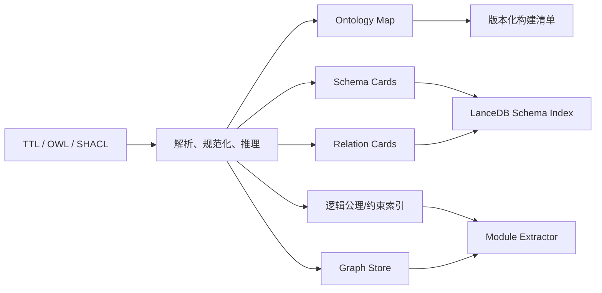
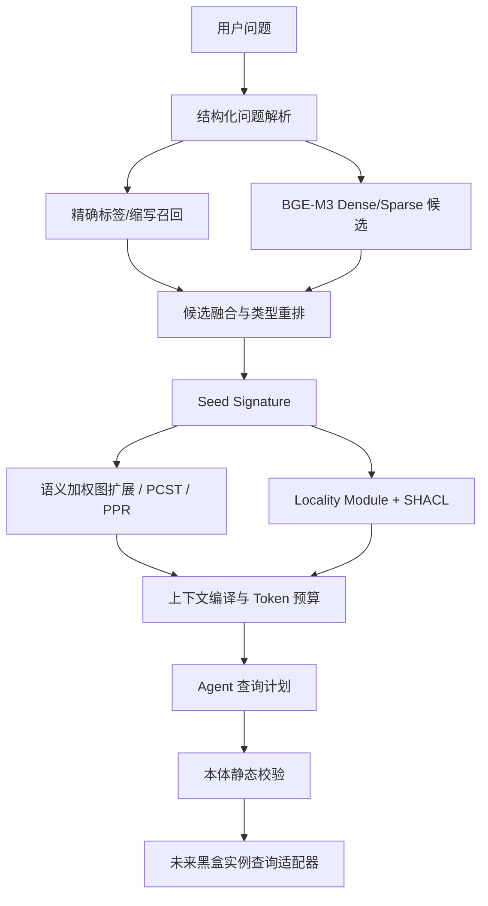

# 本体/知识系统上下文管理与 Agent 本体理解技术调研

> 调研日期：2026-07-27
> 适用项目：Ontology RAG Demo
> 重点：TBox/本体层知识召回、Agent 本体理解、精确上下文构造
> 当前边界：实例数据召回尚未就绪，未来也可能通过完全黑盒的查询接口接入

## 1. 执行摘要

本报告的核心结论是：

1. **不应把完整本体直接塞入 Agent 上下文。** 长上下文并不等于有效理解；相关信息在长输入中可能被忽略，且无关内容本身会降低任务表现。[Lost in the Middle](https://arxiv.org/abs/2307.03172) 已展示长上下文中的位置敏感和利用率下降。
2. **Embedding 不应舍弃，但不应承担最终语义裁决。** 它最适合作为用户语言到本体概念、关系和查询样例的候选发现器；精确别名、类型兼容、图结构和形式化约束负责后续消歧与验证。
3. **“最短路径/最小连通子图”只解决图连通性，不保证本体语义完整。** 对 OWL 本体，应把相关锚点视为 seed signature，再补充 locality-based ontology module，保证与种子概念逻辑相关的公理没有被路径算法遗漏。
4. **Agent 理解本体的可行方式是渐进披露。** 常驻一个小型 Ontology Map；按问题检索 Schema Card；必要时继续调用 `describe`、`expand`、`extract_module`、`validate_plan` 等工具，而不是一次性接收整个本体。
5. **当前没有实例数据并不妨碍核心能力验证。** 现阶段可以把终点定义为“生成并验证一个本体合法的查询计划”，而不是必须得到实例答案。未来黑盒实例查询引擎只需要实现稳定的适配器契约。
6. **现阶段最值得实现的方案不是完整 GraphRAG 平台，而是 Ontology Context Compiler。** 离线把 TTL/OWL 编译成全局地图、Schema Card、关系卡片、逻辑模块索引和查询样例；在线通过混合召回、图扩展和预算化序列化为 Agent 构造上下文。

建议保留当前的 BGE-M3 + LanceDB + NetworkX 基线，但将索引从一个表拆成至少两个逻辑集合：

- `ontology_schema_cards`：类、属性、约束、别名和查询能力。
- `business_evidence_chunks`：规范文档、建模依据和非结构化说明。

本体层优先完成后，即使实例查询引擎长期是黑盒，Agent 仍然可以稳定完成：

- 问题意图识别。
- 本体实体和关系链接。
- 相关本体模块召回。
- 查询范围解释。
- 查询计划生成与静态校验。
- 对黑盒工具返回结果进行语义化总结。

## 2. 问题定义

### 2.1 当前路径

当前设想可以抽象为：

```text
用户问题
  → Agent 提取关键字/锚点
  → 向量 Top-K
  → 最短路径/最小连通子图
  → 黑盒实例查询
  → Agent 总结
```

该路径适合先验证端到端链路，但 Agent 对本体的认知仍然有限：

- 不知道本体由哪些业务模块组成。
- 不知道类、对象属性、数据属性和实例之间的差异。
- 不知道属性的 domain/range、方向、逆属性和基数限制。
- 不知道同义词、缩写、弃用项和建模边界。
- 不知道某条最短路径是否只是经过 `owl:Thing`、`NetworkEntity` 等宽泛概念。
- 无法判断黑盒查询接口应该收到什么结构化参数。

因此，核心问题不是“如何给 Agent 更多三元组”，而是：

> 如何在有限上下文中，向 Agent 提供对当前问题足够、可验证、可继续探索的本体视图。

### 2.2 TBox 与 ABox 的分离

本报告区分：

- **TBox/Schema**：类、属性、层级、约束、术语、规则和建模说明。
- **ABox/Instance Data**：具体网元、告警、KPI、链路和业务实例。

当前重点是 TBox。实例数据未就绪时，应避免让 TBox 检索系统依赖某个具体查询引擎或实例数据库。

建议定义一个中间查询计划，而不是直接生成 SPARQL、nGQL 或其他目标语言：

```json
{
  "intent": "path_query",
  "concepts": ["UserEquipment", "UserPlaneFunction"],
  "relations": ["connectsTo", "hasReferencePoint"],
  "constraints": [],
  "requested_fields": ["path", "network_functions", "interfaces"]
}
```

本体层负责验证这个计划是否合法；未来再由适配器把它编译到黑盒查询接口。

## 3. 相关研究脉络

### 3.1 长上下文不是本体理解的替代品

[Lost in the Middle](https://arxiv.org/abs/2307.03172) 发现，即使模型支持长上下文，其使用信息的能力仍具有明显的位置偏差：相关内容处于输入中间时，表现可能显著下降。

这意味着“把整个 TTL 序列化到 prompt”存在三类问题：

- Token 成本和延迟增加。
- 关键定义、约束可能被大量无关公理稀释。
- 同一实体在文件多个位置出现，模型难以拼接完整语义。

因此，上下文管理的目标应是**最小充分上下文**，而不是最大上下文。

### 3.2 分层摘要与全局/局部上下文

[RAPTOR](https://proceedings.iclr.cc/paper_files/paper/2024/hash/8a2acd174940dbca361a6398a4f9df91-Abstract-Conference.html) 通过递归聚类和摘要构建多层树，在查询时从不同抽象层级召回内容。它处理的是文档，但对本体上下文有直接启发：

- 顶层：本体领域地图和模块摘要。
- 中层：领域或模块级摘要。
- 底层：实体、关系和公理级 Schema Card。

[Microsoft GraphRAG](https://microsoft.github.io/graphrag/query/overview/) 将查询分为 Local、Global 和 DRIFT 等模式：

- Local Search 从实体附近的图和原始文本构造局部上下文。
- Global Search 基于社区报告做全局总结。
- DRIFT 将社区信息作为局部查询的起点并生成细化问题。

Microsoft GraphRAG 主要针对从文档抽取出的图，而非形式化 OWL 本体，但其“全局社区摘要 + 局部实体上下文”的分层方式值得借鉴。对正式本体，不需要重新用 LLM 抽图，可以直接利用现有类层次、命名空间和设计模块生成确定性摘要。

### 3.3 图子结构检索

#### G-Retriever

[G-Retriever](https://arxiv.org/abs/2402.07630) 将图 RAG 的子图选择建模为 Prize-Collecting Steiner Tree（PCST）：节点相关性作为 prize，图边作为连接成本，在上下文预算下寻找既相关又连通的子图。

对当前项目的启发：

- 比“所有锚点的无权最短路径”更适合平衡相关性和子图大小。
- 可以给具体业务关系较低成本，给顶层抽象关系较高成本。
- 可将 BGE-M3 或 reranker 分数转成节点 prize。

局限是 PCST 仍然主要优化图结构与相关性，不天然理解 OWL 逻辑完备性。

#### HippoRAG

[HippoRAG](https://arxiv.org/abs/2405.14831) 将查询实体链接到知识图谱，然后用 Personalized PageRank 传播相关性，强调单次图传播对跨文档、多跳关联的价值。

对本体召回的启发：

- 多锚点不一定需要强制连接成一棵树。
- 可以从多个候选概念注入不同初始权重，再通过关系类型加权传播。
- 适合发现与多个问题概念共同相关、但不在最短路径上的类和属性。

#### Think-on-Graph / ToG 2.0

[Think-on-Graph 2.0](https://arxiv.org/abs/2407.10805) 不是一次性检索子图，而是在图检索和文本上下文检索之间迭代：图帮助缩小文本范围，文本反过来帮助消歧并决定下一步图探索。

这与 Agent 按需理解本体非常契合：

```text
候选概念
  → 查看定义和邻接关系
  → 修正概念/关系选择
  → 扩展新模块
  → 判断上下文是否充分
```

代价是多轮 LLM 调用会增加延迟，因此应先用确定性规则完成大部分候选过滤，只在歧义或复杂问题上进入迭代探索。

#### OG-RAG

[OG-RAG](https://arxiv.org/abs/2412.15235) 直接提出 Ontology-Grounded RAG，以本体对事实簇进行 grounding，并检索能够形成精确上下文的最小 hyperedge 集合。其论文报告了相对基线的事实召回和回答正确性提升，但这些数值来自论文自己的数据集与实验，不能直接外推到 3GPP 场景。

其更有价值的思想是：

- 检索单位不必是独立三元组或文本块。
- 可以把围绕一个概念、关系或流程的公理与说明组织成一个语义单元。
- 上下文选择目标应是覆盖问题所需事实簇，而不是简单 Top-K。

### 3.4 本体模块抽取

普通图路径可能遗漏：

- 等价类定义。
- 属性限制。
- 基数约束。
- disjointness。
- property chain。
- 与种子实体逻辑相关但不在最短路径上的公理。

[Oxford Locality Module Extractor](https://www.cs.ox.ac.uk/isg/tools/ModuleExtractor/) 和 OWL API 实现了基于 locality 的本体模块抽取。它以一组实体 signature 为种子，提取与这些实体逻辑相关的公理。

[ROBOT](https://link.springer.com/article/10.1186/s12859-019-3002-3) 将相关方法产品化为：

- MIREOT：从底层实体提取到指定顶层实体的祖先。
- BOT：偏向包含输入实体与祖先间的关系。
- TOP：偏向输入实体及其后代。
- STAR：通常产生更小的模块。

ROBOT 文档指出这些 locality 方法用于捕获与 seed set 逻辑相关的信息，并支持附加来源标记。

对当前项目最重要的结论是：

> 最短路径和 Steiner 子图用于“结构相关性”，locality module 用于“逻辑相关性”；二者应合并，而不是互相替代。

### 3.5 本体向量表示

#### OWL2Vec*

[OWL2Vec*](https://link.springer.com/article/10.1007/s10994-021-05997-6) 同时编码：

- 本体图结构。
- 标签、注释和定义等词法信息。
- OWL 逻辑构造。

它说明仅把 `rdfs:label` 或定义文本送入通用 embedding，无法完整捕获本体的形式语义。

#### OPA2Vec

[OPA2Vec](https://academic.oup.com/bioinformatics/article/35/12/2133/5165380) 将形式公理和 annotation axioms 共同转为向量表示，强调标签、定义、同义词与逻辑公理结合的价值。

#### 对当前项目的判断

暂时不建议立即引入 OWL2Vec* 或重新训练 ontology embedding：

- 当前 3GPP 本体规模小。
- BGE-M3 对中英文标签、缩写和自然语言定义更直接。
- 当前最主要风险是实体链接、Schema Card 设计和子图语义，而不是 embedding 表征上限。

但 Schema Card 不应只包含标签。至少应包含：

- 实体类型。
- 标签、缩写、同义词。
- 定义和建模说明。
- 父类/子类。
- domain/range。
- 逆属性和属性特征。
- 关键 restriction/constraint。
- 来源和版本。

这相当于用确定性方法把结构和逻辑“编译成适合 BGE-M3 的文本表示”。

### 3.6 语义解析、实体链接与查询生成

[ChatKBQA](https://arxiv.org/abs/2310.08975) 将知识库问答拆成知识召回和语义解析，并采用 generate-then-retrieve：先形成抽象 logical form，再检索真实实体与关系进行替换。

对当前项目可以采用更保守的变体：

1. Agent 先生成不带具体 IRI 的 Query Intent。
2. 检索器召回候选类和属性。
3. 根据 domain/range 和图结构消歧。
4. 生成绑定 IRI 的 Query Plan。
5. 本体校验器验证计划。
6. 未来再编译成黑盒查询请求。

这种方式避免 Agent 在没有足够本体上下文时直接猜测 IRI、属性名或查询语法。

### 3.7 形式化约束作为 Agent 的护栏

[OWL 2](https://www.w3.org/TR/owl2-primer/) 可以表达类、属性、domain/range、等价关系、属性限制、基数、property chain 等正式语义。

[SHACL](https://www.w3.org/TR/shacl/) 可以定义 RDF 图结构约束并输出机器可读的验证结果。其价值不仅在实例校验，也在于：

- 为 Agent 明确哪些字段是必填、可选或多值。
- 在执行查询前验证 Query Plan 的类型和路径。
- 为黑盒查询接口生成参数 Schema。

[SKOS](https://www.w3.org/TR/skos-reference/) 的 `prefLabel`、`altLabel` 和 `hiddenLabel` 很适合建立可治理的术语层，特别是 3GPP 缩写、中文名、英文全称和历史名称。

因此，Agent 的“本体理解”不应只来自自然语言摘要，还应受到 OWL/SHACL 的确定性校验。

## 4. 代表性产品与框架

### 4.1 Stardog Voicebox

[Stardog Voicebox](https://docs.stardog.com/voicebox/) 的公开流程与本项目目标最接近：

1. 从用户问题识别关键语义概念。
2. 使用内置向量存储，把用户概念匹配到 ontology/model concepts。
3. 取回相关模型概念和 few-shot examples。
4. 交给 LLM 生成 SPARQL。
5. 执行结构化查询，并保留来源和 lineage。

值得借鉴：

- 把本体概念和 few-shot 查询样例同时召回。
- 先进行模型概念 grounding，再生成结构化查询。
- 区分结构化 KG 结果、RAG 文档结果、代码结果和外部 LLM 知识。
- 查询失败时明确回答数据不可得，而不是让模型补全。

对当前项目而言，实例查询暂未就绪，但可以先复刻前四步中的前三步，并把第四步替换为 Query Plan。

### 4.2 Ontotext GraphDB Talk to Your Graph

[GraphDB Talk to Your Graph](https://graphdb.ontotext.com/documentation/11.0/talk-to-graph.html) 支持组合使用：

- SPARQL。
- Full-text search。
- Semantic similarity search。
- 面向文本块的向量检索。

其 SPARQL 模式要求提供 ontology/schema named graph，或者提供一条能够取得 schema 的 SPARQL 查询；同时可以启用 label full-text search 作为 IRI discovery 的补充。

值得借鉴：

- 不把一种检索方式当成万能入口。
- 精确/全文标签检索用于 IRI 发现。
- 语义检索用于开放式问题。
- SPARQL 用于封闭式、聚合和确定性查询。
- 工具路由由问题类型决定。

这直接支持“精确别名 + embedding + 图/逻辑校验”的混合路线。

### 4.3 Neo4j GraphRAG

[Neo4j GraphRAG Python](https://neo4j.com/docs/neo4j-graphrag-python/current/user_guide_rag.html) 提供：

- Vector Retriever。
- Vector + Cypher 图扩展。
- Vector + full-text hybrid。
- Text2Cypher。
- Tools Retriever。

其中 VectorCypherRetriever 先做向量检索，再从命中节点执行图遍历。这与当前 LanceDB 命中锚点、再经 NetworkX/NebulaGraph 扩图的架构一致。

需要注意：

- Neo4j 方案主要面向 property graph。
- OWL 逻辑语义、restriction 和 locality module 不是其默认检索模型。
- 可以借鉴 retriever 组合和工具契约，但本项目仍需单独实现 ontology-aware 编译与校验。

### 4.4 Microsoft GraphRAG

[Microsoft GraphRAG](https://microsoft.github.io/graphrag/query/overview/) 的 Local/Global/DRIFT 分层适合参考上下文策略，但不建议直接套用其完整索引流程：

- 本项目已有人工设计的正式本体，无需让 LLM 再从文档抽取一套图。
- LLM 抽取图可能丢失 OWL 约束或制造与正式本体冲突的关系。
- 可借用社区/模块摘要和查询路由，而不是重复构图。

### 4.5 LlamaIndex

[LlamaIndex RouterRetriever](https://docs.llamaindex.ai/en/stable/api_reference/retrievers/router/) 可以根据查询和工具 metadata 选择一个或多个 retriever。其价值主要在编排模式：

- Schema 检索器。
- 文档检索器。
- 图扩展工具。
- 查询样例检索器。

可以用类似模式实现，但当前 demo 没必要引入完整框架；现有 Python 接口足以完成同样的可控路由。

### 4.6 NebulaGraph

[NebulaGraph Fusion GraphRAG](https://nebula-graph.io/solutions-fusion-graphrag) 强调图关系和向量检索的联合使用。NebulaGraph 适合作为后续图存储与在线遍历后端，但它解决的是存储、查询和图计算问题，不会自动让 Agent 理解 OWL 本体。

因此应保持：

```text
Ontology Context Compiler / Retriever
                ↓
GraphStore Adapter
       ├─ NetworkX
       └─ NebulaGraph
```

不要让上层 Agent 直接依赖某一种图数据库查询语言。

## 5. 综合判断：最适合当前项目的架构

### 5.1 离线：Ontology Context Compiler

建议把 `build-index` 扩展为一个确定性的本体编译过程。



#### Ontology Map

面向 Agent 的短摘要，建议控制在约 800～1500 tokens：

- 本体名称、版本和范围。
- 顶层业务域。
- 关键类。
- 关键关系。
- 建模边界和非规范扩展。
- 可调用的本体工具。

它常驻 system/developer context，但不包含全量实体。

#### Schema Card

每个类或属性一张卡片：

```yaml
iri: http://3gpp-ontology.org/ns/5gs#UPF
kind: Class
preferred_label: User Plane Function
labels:
  en: User Plane Function
  zh: 用户面功能
aliases: [UPF]
module: 5GC
parents: [CoreNetworkFunction]
outgoing_relations: [N6, N9]
incoming_relations: [N3]
restrictions: []
description: ...
provenance:
  - TS 23.501 ...
ontology_version: ...
```

卡片同时有：

- 机器可读 JSON。
- 用于 embedding 的自然语言文本。
- 可选的紧凑 Turtle/三元组视图。

#### Relation Card

关系应独立索引，因为用户问题经常直接表达关系意图：

```yaml
iri: ...#N3
kind: ObjectProperty
labels: [N3 reference point]
domain: [GNB]
range: [UPF]
direction: GNB -> UPF
inverse: null
characteristics: []
description: ...
```

#### Query Pattern Card

保存经人工审核的示例：

```yaml
question_pattern: "X 到 Y 的路径经过哪些网元？"
intent: path_query
required_schema: [NetworkEntity, connectsTo]
plan_template:
  source: $X
  target: $Y
  return: [path, relations]
```

产品实践中，Stardog 明确使用相关 ontology concepts 和 few-shot examples 共同帮助生成查询；本项目应采用同样思路。

### 5.2 在线：预算化本体召回



#### 第一步：问题解析

Agent 只输出结构化分析，不直接生成查询：

```json
{
  "intent": "path_query",
  "mentions": ["UE", "UPF"],
  "relation_phrases": ["用户面路径"],
  "constraints": [],
  "expected_answer_shape": "ordered_path"
}
```

#### 第二步：多路候选生成

建议按以下优先级：

1. IRI、缩写、`prefLabel` 精确匹配。
2. `altLabel`、中文名、英文全称、大小写和连字符归一化匹配。
3. 稀疏/关键词召回。
4. BGE-M3 dense 召回。
5. 可选 ColBERT 或 cross-encoder rerank。

BGE-M3 原生支持 dense、sparse 和 multi-vector 三种方式，1024 维、最大序列长度 8192；当前 demo 只用了 dense。[BGE-M3 模型卡](https://huggingface.co/BAAI/bge-m3)

对 3GPP 场景，缩写是高精度信号，因此不能只依赖 dense embedding。

#### 第三步：候选融合和消歧

重排特征建议包括：

- 文本相关性。
- exact/alias match 类型。
- 问题意图与实体类型兼容性。
- relation domain/range 是否兼容。
- 候选之间是否存在有意义的连接。
- 是否位于当前业务模块。
- 是否是过于宽泛的顶层实体。
- 是否已弃用。

可先采用规则加权或 Reciprocal Rank Fusion，不必立即训练 reranker。

#### 第四步：结构与逻辑双通道扩展

结构通道：

- 语义加权最短路径。
- Steiner Tree/PCST。
- Personalized PageRank。
- 限定关系类型和最大节点预算。

逻辑通道：

- Seed signature 的 locality module。
- 与实体关联的 SHACL shapes。
- 必要的父类、domain/range、restriction 和 disjointness。

最终上下文是两者的去重合并：

```text
Context = Relevant Graph Subgraph
        ∪ Logical Ontology Module
        ∪ Relevant Schema Cards
        ∪ Relevant Query Patterns
```

### 5.3 Agent 本体工具设计

建议提供小而明确的工具，而不是一个万能 `query_ontology`：

#### `ontology_overview`

返回：

- 本体版本。
- 模块列表。
- 顶层类和关键关系。
- 可用工具。

#### `search_schema`

输入：

```json
{
  "text": "用户面路径",
  "kinds": ["Class", "ObjectProperty"],
  "top_k": 10
}
```

返回时必须包含：

- 候选 IRI。
- 命中标签。
- 命中方式。
- 分数。
- 简短定义。
- domain/range 或父类摘要。

#### `describe_schema`

返回指定实体的完整 Schema Card、邻接关系、约束和 provenance。

#### `extract_ontology_context`

输入：

```json
{
  "seeds": ["...#UE", "...#UPF"],
  "intent": "path_query",
  "max_nodes": 30,
  "max_tokens": 2500
}
```

返回：

- 锚点。
- 图子结构。
- 逻辑模块。
- 被裁剪内容统计。
- 人类可读摘要。
- 机器可读结构。

#### `validate_query_plan`

在没有实例数据库时也能运行：

- 类和属性是否存在。
- 关系方向是否正确。
- domain/range 是否兼容。
- 过滤字段是否合法。
- 是否缺少必要路径。
- 是否触犯 SHACL/本体约束。

#### `execute_instance_query`

未来适配黑盒查询引擎。Agent 不需要知道内部使用 SPARQL、nGQL、SQL 还是 API。

工具响应建议统一包含：

```json
{
  "status": "ok",
  "ontology_version": "...",
  "result": {},
  "provenance": [],
  "warnings": [],
  "truncated": false,
  "continuation_hint": null
}
```

### 5.4 上下文序列化

建议把查询时上下文分成四层：

1. **常驻 Ontology Map**：约 800～1500 tokens。
2. **问题相关 Schema Cards**：通常 5～10 张。
3. **相关子图与逻辑模块**：按问题动态生成。
4. **查询样例和校验结果**：只在生成计划时加入。

推荐顺序：

```text
任务与工具规则
→ Ontology Map
→ 用户问题与结构化意图
→ 已链接的概念/关系
→ 子图摘要
→ 关键形式化公理
→ few-shot 查询样例
→ 输出 JSON Schema
```

不建议直接使用完整 RDF/XML。对 Agent 可同时提供：

- 简洁自然语言解释。
- 结构化 JSON。
- 少量权威 Turtle/N-Triples。

自然语言摘要只能用于理解，原始公理才是校验依据。

## 6. 实例查询未就绪时如何推进

实例查询不应成为本体层研发的阻塞项。

### 当前可交付结果

每个问题先输出：

```json
{
  "question_understanding": {},
  "linked_schema": {},
  "retrieved_context": {},
  "validated_query_plan": {},
  "instance_execution": {
    "status": "not_available"
  }
}
```

### 使用 Mock ABox

只需要很小的合成实例数据验证：

- 查询计划能否被编译。
- 类型和关系方向是否正确。
- 返回结果能否被 Agent 正确解释。

不需要复刻真实数据规模或真实查询性能。

### 黑盒适配原则

未来实例引擎只需接受稳定 IR：

```text
QueryPlan
  → SPARQL Adapter
  → nGQL Adapter
  → REST/Skill Adapter
```

本体召回、Agent 理解和计划校验层不应知道后端细节。

## 7. 评估体系

在没有真实实例查询的情况下，应把评估拆成可独立观测的阶段。

### 7.1 Schema Linking

- Entity Recall@K。
- Relation Recall@K。
- Top-1 accuracy。
- 别名/缩写命中率。
- 歧义实体消解准确率。
- 不存在概念的拒识率。

### 7.2 Context Retrieval

- Gold axiom recall。
- 子图节点/边 precision、recall、F1。
- 关键 domain/range/restriction 覆盖率。
- 逻辑模块覆盖率。
- 每题 context tokens。
- 每个正确公理的 token 成本。
- disconnected/over-generalized subgraph 比例。

### 7.3 Agent Understanding

- Intent accuracy。
- Query Plan schema validity。
- 属性方向正确率。
- 不合法字段率。
- 校验后一次通过率。
- 需要继续调用本体工具的轮数。
- 有充分证据时的回答覆盖率。
- 证据不足时的正确拒答率。

### 7.4 建议的消融实验

至少比较：

1. 只有 exact alias。
2. 只有 BGE-M3 dense。
3. exact + dense。
4. exact + dense + sparse。
5. Top-K 节点一跳扩展。
6. 无权最短路径。
7. 语义加权最短路径/Steiner。
8. 图子结构 + locality module。
9. 无 Ontology Map。
10. Ontology Map + Schema Card。

这样可以回答“embedding 是否真的贡献召回”“图算法是否增加有效公理”“上下文理解提升来自哪里”。

### 7.5 3GPP 首批测试问题类型

建议建立 30～50 个本体层问题：

- 单实体定义：UPF 是什么？
- 缩写消歧：CU、DU、AF。
- 类层次：UPF 属于哪类网络功能？
- 属性方向：N3 的两端是什么？
- 路径：UE 到 DN 涉及哪些网元和参考点？
- 多锚点：AMF、SMF、UPF 如何协同？
- 域边界：无线域到核心域经过什么边界？
- 约束：某关系允许连接哪些类型？
- 设计边界：哪些概念属于 3GPP 规范，哪些是本体设计扩展？
- 不可回答：询问本体中不存在的设备或指标。

每题人工标注：

- 意图。
- 锚点实体。
- 关键关系。
- 必须包含的公理。
- 允许的扩展节点。
- 最大可接受上下文规模。

## 8. 推荐实施路线

### Phase 1：Schema Card 与混合实体链接

优先级最高，仍使用 LanceDB + NetworkX：

1. 从 TTL 确定性生成 Ontology Map。
2. 生成 Class/Property Schema Card。
3. 将本体卡片和规范文档拆成两个 LanceDB 表。
4. 增加 exact alias/SKOS 检索。
5. 融合 exact、dense 和结构分数。
6. 为每次召回输出 trace。
7. 建立首批 3GPP 本体问题集。

这一阶段不需要实例数据，也不需要 NebulaGraph。

### Phase 2：逻辑模块与查询计划

1. 增加 relation-aware edge weights。
2. 比较 shortest path、Steiner/PCST、PPR。
3. 接入 OWL locality module extraction。
4. 将 SHACL/OWL constraints 加入上下文。
5. 定义 QueryPlan JSON Schema。
6. 实现 `validate_query_plan`。
7. 加入人工审核的 Query Pattern Card。

### Phase 3：Agentic Ontology Exploration

1. Agent 只在歧义或复杂问题时继续调用 `describe/expand`。
2. 增加 context sufficiency 判断。
3. 按 token budget 逐级披露。
4. 缓存 `(ontology_version, seed_signature, intent)` 对应模块。
5. 记录检索轨迹、裁剪原因和 Agent 修正过程。

### Phase 4：黑盒实例查询适配

1. 用 Mock ABox 验证 QueryPlan。
2. 为真实查询 Skill/API 实现 adapter。
3. 加入 dry-run/explain 能力。
4. 区分本体证据、实例结果和文档证据。
5. 最后再做端到端答案指标。

## 9. 不建议当前采用的方案

### 直接把完整本体放入 prompt

不可控、不可扩展，也难以评估哪部分上下文真正有效。

### 只用向量 Top-K

会遗漏缩写精确匹配、关系方向、逻辑约束和多跳结构。

### 只用最短路径

容易经过宽泛顶层类，也可能遗漏与种子逻辑相关的 restriction 和 constraint。

### 立即训练专用 ontology embedding

当前数据规模和评估集都不足，难以证明训练收益。先用丰富 Schema Card + BGE-M3 建立基线。

### 立即做 Text2SPARQL/nGQL

实例接口尚未稳定，过早绑定查询语言会把本体理解问题和后端语法问题混在一起。应先生成后端无关的 QueryPlan。

### 重新用 LLM 从 3GPP 文档构建另一套知识图

已有人工本体是权威 Schema。LLM 抽取结果可以作为候选补充或缺口发现，但不能替代正式本体。

## 10. 风险与治理

- **摘要失真**：LLM 摘要不能作为权威公理；卡片结构字段必须从 RDF 确定性生成。
- **推理污染**：区分 asserted 和 inferred axioms，并记录使用的 reasoner/profile。
- **版本漂移**：所有卡片、向量和缓存绑定 ontology content hash/version。
- **别名冲突**：记录匹配原因、候选列表和消歧依据。
- **顶层节点捷径**：对 `owl:Thing`、通用基类和 metadata 边设置高成本或默认排除。
- **工具注入**：把 ontology comments 当作数据而不是指令，使用明确的上下文边界。
- **来源缺失**：Schema Card 和子图边保留 specification clause、source file 和 asserted/inferred 标记。
- **访问控制**：未来若本体本身包含敏感业务架构，Schema 检索也必须按用户权限过滤。

## 11. 最终建议

当前项目最合理的目标不是先追求“Agent 能回答所有实例问题”，而是构建一个可验证的本体认知层：

```text
Ontology Context Compiler
  + Hybrid Schema Retrieval
  + Graph/Logic Module Extraction
  + Query Plan Validation
```

具体决策：

- 保留 BGE-M3 和 LanceDB。
- 增加 exact/SKOS/缩写检索，不让 embedding 单独决定实体。
- 把本体卡片和规范文档分开索引。
- 用 Schema Card 作为 Agent 理解本体的主要载体。
- 用语义加权子图解决结构相关性。
- 用 locality module 和 SHACL 解决逻辑完整性。
- 用 QueryPlan 隔离尚未就绪或完全黑盒的实例查询引擎。
- 先评估 Schema Linking、Ontology Context Recall 和 Plan Validity，再评估最终答案。

一句话概括：

> 不让 Agent 记住整个本体，而是让它拥有一张本体地图、一个可搜索的本体目录，以及按需提取逻辑完备局部模块的工具。

## 12. 主要参考资料

### 研究

- [Lost in the Middle: How Language Models Use Long Contexts](https://arxiv.org/abs/2307.03172)
- [RAPTOR: Recursive Abstractive Processing for Tree-Organized Retrieval](https://proceedings.iclr.cc/paper_files/paper/2024/hash/8a2acd174940dbca361a6398a4f9df91-Abstract-Conference.html)
- [From Local to Global: A Graph RAG Approach to Query-Focused Summarization](https://arxiv.org/abs/2404.16130)
- [G-Retriever: Retrieval-Augmented Generation for Textual Graph Understanding and Question Answering](https://arxiv.org/abs/2402.07630)
- [HippoRAG: Neurobiologically Inspired Long-Term Memory for Large Language Models](https://arxiv.org/abs/2405.14831)
- [Think-on-Graph 2.0](https://arxiv.org/abs/2407.10805)
- [OG-RAG: Ontology-Grounded Retrieval-Augmented Generation](https://arxiv.org/abs/2412.15235)
- [ChatKBQA: A Generate-then-Retrieve Framework for Knowledge Base Question Answering](https://arxiv.org/abs/2310.08975)
- [OWL2Vec*: Embedding of OWL Ontologies](https://link.springer.com/article/10.1007/s10994-021-05997-6)
- [OPA2Vec](https://academic.oup.com/bioinformatics/article/35/12/2133/5165380)
- [Locality Module Extractor](https://www.cs.ox.ac.uk/isg/tools/ModuleExtractor/)
- [ROBOT: A Tool for Automating Ontology Workflows](https://link.springer.com/article/10.1186/s12859-019-3002-3)

### 标准

- [OWL 2 Primer](https://www.w3.org/TR/owl2-primer/)
- [SHACL](https://www.w3.org/TR/shacl/)
- [SKOS Reference](https://www.w3.org/TR/skos-reference/)
- [SPARQL 1.1 Query Language](https://www.w3.org/TR/sparql11-query/)

### 产品与框架

- [Microsoft GraphRAG Query Engine](https://microsoft.github.io/graphrag/query/overview/)
- [Stardog Voicebox](https://docs.stardog.com/voicebox/)
- [GraphDB Talk to Your Graph](https://graphdb.ontotext.com/documentation/11.0/talk-to-graph.html)
- [Neo4j GraphRAG Python](https://neo4j.com/docs/neo4j-graphrag-python/current/user_guide_rag.html)
- [LlamaIndex RouterRetriever](https://docs.llamaindex.ai/en/stable/api_reference/retrievers/router/)
- [NebulaGraph Fusion GraphRAG](https://nebula-graph.io/solutions-fusion-graphrag)
- [BGE-M3 Model Card](https://huggingface.co/BAAI/bge-m3)
- [LanceDB Quickstart](https://docs.lancedb.com/quickstart)
